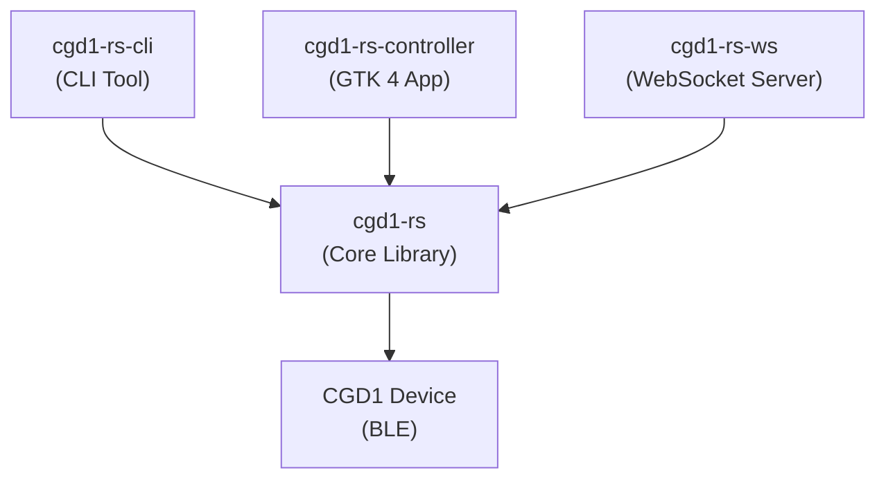

# cgd1-rs

[](https://crates.io/crates/cgd1-rs)
[](https://doc.rust-lang.org/edition-guide/editions/2024/)
[](https://opensource.org/licenses/MIT)

[](https://github.com/smearor/cgd1-rs/actions/workflows/build.yml)
[](https://github.com/smearor/cgd1-rs/actions/workflows/msrv.yml)
[](https://github.com/smearor/cgd1-rs/actions/workflows/audit.yml)
[](https://github.com/smearor/cgd1-rs/actions/workflows/book.yml)

A Rust library and toolkit for the Qingping CGD1 Bluetooth alarm clock. It provides a complete BLE transport layer, command protocol implementation, and three frontends: a command-line tool, a GTK 4 desktop application, and a WebSocket/REST server.

## Features

- **BLE Transport** — Scan, connect, authenticate, and communicate via Bluetooth Low Energy
- **Time Synchronization** — Sync the device clock to the current system time
- **Alarm Management** — Read, set, and delete up to 16 alarms with day-of-week repeat masks and snooze
- **Device Settings** — Volume, brightness, timezone, time format, temperature unit, language, night mode
- **Sensor Monitoring** — Real-time temperature and humidity via BLE notifications, plus passive advertisement parsing
- **Battery Monitoring** — Read battery level via the standard GATT battery service
- **Audio Upload** — Upload custom ringtones (8-bit PCM, 8 kHz, mono) via the block-based BLE protocol
- **Firmware Query** — Read the device firmware version string
- **Reconnection** — Automatic reconnection with exponential backoff and full state recovery

## Crates

| Crate                                        | Description                                                                     | MSRV |
|----------------------------------------------|---------------------------------------------------------------------------------|------|
| [`cgd1-rs`](./cgd1-rs)                       | Core library: BLE transport, auth, commands, events, device handle              | 1.88 |
| [`cgd1-rs-cli`](./cgd1-rs-cli)               | Command-line tool with 14 subcommands and interactive REPL                      | 1.89 |
| [`cgd1-rs-controller`](./cgd1-rs-controller) | GTK 4 desktop application with sensor display, alarm editor, and settings panel | 1.92 |
| [`cgd1-rs-ws`](./cgd1-rs-ws)                 | WebSocket and REST server for network access to the device                      | 1.88 |

## Quick Start

### Prerequisites

- Rust toolchain (Edition 2024)
- Linux: BlueZ + D-Bus (`sudo apt-get install -y pkg-config libdbus-1-dev`)
- macOS: CoreBluetooth (built-in, no extra packages)
- GTK 4 controller (optional, Linux only): `sudo apt-get install -y libgtk-4-dev`

### Build

```bash
git clone https://github.com/smearor/cgd1-rs.git
cd cgd1-rs
cargo build --release
```

### Usage

```bash
# Scan for nearby devices
cgd1 scan --duration 10

# Synchronize the device clock
cgd1 sync-time AA:BB:CC:DD:EE:FF

# Read all alarms
cgd1 alarm-list AA:BB:CC:DD:EE:FF

# Set a weekday alarm at 07:30
cgd1 alarm-set AA:BB:CC:DD:EE:FF 3 07:30 --repeat 3e

# Monitor sensors in real-time
cgd1 monitor AA:BB:CC:DD:EE:FF --duration 60

# Start the WebSocket server
cgd1-ws --port 3000
```

### Testing without Hardware

All tests run without a physical device using the in-memory `VirtualClockTransport`:

```bash
cargo test --all
```

The CLI also supports a virtual backend for manual testing:

```bash
cgd1 --backend virtual scan
cgd1 --backend virtual sync-time AA:BB:CC:DD:EE:FF
```

## Documentation

- [**User Guide**](https://smearor.github.io/cgd1-rs/book/) — Full mdBook documentation
- [BLE Protocol](docs/BLE.md) — Reverse-engineered BLE protocol specification
- [Hardware Notes](docs/HARDWARE.md) — CGD1 hardware specifications
- [Concept Document](concepts/planned/CGD1-RS.md) — Project phases and architecture
- [Changelog](CHANGELOG.md) — Release history

## Architecture



All three frontends build on the same core library, which abstracts the BLE protocol, authentication, and command/response handling.

## License

MIT — see [LICENSE](LICENSE).