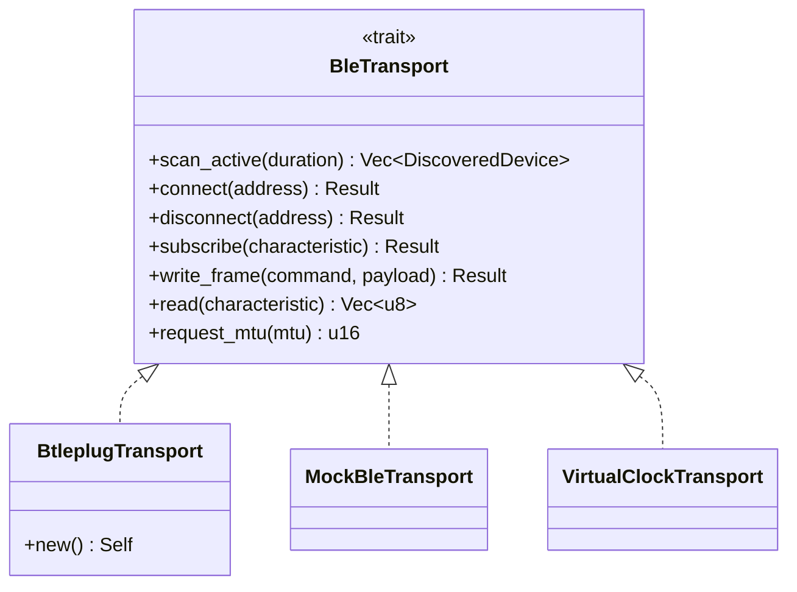
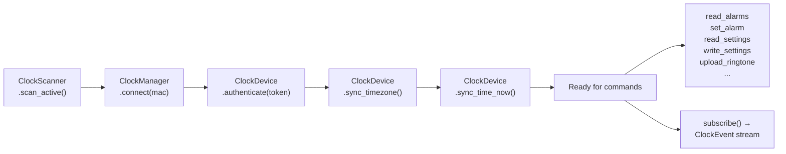
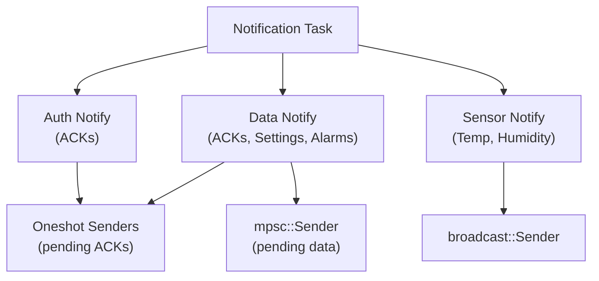

# Architecture

## Workspace Layout

```
cgd1-rs/
├── cgd1-rs/              # Core library
│   └── src/
│       ├── ble/          # BLE transport layer
│       ├── command/      # Protocol commands, alarm, settings types
│       ├── error/        # Error types (transport, auth, clock)
│       ├── token/        # Auth token + file store
│       ├── types/        # Newtypes (MAC, temperature, humidity, etc.)
│       ├── device.rs     # ClockDevice: connected device handle
│       ├── event.rs      # ClockEvent enum
│       ├── manager.rs    # ClockManager: multi-device connection manager
│       └── scanner.rs    # ClockScanner: device discovery
├── cgd1-rs-cli/          # Command-line tool
├── cgd1-rs-controller/   # GTK 4 desktop application
├── cgd1-rs-ws/           # WebSocket + REST server
└── book/                 # This documentation
```

## Core Library (`cgd1-rs`)

### BLE Transport Layer

The `BleTransport` trait abstracts all BLE operations, enabling testing with `MockBleTransport` and `VirtualClockTransport` without real hardware.



**`BtleplugTransport`** — Real hardware backend using the `btleplug` crate. Works on Linux (BlueZ), macOS (CoreBluetooth), and Windows.

**`MockBleTransport`** — In-memory mock with channels for advertisements and notifications. Used in unit tests.

**`VirtualClockTransport`** — Full in-memory simulation of the CGD1 device. Responds to commands with appropriate ACKs, maintains alarm/settings state, and emits sensor notifications. Used in integration tests for CLI and WebSocket server.

### Device Lifecycle



The `connect_authenticate_and_sync` method performs all steps in sequence. `sync_timezone` reads the device settings, computes the local system UTC offset via `chrono::Local`, and writes the correct timezone before `sync_time` to avoid time display offsets (the device defaults to UTC+8 after factory reset).

### ClockDevice

`ClockDevice` is the primary handle for interacting with a connected CGD1. It owns:

- **Transport reference** — For sending commands and reading data
- **Pending ACK map** — `HashMap<u8, VecDeque<oneshot::Sender>>` for matching ACKs to pending requests by command byte
- **Pending data response channel** — `mpsc::Sender` for multi-packet responses (e.g., alarm read, settings read)
- **Event broadcast sender** — `broadcast::Sender<ClockEvent>` for sensor, battery, and connection events
- **Auth token** — Stored after successful authentication
- **Notification task handle** — `JoinHandle` stored so it can be aborted on disconnect, preventing zombie tasks from stealing notifications
- **Token store** — Optional `Arc<dyn TokenStore>` for persisting auth tokens after privileged commands succeed

#### Notification Task

A background task per connected device listens for BLE notifications and dispatches them:



> **Note**: Battery is **not** sourced from GATT notifications. The GATT Battery Service (`0x2A19`) returns an unreliable 99% on the CGD1. Battery data comes exclusively from advertising packets, cached via `KnownDeviceStore`. See [Sensors & Battery](./sensors.md) for details.

#### Request-Response Pattern

Commands that expect an ACK use a `oneshot::channel`. The pending request is registered **before** the command frame is sent to prevent a race condition where the ACK arrives before the receiver is set up:

1. `prepare_ack(command)` — Registers a `oneshot::Sender` in the pending map
2. `transport.write_frame(command, payload)` — Sends the command
3. `wait_ack(receiver, timeout)` — Waits for the ACK with a 10-second timeout

Multi-packet responses (e.g., `read_alarms`, `read_settings`) use an `mpsc::Sender` instead, allowing the notification task to forward data packets as they arrive.

### Reconnection

If the device disconnects unexpectedly, the library attempts reconnection with exponential backoff (1s, 2s, 4s, 8s, 16s, 32s capped). After a successful BLE reconnect, the full state recovery sequence is performed:

1. **Transport cleanup** — `transport.disconnect()` to clear stale connection state
2. **BLE Reconnect** via `transport.connect(address)`
3. **GATT Re-subscription** for Auth Notify, Data Notify, and Sensor Notify
4. **Re-authentication** using the stored token
5. **Flag reset** — `is_authenticated` set to `true`

`ClockEvent::Disconnected` and `ClockEvent::Reconnected` are broadcast to subscribers.

### KnownDeviceStore

The `KnownDeviceStore` persists known device MAC addresses and battery levels:

- **`known_devices.json`** — List of previously seen device MAC addresses, used to populate the controller dropdown on startup.
- **`battery_cache.json`** — Map of MAC address to battery level (u8), populated from advertising scans. Loaded on startup into the controller's `scan_battery_cache`.

Both files reside in the platform-dependent data directory (e.g., `~/.local/share/cgd1-rs/` on Linux).

### Error Handling

The library uses structured error types:

- **`TransportError`** — BLE-level errors (not connected, characteristic not found, timeout, etc.)
- **`ClockError`** — Library-level errors (auth failed, command rejected, timeout, invalid alarm slot, parse errors, IO errors)
- **`AuthFailedError`** — Authentication failure with context (reason, is_new_token, token_path)

All errors implement `std::error::Error` and `Display`. The CLI additionally uses `miette::Diagnostic` for rich terminal output.

### Newtypes

The library uses newtypes for compile-time validation at the API boundary:

| Type | Validation | Used By |
|---|---|---|
| `MacAddress` | 6-byte MAC, colon-separated hex | All commands |
| `ScanDuration` | 1–600 seconds | `scan` |
| `AlarmSlotIndex` | 0–15 | `alarm-set`, `alarm-delete` |
| `ClockTime` | HH:MM (0–23, 0–59) | `alarm-set` |
| `DayMask` | u8 bitmask | `alarm-set` |
| `Brightness` | 0–150, multiple of 10 | `brightness`, `settings-write` |
| `Volume` | 1–5 | `settings-write`, `ringtone-preview` |
| `Timezone` | -720 to +840 minutes | `settings-write` |
| `RingtoneSignature` | 4 bytes or named slot | `ringtone-upload` |

All newtypes implement `FromStr` for CLI/JSON parsing and `Display` for output.

## Frontends

### CLI (`cgd1-rs-cli`)

Each subcommand connects, authenticates, executes one operation, and disconnects. The `repl` subcommand keeps a persistent connection. See [CLI Tool](./cli.md).

### GTK 4 Controller (`cgd1-rs-controller`)

A desktop application with a sidebar for device management and tabbed views for sensors, alarms, and settings. Uses `glib::MainContext::spawn_local` to bridge async BLE operations with the GTK event loop. See [Controller](./controller.md).

### WebSocket Server (`cgd1-rs-ws`)

An Axum-based server exposing a WebSocket endpoint for command/response and event streaming, plus REST endpoints for read operations. See [WebSocket Server](./websocket.md).
