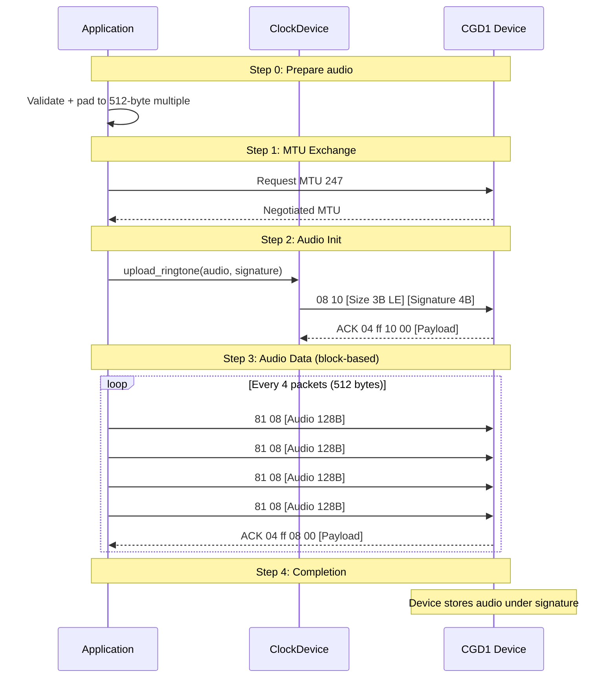

# Audio Upload

The CGD1 supports uploading custom ringtones via a block-based BLE transfer protocol. Audio is sent as 8-bit unsigned PCM at 8 kHz mono.

## Audio Format

| Property    | Value                                               |
|-------------|-----------------------------------------------------|
| Format      | 8-bit unsigned PCM                                  |
| Sample rate | 8000 Hz                                             |
| Channels    | Mono                                                |
| Max size    | ~98 KB (~12 seconds)                                |
| Padding     | Multiple of 512 bytes (`00` end marker + `FF` fill) |

## Ringtone Signatures

### Built-in Ringtones

The original Qingping/ClearGrass PCM ringtones have been replaced with audio from
[lomiri-sounds](https://gitlab.com/ubports/development/core/lomiri-sounds) (CC-BY-SA-3.0)
and a chiptune remix by Dubmood (CC-BY-NC-SA-4.0). See
[LICENSE_RINGTONES.md](https://github.com/smearor/cgd1-rs/blob/main/LICENSE_RINGTONES.md)
for full attribution and license details.

| Signature  | Name               | Source                 | Copyright holder            | License         | PCM length |
|------------|--------------------|------------------------|-----------------------------|-----------------|------------|
| `fdc366a5` | Beep               | Alarm clock.ogg        | 2013, Canonical Ltd.        | CC-BY-SA-3.0    | 95967      |
| `0961bb77` | Digital Ringtone   | Mallet.ogg             | 2013, Canonical Ltd.        | CC-BY-SA-3.0    | 18155      |
| `ba2c2c8c` | Digital Ringtone 2 | Sintonia.ogg           | 2018, Mauricio Duarte       | CC-BY-4.0       | 18462      |
| `ea2d4c02` | Cuckoo             | Counterpoint.ogg       | 2013, Canonical Ltd.        | CC-BY-SA-3.0    | 76522      |
| `791bacb3` | Telephone Ringtone | Call me.ogg            | 2018, Anonymous             | CC0-1.0         | 95967      |
| `1d019fd6` | Exotic Guitar      | Latin.ogg              | 2013, Canonical Ltd.        | CC-BY-SA-3.0    | 96000      |
| `6e70b659` | Lively Piano       | UBports.ogg            | 2018, Mauricio Duarte       | CC-BY-4.0       | 96000      |
| `8f004886` | Story Piano        | Melody piano.ogg       | 2013, Canonical Ltd.        | CC-BY-SA-3.0    | 86043      |
| `26522519` | Forest Piano       | Mangore.ogg            | 2018, Mauricio Duarte       | CC-BY-4.0       | 69819      |
| `4d6f6e6b` | Monkey Island      | monkey-island-8bit     | Kalle Jonsson (Dubmood)     | CC-BY-NC-SA-4.0 | 80000      |
| `416c5379` | Alarm Synth        | Alarm synth.ogg        | 2013, Canonical Ltd.        | CC-BY-SA-3.0    | 96000      |
| `41724d62` | Array Mbira        | Array mbira.ogg        | 2013, Canonical Ltd.        | CC-BY-SA-3.0    | 79033      |
| `426c6973` | Bliss              | Bliss.ogg              | 2013, Canonical Ltd.        | CC-BY-SA-3.0    | 47181      |
| `43656c73` | Celestial          | Celestial.ogg          | 2013, Canonical Ltd.        | CC-BY-SA-3.0    | 96000      |
| `456e7472` | Entropy            | Entropy.ogg            | 2018, Mauricio Duarte       | CC-BY-4.0       | 96000      |
| `476c4d61` | Glass Marimba      | Glass marimba.ogg      | 2013, Canonical Ltd.        | CC-BY-SA-3.0    | 96000      |
| `48616c6f` | Halo Pentatonic    | Halo Pentatonic.ogg    | 2013, Canonical Ltd.        | CC-BY-SA-3.0    | 87819      |
| `4861726d` | Harmonics          | Harmonics.ogg          | 2013, Canonical Ltd.        | CC-BY-SA-3.0    | 64230      |
| `48617270` | Harp Arp           | Harp arp.ogg           | 2013, Canonical Ltd.        | CC-BY-SA-3.0    | 50077      |
| `4b6f746f` | Koto Chords        | Koto chords.ogg        | 2013, Canonical Ltd.        | CC-BY-SA-3.0    | 96000      |
| `53616b65` | Sakenointi         | sakenointi.ogg         | 2018, TMetso                | CC-BY-4.0       | 78454      |
| `53616d73` | Sam's Song         | Sam's Song.ogg         | 2013, Sam Hulick            | CC-BY-SA-3.0    | 38147      |
| `536f756c` | Soul               | Soul.ogg               | 2013, Canonical Ltd.        | CC-BY-SA-3.0    | 96000      |
| `53706172` | Sparkle            | Sparkle.ogg            | 2013, Canonical Ltd.        | CC-BY-SA-3.0    | 71332      |
| `53757072` | Supreme            | Supreme.ogg            | 2013, Canonical Ltd.        | CC-BY-SA-3.0    | 91793      |
| `53757275` | Suru Arpeggio      | Suru arpeggio.ogg      | 2013, Canonical Ltd.        | CC-BY-SA-3.0    | 96000      |
| `54696d65` | Time Not Lost      | Time not Lost.ogg      | 2018, Mauricio Duarte       | CC-BY-4.0       | 95944      |
| `576f6f64` | Wooden Drive       | Wooden Drive.ogg       | 2018, Amber Forest          | CC-BY-3.0       | 56816      |
| `958f8a83` | Elysium            | ELYSIUM.MOD            | Jester                      | CC-BY-NC-SA-4.0 | 96000      |

**Sources:**

- lomiri-sounds: https://gitlab.com/ubports/development/core/lomiri-sounds
- Upstream copyright file: https://gitlab.com/ubports/development/core/lomiri-sounds/-/blob/main/debian/copyright?ref_type=heads
- Dubmood (Monkey Island): chiptune remix, CC-BY-NC-SA-4.0
- Full attribution and license details: [LICENSE_RINGTONES.md](https://github.com/smearor/cgd1-rs/blob/main/LICENSE_RINGTONES.md)

### Custom Slots

Two alternating slot signatures are used for custom uploads:

| Signature | Name | Constant |
|---|---|---|
| `deaddead` | Custom Slot A | `RingtoneSignature::CustomSlotA` |
| `beefbeef` | Custom Slot B | `RingtoneSignature::CustomSlotB` |

> Always alternate between slots when uploading new custom audio. The device may reject uploads if the target signature matches the currently active ringtone.

## Upload Protocol



### Step 0 - Prepare the Payload

1. Decode/resample the source file to 8-bit unsigned PCM, 8000 Hz, mono
2. Pad to a multiple of 512 bytes: first padding byte is `00` (end-of-audio marker), remaining are `FF`
3. Keep the total under ~98 KB

The `validate_audio` function checks these constraints and returns an error if they are violated.

### Step 1 - MTU Exchange

Before uploading, an MTU exchange is performed to ensure the 130-byte packets (128 bytes audio + 2-byte header) fit within a single BLE packet:

```rust
let mtu = transport.request_mtu(247).await?;
if mtu < 130 {
    return Err(ClockError::MtuTooSmall { mtu });
}
```

### Step 2 - Audio Init

Send `08 10 [Size 3B LE] [Signature 4B]` to Data Write.

- **Size**: Padded audio length in bytes (Little Endian, 3 bytes)
- **Signature**: Target ringtone slot signature

Wait for ACK: `04 ff 10 [Status] [Payload]` (status `00` = success)

### Step 3 - Send Audio Data

- **Packet format**: `81 08 [Audio 128B]` (130 bytes on the wire)
- A trailing packet shorter than 128 bytes is padded with `FF`
- **Packets per block**: 4 (512 bytes of audio per block)
- After every 4th packet (or the last packet), wait for block ACK: `04 ff 08 [Status] [Payload]`
- Each packet is written with write-with-response

### Step 4 - Completion

After the last block ACK, the device stores the audio under the given signature. Select it as the active ringtone by writing the same signature in the settings payload (bytes 16–19).

> **Important**: The transfer must own the connection. Alarm reads, settings reads, RSSI polling, or notification re-subscriptions issued in parallel can abort the upload. The library holds a mutex for the whole transfer.

## CLI Usage

```bash
cgd1 ringtone-upload AA:BB:CC:DD:EE:FF audio.pcm --signature CustomSlotA
```

| Argument | Description |
|---|---|
| `address` | Device MAC address |
| `file` | Path to 8-bit PCM audio file (8 kHz, mono) |
| `--signature` | Ringtone name (`CustomSlotA`, `CustomSlotB`) or 4-byte hex (e.g., `deadbeef`) |

After uploading, select the ringtone by writing its signature to the device settings:

```bash
cgd1 settings-write AA:BB:CC:DD:EE:FF --volume 3
```

> The CLI does not yet support writing the ringtone signature directly via `settings-write`. Use the library API or the GTK controller for this.

## Library API

```rust
use cgd1_rs::RingtoneSignature;
use std::path::Path;

// Upload from file
let audio = std::fs::read("audio.pcm")?;
device.upload_ringtone(&audio, RingtoneSignature::CustomSlotA).await?;

// Or upload from bytes
let audio: Vec<u8> = generate_pcm_audio();
device.upload_ringtone(&audio, RingtoneSignature::CustomSlotA).await?;

// Select as active ringtone
let mut settings = device.read_settings().await?;
settings.ringtone_signature = RingtoneSignature::CustomSlotA;
device.write_settings(&settings).await?;
```
