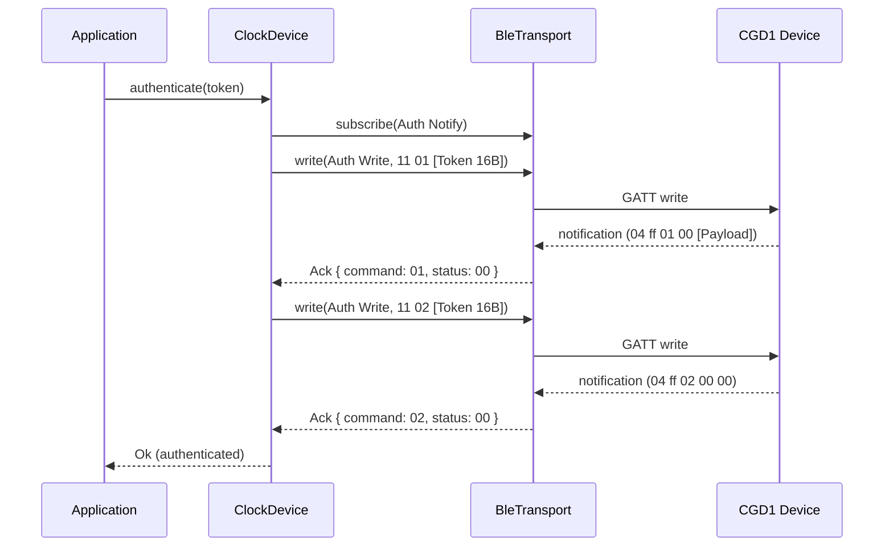

# Authentication

The CGD1 uses a two-step token handshake on the Auth characteristics. Once paired, the same 16-byte token must be used for all future connections.

## Protocol



### Steps

1. **Subscribe** to Auth Notify (`00000002-...`)
2. **Auth Init**: Send `11 01 [Token 16B]` to Auth Write
3. **Wait for ACK**: `04 ff 01 00 [Payload]` (status `00` = success)
4. **Auth Confirm**: Send `11 02 [Token 16B]` to Auth Write
5. **Wait for final ACK**: `04 ff 02 00 00`

## Token Management

### Token Generation

A new 16-byte random token is generated for first-time pairing using `rand::random()`.

### Token Persistence

Tokens are stored in a file-based store, keyed by MAC address. The default directory is platform-dependent (via `dirs` crate):

- **Linux**: `~/.local/share/cgd1-rs/tokens/`
- **macOS**: `~/Library/Application Support/cgd1-rs/tokens/`

### Persistence Rule

> A newly generated token is only persisted after a privileged command (e.g., `sync_time`) succeeds. An Auth Confirm ACK alone does not prove the token was accepted — the device may send an ACK even with a bad token.

The `sync-time` CLI command uses `connect_with_store`, which persists the token only after `sync_time_now()` succeeds:

```rust
let (connection, store) = DeviceConnection::connect_with_store(&args.address).await?;
connection.device().sync_time_now().await?;

if token_result.is_new() {
    store.save(&args.address, &token_result)?;
}
```

### Auth Failure

If authentication fails, `AuthFailedError` provides actionable context:

| Field | Description |
|---|---|
| `reason` | Human-readable failure reason |
| `is_new_token` | Whether the token was newly generated (not yet paired) |
| `token_path` | Filesystem path where the token would be stored |

The CLI renders this as a `miette` diagnostic with suggestions.

## Using the Library

```rust
use cgd1_rs::{BtleplugTransport, ClockManager, FileTokenStore, MacAddress, TokenStore};
use std::sync::Arc;

let transport = Arc::new(BtleplugTransport::new().await?);
let manager = ClockManager::new(transport.clone());
let device = manager.connect(&mac).await?;

let store = Arc::new(FileTokenStore::default_directory());
let token_result = store.load_or_generate(&mac);

device.set_token_store(store.clone() as Arc<dyn TokenStore>);
device.authenticate(&token_result).await?;

// Token is confirmed only after a privileged command succeeds
device.sync_time_now().await?;

if token_result.is_new() {
    store.save(&mac, &token_result)?;
}
```

## Firmware Version

After authentication, the firmware version can be queried:

```rust
let firmware: String = device.read_firmware().await?;
println!("Firmware: {}", firmware);
```

Protocol: Send `01 0d` to Auth Write, receive `0b [Byte] [ASCII String]` on Auth Notify.

Known firmware versions: `1.0.1_0046`, `1.0.1_0063`, `1.0.1_0067`, `1.0.1_0126`, `1.0.1_0130`, `1.0.1_0132`.
