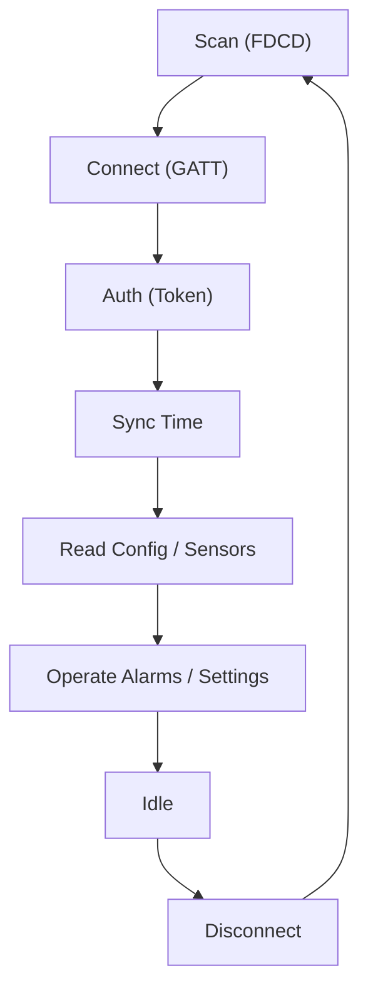

# BLE Protocol

This chapter summarizes the Qingping CGD1 BLE protocol as implemented by `cgd1-rs`. For the full reverse-engineered specification, see [BLE.md](https://github.com/smearor/cgd1-rs/blob/main/docs/BLE.md).

## GATT Service & Characteristics

### Custom Primary Service

```
22210000-554a-4546-5542-46534450466d
```

### Characteristics

| Name | UUID | Direction |
|---|---|---|
| Auth Write | `00000001-0000-1000-8000-00805f9b34fb` | Host → Device |
| Auth Notify | `00000002-0000-1000-8000-00805f9b34fb` | Device → Host |
| Data Write | `0000000b-0000-1000-8000-00805f9b34fb` | Host → Device |
| Data Notify | `0000000c-0000-1000-8000-00805f9b34fb` | Device → Host |
| Sensor Notify | `00000100-0000-1000-8000-00805f9b34fb` | Device → Host |

### Standard Services

| Service | UUID | Characteristic | UUID | Format |
|---|---|---|---|---|
| Battery | `0x180f` | Battery Level | `0x2a19` | 1 byte (0–100%) |

## Frame Format

Every frame follows the same structure:

```
Request:  [Length] [Command] [Payload...]
ACK:      04 ff [Command] [Status] [Payload 1B]
```

The length byte counts the bytes that follow it. An ACK is always exactly 5 bytes: `04 ff [Command] [Status] [Payload]`. Status `00` means success.

## Command Summary

| Length | Command | Operation | Characteristic |
|---|---|---|---|
| `0x11` | `0x01` | Auth Init | Auth Write |
| `0x11` | `0x02` | Auth Confirm | Auth Write |
| `0x05` | `0x09` | Time Sync | Auth Write |
| `0x01` | `0x0d` | Read Firmware | Auth Write |
| `0x01` | `0x02` | Read Settings | Data Write |
| `0x13` | `0x01` | Set Settings | Data Write |
| `0x02` | `0x03` | Set Brightness | Data Write |
| `0x01` | `0x04` | Preview Ringtone (current vol) | Data Write |
| `0x02` | `0x04` | Preview Ringtone (specific vol) | Data Write |
| `0x01` | `0x06` | Read Alarms | Data Write |
| `0x07` | `0x05` | Set/Delete Alarm | Data Write |
| `0x08` | `0x10` | Audio Init | Data Write |
| `0x81` | `0x08` | Audio Data Packet | Data Write |

## Connection Lifecycle



### Passive vs Connected

- **Passive (no connection)**: Sensor data (temperature, humidity, battery) via BLE advertisements with `FDCD` service-data UUID. No authentication required.
- **Connected**: Authentication required for all write operations. Sensor data also available via real-time notify characteristic. Battery via standard GATT battery service.

For protocol details on each operation, see the dedicated chapters: [Authentication](./authentication.md), [Alarms](./alarms.md), [Settings](./settings.md), [Sensors & Battery](./sensors.md), [Audio Upload](./audio.md).
