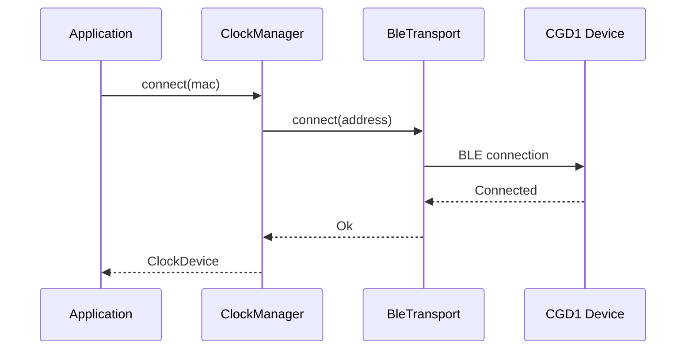

# Scanning & Connecting

## Device Discovery

The CGD1 broadcasts BLE advertisements with the ClearGrass/Qingping service-data UUID `0xFDCD`. These advertisements carry sensor data (temperature, humidity, battery) and the device MAC address, allowing discovery without a connection.

### Scanning with the CLI

```bash
cgd1 scan --duration 10
```

The `--duration` flag accepts values from 1 to 600 seconds (default: 10).

Output:

```
Scanning for 10s...
Found 1 device(s):
  MAC: AA:BB:CC:DD:EE:FF
    Temperature: 23.4 C
    Humidity: 45.6 %
    Battery: 87 %
```

### Scanning with the Library

```rust
use cgd1_rs::{BtleplugTransport, ClockScanner, BleTransport};
use std::sync::Arc;
use std::time::Duration;

let transport = Arc::new(BtleplugTransport::new().await?);
let scanner = ClockScanner::new(transport);

let devices = scanner.scan_active(Duration::from_secs(10)).await?;

for device in &devices {
    println!("MAC: {}", device.address);
    if let Some(ad) = &device.advertisement {
        println!("  Temperature: {:.1} C", ad.temperature.value());
        println!("  Humidity: {:.1} %", ad.humidity.value());
        println!("  Battery: {} %", ad.battery.value());
    }
}
```

### Advertisement Data

The `AdvertisementData` struct is parsed from the raw service-data payload:

| Field | Type | Scaling |
|---|---|---|
| MAC | 6 bytes (reversed) | — |
| Temperature | Int16 BE | / 10 (°C) |
| Humidity | UInt16 BE | / 10 (%) |
| Battery | UInt8 | & 0x7F (mask bit 7) |

## Connecting

### Connection Flow



### Connecting with the Library

```rust
use cgd1_rs::{BtleplugTransport, ClockManager, MacAddress};
use std::sync::Arc;

let transport = Arc::new(BtleplugTransport::new().await?);
let manager = ClockManager::new(transport);

let mac: MacAddress = "AA:BB:CC:DD:EE:FF".parse()?;
let device = manager.connect(&mac).await?;
```

`ClockManager` tracks connected devices by MAC address. Calling `connect` on an already-connected device returns the existing handle.

### Multi-Device Management

`ClockManager` supports simultaneous connections to multiple CGD1 devices:

```rust
let device_a = manager.connect(&mac_a).await?;
let device_b = manager.connect(&mac_b).await?;

// Both devices are now connected and can be operated independently
device_a.sync_time_now().await?;
device_b.read_alarms().await?;
```

### Disconnecting

```rust
manager.disconnect(&mac).await?;
```

This tears down the BLE connection and stops the notification task for that device.

### Virtual Backend (Testing)

For testing without hardware, use the `virtual` backend:

```bash
cgd1 --backend virtual scan
cgd1 --backend virtual sync-time AA:BB:CC:DD:EE:FF
```

The virtual backend simulates a CGD1 device in memory, responding to all commands with appropriate ACKs and maintaining alarm/settings state.
