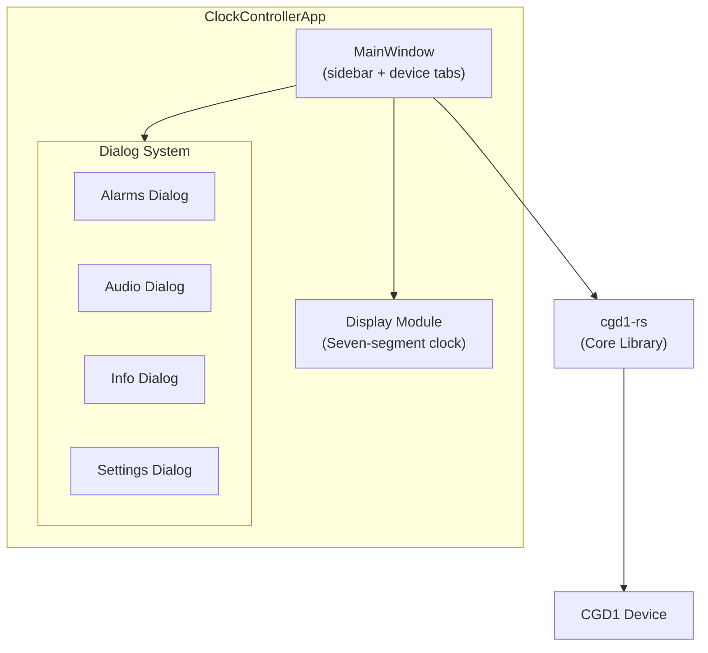

# Controller

The `cgd1-rs-controller` crate is a GTK 4 desktop application for managing CGD1 devices. It provides a graphical interface for scanning, connecting, viewing sensor data, editing alarms, adjusting settings, and uploading ringtones.

## Installation

```bash
# Install GTK 4 development libraries first (see Getting Started)
cargo build --release -p cgd1-rs-controller
```

Run the application:

```bash
cargo run --release -p cgd1-rs-controller
```

## Architecture



### ClockControllerApp

The main `gtk4::Application` subclass. Manages the application lifecycle, window creation, and device connections.

### MainWindow

The main window features a sidebar for device management and a tabbed content area. Each connected device gets its own tab showing:

- **Clock display** - Seven-segment style time display using a custom font
- **Sensor cards** - Temperature, humidity, and battery
- **Device info** - Firmware version, MAC address

### Dialog System

Instead of separate widget files, the controller uses a modular `dialog/` directory:

- **`dialog/alarms.rs`** - Alarm editor dialog with 16 slot rows, each showing time, repeat mask, and snooze toggle
- **`dialog/audio.rs`** - Ringtone upload dialog with file picker and signature selection
- **`dialog/info.rs`** - Device information dialog (firmware, battery, MAC)
- **`dialog/settings.rs`** - Settings panel with sliders, spin buttons, and combo boxes for all device settings

### Display Module

The `display/` directory contains a custom seven-segment clock widget (`seven_segment.rs`) that renders the time using a DSEG7 font. The font files are bundled as assets:

- `assets/fonts/DSEG7Classic-Regular.ttf`
- `assets/fonts/DSEG7Classic-Light.ttf`

## Event Loop Integration

The GTK controller bridges async BLE operations with the GTK event loop using `glib::MainContext::spawn_local`. All spawned tasks accept a `CancellationToken` so they can be aborted when the associated view is closed:

```rust
fn watch_sensor_events(
    device: ClockDevice,
    sensor_card: SensorCard,
    cancel_token: tokio_util::sync::CancellationToken,
) {
    let mut receiver = device.subscribe();
    spawn_local(async move {
        loop {
            tokio::select! {
                biased;
                _ = cancel_token.cancelled() => break,
                event = receiver.recv() => {
                    match event {
                        Ok(ClockEvent::SensorUpdate { temperature, humidity }) => {
                            glib::idle_add_local_once(move || {
                                sensor_card.update(temperature, humidity);
                            });
                        }
                        Ok(ClockEvent::Disconnected) => break,
                        _ => {}
                    }
                }
            }
        }
    });
}
```

## Features

### Device Scanning

The scan dialog shows nearby devices with their advertisement data (temperature, humidity, battery). Clicking a device initiates connection and authentication. The scan callback also persists battery data from advertising to `KnownDeviceStore` and updates the `scan_battery_cache`.

### Known Device Store

The controller maintains a `KnownDeviceStore` that persists:

- **Known device MAC addresses** (`known_devices.json`) - Used to populate the device dropdown on startup and attempt automatic reconnection.
- **Battery levels** (`battery_cache.json`) - Map of MAC address to battery percentage, updated during scans and loaded on startup.

Both files are stored in the platform data directory (e.g., `~/.local/share/cgd1-rs/`).

### Sensor Monitoring

Real-time temperature and humidity are displayed via sensor cards that update from the `ClockEvent` stream. Battery level is shown with a percentage label and progress bar.

### Battery Display

The controller does **not** read battery from GATT (the CGD1's Battery Service characteristic returns an unreliable 99%). Instead, battery data is sourced from BLE advertising scans:

1. **On startup**, `KnownDeviceStore::load_battery()` populates the in-memory `scan_battery_cache` from `battery_cache.json`.
2. **During scans**, the scan callback extracts battery from advertising TLV type `0x02`, updates `scan_battery_cache`, and persists via `KnownDeviceStore::save_battery()`.
3. **On connect**, the connect handler reads the cached battery value and sends `ClockEvent::BatteryLevel` to update the UI.

The device only advertises battery data when **not connected** and the button is held for 3 seconds. Periodic scans (every 60 seconds when disconnected) keep the cache fresh.

### Bluetooth Icon States

The Bluetooth icon in the top-right corner reflects the connection state:

| State                     | CSS Class            | Visual                        | When                                                          |
|---------------------------|----------------------|-------------------------------|---------------------------------------------------------------|
| Disconnected              | `bluetooth-off`      | Dim gray, 40% opacity         | Initial state, after manual disconnect, after connect failure |
| Connecting / Reconnecting | `bluetooth-blinking` | Blinking animation (1s cycle) | During initial connect, during automatic reconnect            |
| Connected                 | *(none)*             | Full color, solid             | After successful connect or reconnect                         |

The icon transitions through these states as follows:
- **Initial** → `bluetooth-off`
- **Connect switch toggled on** → `bluetooth-blinking`
- **Connect succeeds** → solid (remove `bluetooth-blinking` and `bluetooth-off`)
- **Connect fails** → `bluetooth-off`
- **Manual disconnect** → `bluetooth-off`
- **`ClockEvent::Disconnected` (auto)** → `bluetooth-blinking` (reconnect in progress)
- **`ClockEvent::Reconnected`** → solid (remove `bluetooth-blinking` and `bluetooth-off`)

### Alarm Editing

The alarm editor dialog shows all 16 slots in a list. Each row displays:
- Slot index
- Time (HH:MM)
- Repeat mask (as day names)
- Enabled toggle
- Snooze toggle

Editing a row sends the updated alarm to the device immediately.

### Settings Panel

The settings dialog provides graphical controls for all device settings:

- **Volume** - Slider (1–5)
- **Brightness** - Slider (0–100, step 10)
- **Night brightness** - Slider (0–100, step 10)
- **Night mode window** - Hour/minute spin buttons for start and end
- **Timezone** - Spin button (-720 to +840 minutes)
- **Time format** - Combo box (12h / 24h)
- **Temperature unit** - Combo box (°C / °F)
- **Language** - Combo box (English, Chinese, German, Japanese)
- **Ringtone** - Combo box with built-in and custom ringtones

Changes are applied immediately to the device.

### Ringtone Upload

The audio dialog provides a file picker for selecting a PCM audio file and a signature selector for choosing the target slot. The upload progress is shown with a progress bar.

## CSS Styling

The application uses CSS classes for styling:

```css
.sensor-card {
    padding: 12px;
    border-radius: 8px;
    background-color: @theme_base_color;
}

.alarm-slot-row {
    padding: 6px 12px;
}

.settings-panel scale {
    margin: 6px 0;
}
```

## Platform Support

The GTK 4 controller requires Linux with GTK 4 development libraries. It is not supported on macOS or Windows.
