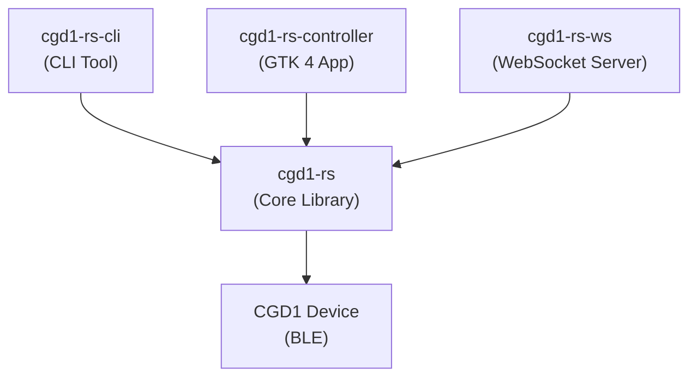

# Introduction

**cgd1-rs** is a Rust library and toolkit for the Qingping CGD1 Bluetooth alarm clock. It provides a complete BLE transport layer, command protocol implementation, and three frontends: a command-line tool, a GTK 4 desktop application, and a WebSocket/REST server.

## Supported Hardware

The Qingping CGD1 is a Bluetooth 5.0 LCD alarm clock with built-in temperature and humidity sensors. It is manufactured by ClearGrass/Qingping.

| Property | Value |
|---|---|
| Model | CGD1 |
| Connectivity | Bluetooth 5.0 (BLE) |
| Sensors | Temperature, humidity (Sensirion) |
| Power | 2 × AA batteries, > 1 year standby |
| Display | LCD with adjustable backlight |
| Alarm slots | Up to 16 |
| Custom ringtones | 2 slots, ~12 s / 98 KB max |

See [Hardware Notes](https://github.com/smearor/cgd1-rs/blob/main/docs/HARDWARE.md) for full specifications.

## Features

- **BLE transport**: Scan, connect, authenticate, and communicate with the CGD1 via Bluetooth Low Energy
- **Time synchronization**: Sync the device clock to the current system time
- **Alarm management**: Read, set, and delete up to 16 alarms with day-of-week repeat masks and snooze
- **Device settings**: Read and write volume, brightness, timezone, time format, temperature unit, language, night mode, and screen duration
- **Sensor monitoring**: Real-time temperature and humidity via BLE notifications, plus passive advertisement parsing
- **Battery monitoring**: Read battery level via the standard GATT battery service
- **Audio upload**: Upload custom ringtones (8-bit PCM, 8 kHz, mono) via the block-based BLE protocol
- **Firmware query**: Read the device firmware version string
- **Reconnection**: Automatic reconnection with exponential backoff and full state recovery

## Crates

| Crate | Description |
|---|---|
| `cgd1-rs` | Core library: BLE transport, auth, commands, events, device handle |
| `cgd1-rs-cli` | Command-line tool with 14 subcommands and interactive REPL |
| `cgd1-rs-controller` | GTK 4 desktop application with sensor display, alarm editor, and settings panel |
| `cgd1-rs-ws` | WebSocket and REST server for network access to the device |

## Architecture Overview

All three frontends build on the same core library, which abstracts the BLE protocol, authentication, and command/response handling. See [Architecture](./architecture.md) for details.

## License

MIT. See [LICENSE](https://github.com/smearor/cgd1-rs/blob/main/LICENSE).
