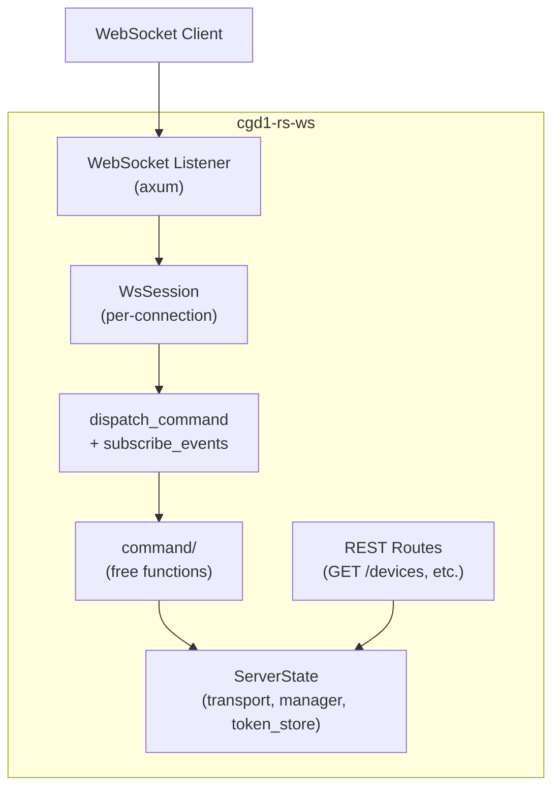

# WebSocket Server

The `cgd1-rs-ws` crate provides a WebSocket and REST server built on Axum. It exposes the full CGD1 device API over JSON for network integration (e.g., Home Assistant, web dashboards).

## Installation

```bash
cargo install --path cgd1-rs-ws
```

## Starting the Server

```bash
cgd1-ws --address 0.0.0.0 --port 3000
```

| Flag | Default | Description |
|---|---|---|
| `--address` | `0.0.0.0` | Bind address |
| `--port` | `3000` | Listen port |
| `-v, --verbose` | 0 | Verbosity level (0–3) |

## Architecture



### ServerState

`ServerState` owns the BLE transport, device manager, and token store. It is `Clone` (via `Arc`) and shared across all connections:

```rust
pub struct ServerState {
    transport: Arc<BtleplugTransport>,
    manager: Arc<ClockManager>,
    token_store: Arc<FileTokenStore>,
}
```

### WsSession

Each WebSocket connection creates a `WsSession` that processes incoming JSON requests and sends JSON responses. Per-message tasks are spawned with `tokio::spawn` for concurrent command handling.

## WebSocket Protocol

### Request Format

```json
{
  "id": 1,
  "command": {
    "type": "scan",
    "duration_secs": 10
  }
}
```

The `id` field is used to match responses to requests. The `command` field uses a tagged enum with `snake_case` serialization.

### Response Format

```json
{
  "id": 1,
  "result": { ... },
  "error": null
}
```

Error responses:

```json
{
  "id": 1,
  "result": null,
  "error": "device AA:BB:CC:DD:EE:FF is not connected"
}
```

### Commands

| Command | Parameters | Description |
|---|---|---|
| `scan` | `duration_secs` | Scan for devices |
| `connect` | `address` | Connect and authenticate |
| `disconnect` | `address` | Disconnect from device |
| `sync_time` | `address` | Synchronize device clock |
| `read_alarms` | `address` | Read all alarm slots |
| `set_alarm` | `address`, `slot`, `time`, `repeat_mask`, `enabled`, `snooze` | Set an alarm |
| `delete_alarm` | `address`, `slot` | Delete an alarm |
| `read_settings` | `address` | Read device settings |
| `write_settings` | `address`, `settings` | Write device settings |
| `set_brightness` | `address`, `value` | Set immediate brightness |
| `preview_ringtone` | `address`, `volume` (optional) | Preview ringtone |
| `read_firmware` | `address` | Read firmware version |
| `read_battery` | `address` | Read battery level |
| `subscribe_events` | `address` | Subscribe to push events |

All address fields use the `MacAddress` newtype (colon-separated hex). Duration uses `ScanDuration` (1–600 seconds). Slot indices use `AlarmSlotIndex` (0–15). Brightness uses `Brightness` (0–150, multiple of 10).

### Event Subscription

After sending `subscribe_events`, the server pushes `WsEvent` messages to the client:

```json
{
  "event": "sensor_update",
  "data": {
    "temperature": 23.4,
    "humidity": 45.6
  }
}
```

Event types:

| Event | Payload | Description |
|---|---|---|
| `sensor_update` | `temperature`, `humidity` | Real-time sensor data |
| `battery_level` | `level` | Battery level change |
| `disconnected` | (empty) | Device disconnected |
| `reconnected` | (empty) | Device reconnected |
| `ack` | `command`, `status` | Command ACK from device |
| `advertisement` | (full advertisement data) | Passive advertisement received |

## REST API

Read-only endpoints are available via REST:

| Method | Path | Description |
|---|---|---|
| `GET` | `/health` | Server health check |
| `GET` | `/api/devices` | List connected devices |
| `GET` | `/api/devices/{address}/sensors` | Latest sensor data |
| `GET` | `/api/devices/{address}/battery` | Battery level |
| `GET` | `/api/devices/{address}/firmware` | Firmware version |
| `GET` | `/api/devices/{address}/alarms` | All alarms |
| `GET` | `/api/devices/{address}/settings` | Device settings |

Path parameters use `{address}` syntax (Axum 0.8+). The address is a MAC address in colon-separated hex format (e.g., `AA:BB:CC:DD:EE:FF`).

### Example: REST Request

```bash
curl http://localhost:3000/api/devices/AA:BB:CC:DD:EE:FF/sensors
```

Response:

```json
{
  "temperature": 23.4,
  "humidity": 45.6
}
```

### Example: WebSocket Session

```javascript
const ws = new WebSocket("ws://localhost:3000/ws");

ws.onopen = () => {
  // Connect to a device
  ws.send(JSON.stringify({
    id: 1,
    command: { type: "connect", address: "AA:BB:CC:DD:EE:FF" }
  }));

  // Subscribe to events
  ws.send(JSON.stringify({
    id: 2,
    command: { type: "subscribe_events", address: "AA:BB:CC:DD:EE:FF" }
  }));
};

ws.onmessage = (event) => {
  const msg = JSON.parse(event.data);
  if (msg.result !== null) {
    console.log("Response:", msg);
  } else if (msg.event) {
    console.log("Event:", msg);
  }
};
```

## Error Handling

`ServerError` converts to HTTP status codes for REST endpoints:

| Error | Status Code |
|---|---|
| `NotConnected` | 404 |
| `Json` parse error | 400 |
| `Core` (BLE/library errors) | 500 |

WebSocket errors are returned in the `error` field of the JSON response.
