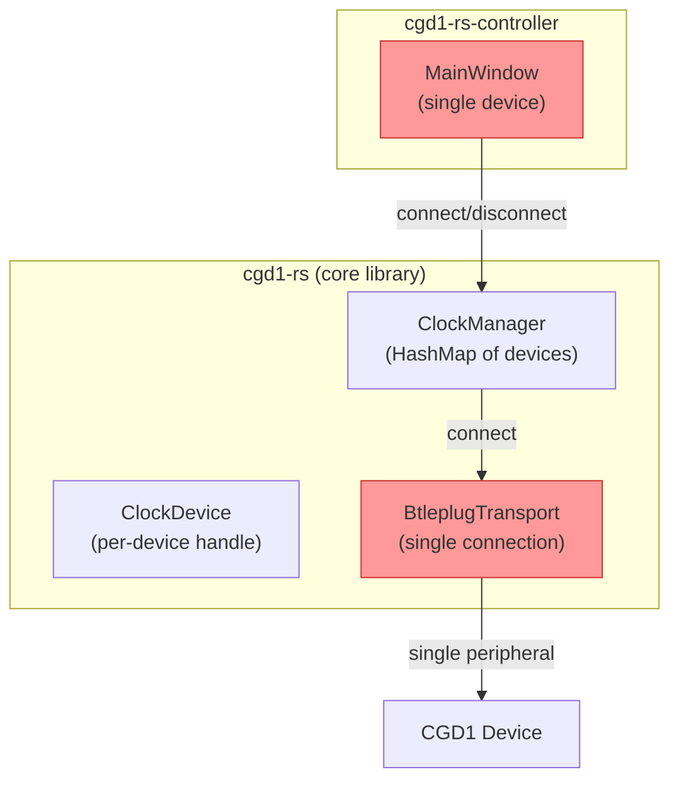
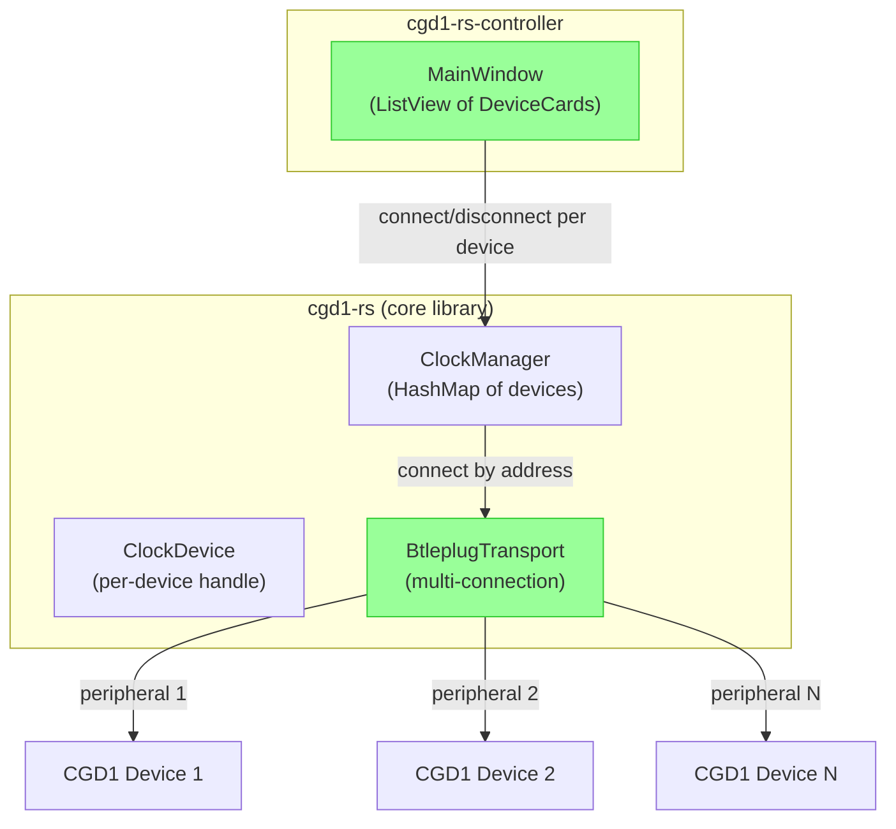
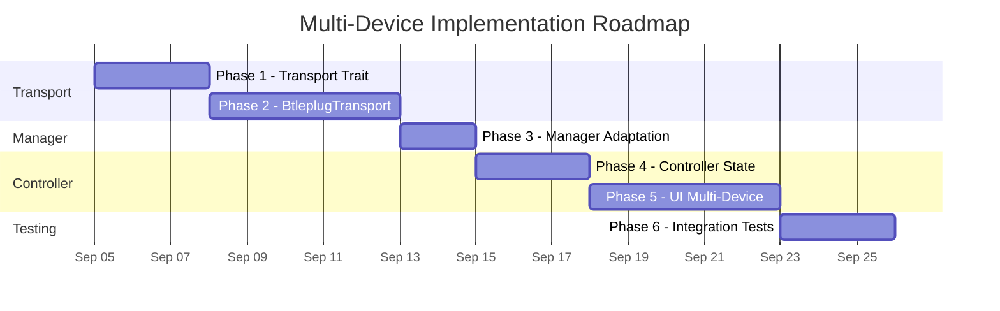
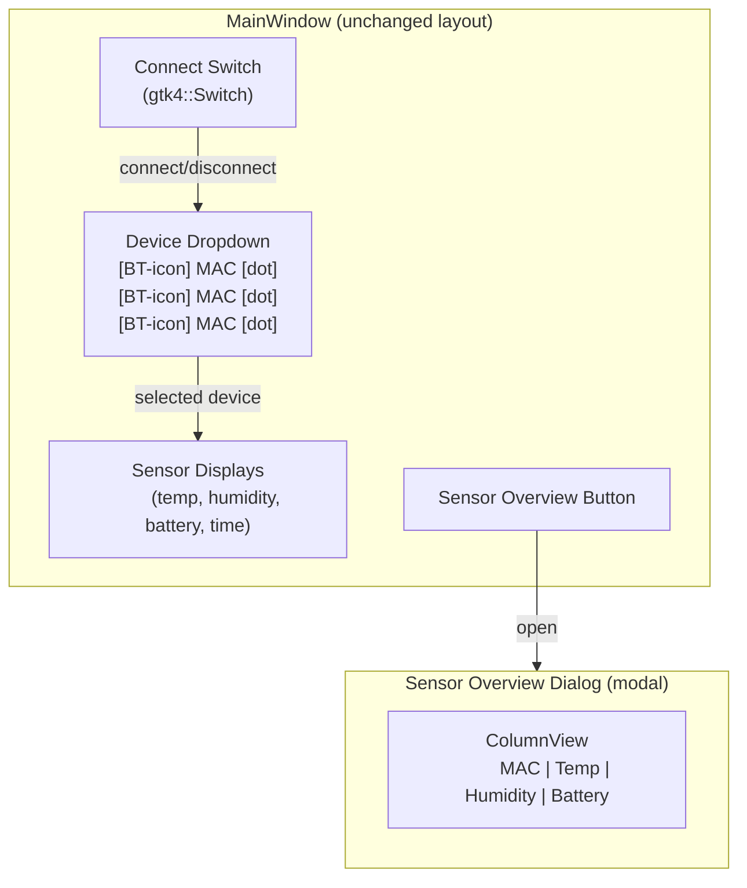
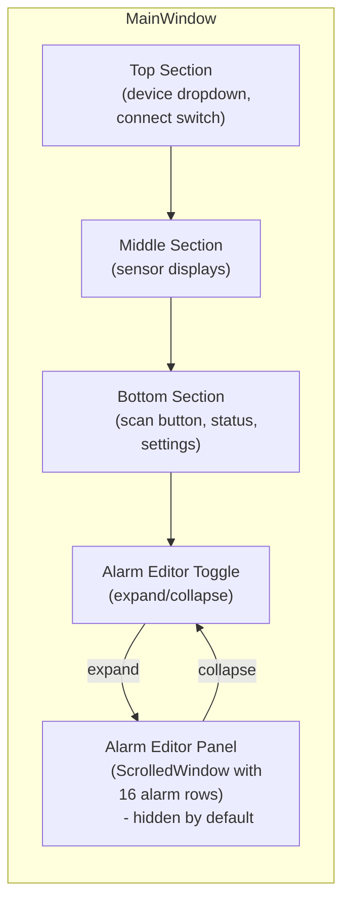

# Multi-Device Support Concept

Enable the `cgd1-rs-controller` application to connect to, display, and manage
multiple CGD1 alarm clocks simultaneously.

## Motivation

The current architecture limits the system to a single active BLE connection.
The `ClockManager` already maintains a `HashMap<MacAddress, ClockDevice>` and
supports multiple devices at the library level, but the `BleTransport` trait
and `BtleplugTransport` implementation enforce a single connection through:

- A single `connected: AtomicBool` flag
- A single `state.peripheral: Option<Peripheral>`
- A single `notification_stream: Option<NotificationStream>`

The controller UI is similarly single-device: one set of displays, one connect
toggle, one `connected_address: Option<MacAddress>`, one `last_data_time`.

This concept describes the changes needed across all layers to support
multiple simultaneous device connections.

## Current Architecture



Red-highlighted components are single-device bottlenecks.

## Target Architecture



## Implementation Phases



---

## Phase 1 - Transport Trait Refactoring

### Goal

Add an `address` parameter to all connection-scoped methods in the
`BleTransport` trait, so each call explicitly targets a specific device.

### Trait Changes

The current trait uses implicit "current connection" semantics. The new trait
makes the target device explicit:

```rust
#[async_trait]
pub trait BleTransport: Send + Sync {
    // Scanning - unchanged (not connection-scoped)
    async fn start_scan(&self, filter_uuid: Uuid) -> Result<()>;
    async fn stop_scan(&self) -> Result<()>;
    async fn next_advertisement(&self) -> Option<AdvertisementData>;

    // Connection - now address-scoped
    async fn connect(&self, address: &MacAddress) -> Result<()>;
    async fn disconnect(&self, address: &MacAddress) -> Result<()>;
    fn is_connected(&self, address: &MacAddress) -> bool;

    // Write/Subscribe/Read - now address-scoped
    async fn write(&self, address: &MacAddress, characteristic: CharacteristicUuid, data: &[u8]) -> Result<()>;
    async fn subscribe(&self, address: &MacAddress, characteristic: CharacteristicUuid) -> Result<()>;
    async fn read(&self, address: &MacAddress, characteristic: CharacteristicUuid) -> Result<Vec<u8>>;

    // Notifications - now address-scoped
    async fn next_notification(&self, address: &MacAddress) -> Option<(Uuid, Vec<u8>)>;

    // MTU - now address-scoped
    async fn request_mtu(&self, address: &MacAddress, mtu: u16) -> Result<u16>;

    // Convenience methods - updated default implementations
    async fn write_command(&self, address: &MacAddress, command: Command, data: &[u8]) -> Result<()> {
        self.write(address, command.characteristic(), data).await
    }

    async fn write_frame(&self, address: &MacAddress, command: Command, payload: &[u8]) -> Result<()> {
        let frame = CommandFrame::from_command(command, payload.to_vec());
        let encoded = frame.encode();
        self.write(address, command.characteristic(), &encoded).await
    }
}
```

### Notification Routing

The current `next_notification()` returns notifications from the single
connected peripheral. With multiple peripherals, each has its own
notification stream. The new `next_notification(address)` returns
notifications only from the specified device's stream.

Each `ClockDevice` notification task already calls
`transport.next_notification()` in a loop. With the address parameter, it
calls `transport.next_notification(&self.address)` and receives only its
own notifications.

### Backward Compatibility

This is a **breaking change** to the `BleTransport` trait. All implementors
must be updated:

- `BtleplugTransport` - Phase 2
- `MockBleTransport` - update method signatures
- `VirtualClockTransport` - already tracks devices by address internally,
  needs signature updates only

---

## Phase 2 - BtleplugTransport Multi-Connection

### Goal

Replace single-connection state with per-device state in `BtleplugTransport`.

### State Changes

```rust
/// Per-device connection state.
struct DeviceConnection {
    /// The btleplug peripheral handle.
    peripheral: Peripheral,
    /// Discovered GATT characteristics keyed by UUID.
    characteristics: HashMap<Uuid, Characteristic>,
    /// Notification stream for this peripheral.
    notification_stream: NotificationStream,
}

/// btleplug implementation supporting multiple simultaneous connections.
pub struct BtleplugTransport {
    adapter: Adapter,
    /// Per-device connection state, keyed by MAC address.
    connections: Mutex<HashMap<MacAddress, DeviceConnection>>,
    /// Event stream for scan advertisements.
    event_stream: Mutex<Option<EventStream>>,
    /// Service-data UUID to filter advertisements by.
    scan_filter_uuid: Mutex<Option<Uuid>>,
}
```

### Method Implementations

#### `connect(address)`

1. Check `connections` - if address already present, return `AlreadyConnected`
2. Find peripheral via `adapter.peripherals()`
3. `peripheral.connect().await`
4. `peripheral.discover_services().await`
5. Build characteristics map
6. `peripheral.notifications().await` → notification stream
7. Insert `DeviceConnection` into `connections` map

#### `disconnect(address)`

1. Remove `DeviceConnection` from `connections` map
2. `peripheral.disconnect().await` (best-effort, log errors)

#### `write(address, characteristic, data)`

1. Look up `DeviceConnection` by address
2. Find characteristic in `connection.characteristics`
3. `peripheral.write(&char, data, WriteType::WithResponse).await`

#### `subscribe(address, characteristic)`

1. Look up `DeviceConnection` by address
2. `peripheral.subscribe(&char).await`

#### `next_notification(address)`

1. Look up `DeviceConnection` by address
2. `connection.notification_stream.next().await`
3. Return `Some((uuid, value))` or `None` if stream ended

#### `is_connected(address)`

1. Check if `connections` contains the address

### Migration of `TransportState`

The current `TransportState` struct is replaced by `DeviceConnection`. The
`scan_filter_uuid` field moves to a top-level `Mutex<Option<Uuid>>` on
`BtleplugTransport` since scanning is not connection-scoped.

---

## Phase 3 - Manager Adaptation

### Goal

Update `ClockManager` method signatures to pass `address` through to the
transport layer.

### Current State

`ClockManager` already tracks devices by address in a `HashMap`. The
`connect()` method calls `transport.connect(address)` which already takes
an address. The main changes are in methods that call `transport.write()`,
`transport.subscribe()`, `transport.read()`, and
`transport.next_notification()` - these now need the address parameter.

### Changes

```rust
impl ClockManager {
    pub async fn connect(&self, address: &MacAddress) -> Result<ClockDevice> {
        // transport.connect(address) - unchanged
        // device.spawn_notification_task() - device now passes its address
        //   to transport.next_notification(&address) internally
    }

    pub async fn disconnect(&self, address: &MacAddress) -> Result<()> {
        // transport.disconnect(address) - updated signature
    }
}
```

### `ClockDevice` Changes

`ClockDevice` already stores its `address`. The `notification_task` function
must pass `address` to `transport.next_notification()`:

```rust
async fn notification_task(
    transport: Arc<dyn BleTransport>,
    address: MacAddress,  // new parameter
    event_sender: broadcast::Sender<ClockEvent>,
    // ... other params
) {
    loop {
        match transport.next_notification(&address).await {
            Some((uuid, value)) => { /* ... */ }
            None => { /* reconnect logic */ }
        }
    }
}
```

All `transport.write_*()`, `transport.subscribe()`, and `transport.read()`
calls in `ClockDevice` methods must pass `&self.address`.

---

## Phase 4 - Controller State Refactoring

### Goal

Replace single-device state with per-device state tracking.

### Current State (Single-Device)

```rust
pub struct MainWindow {
    connected_address: Arc<Mutex<Option<MacAddress>>>,
    last_data_time: Arc<Mutex<Option<Instant>>>,
    // ... single set of displays
}
```

### New State (Multi-Device)

```rust
/// Per-device runtime state.
struct DeviceRuntimeState {
    /// Whether the device is currently connected.
    connected: bool,
    /// Timestamp of the last sensor or battery data received.
    last_data_time: Option<Instant>,
    /// Number of consecutive scans in which the device was not seen.
    missed_scans: u32,
}

pub struct MainWindow {
    /// Per-device runtime state, keyed by MAC address.
    device_states: Arc<Mutex<HashMap<MacAddress, DeviceRuntimeState>>>,
    /// Known device addresses from scans and persisted store.
    known_devices: Arc<Mutex<Vec<MacAddress>>>,
    /// Persistent store of previously connected device addresses.
    known_device_store: Arc<KnownDeviceStore>,
    /// Timestamp of the last scan initiation.
    last_scan_time: Arc<Mutex<Option<Instant>>>,
    // ... UI widgets (see Phase 5)
}
```

### Stale-Data Detection

The periodic stale-data check iterates over all connected devices:

```rust
glib::timeout_add_local(Duration::from_secs(10), move || {
    let mut states = device_states.lock().expect("mutex poisoned");
    for (addr, state) in states.iter_mut() {
        if state.connected {
            if let Some(t) = state.last_data_time {
                if t.elapsed() > Duration::from_secs(120) {
                    warn!(address = %addr, "stale data, disconnecting");
                    // Trigger disconnect for this specific device
                }
            }
        }
    }
    glib::ControlFlow::Continue
});
```

### Reconnect Logic

Reconnect attempts are per-device. After a stale-data disconnect, schedule a
reconnect for that specific address (same 5-second delay as current).

---

## Phase 5 - UI: Device Switcher Dropdown

### Goal

Keep the existing single-device main layout, but enhance the device dropdown
with per-entry status indicators and replace the connect toggle button with a
lightweight switch. Add a sensor overview dialog for a tabular all-devices
view.

### Design Rationale

Three UI approaches were considered:

| Approach | Parallel visibility | Layout change | Effort |
|---|---|---|---|
| **A - Cards** (ListView of DeviceCards) | All devices at once | Major | High |
| **B - Tabs** (Notebook per device) | One at a time | Medium | Medium |
| **C - Dropdown** (Device Switcher) | One at a time | Minimal | Low |

Option C was chosen because:

- The main layout stays unchanged - minimal risk and effort.
- Per-device status is visible when the dropdown is opened, compensating for
  the "one device visible" limitation.
- A sensor overview dialog provides the all-devices-at-a-glance view without
  permanent screen space.
- The transport and manager changes (Phases 1-4) deliver the real
  multi-device value; the UI change is incremental.

### UI Layout



### Enhanced Dropdown Entries

Each dropdown entry shows three elements side by side:

```
[Bluetooth-Icon]  58:2d:34:82:cc:81  [Connection-Dot]
```

| State | Bluetooth Icon | Connection Dot |
|---|---|---|
| Available + Connected | `bluetooth-active` (blue) | Green filled circle |
| Available + Disconnected | `bluetooth-active` (blue) | Grey hollow circle |
| Not available (offline) | `bluetooth-disabled` (grey) | Grey hollow circle |

Implementation with `SignalListItemFactory` on the `DropDown`:

```rust
let factory = SignalListItemFactory::new();

factory.connect_setup(move |_, item| {
    let row = gtk4::Box::builder()
        .orientation(gtk4::Orientation::Horizontal)
        .spacing(6)
        .margin_start(6)
        .margin_end(6)
        .build();
    let bt_icon = gtk4::Image::new();
    let addr_label = gtk4::Label::new(None);
    let dot = gtk4::Image::new();
    row.append(&bt_icon);
    row.append(&addr_label);
    row.append(&dot);
    item.set_child(Some(&row));
});

factory.connect_bind(move |_, item| {
    // Read DeviceInfoObject from item
    // bt_icon: "bluetooth-active" if available, "bluetooth-disabled" if offline
    // dot: "emblem-default" (green) if connected, grey circle if not
    // addr_label: MAC address string
});
```

GTK4 standard icon names: `bluetooth-active`, `bluetooth-disabled`,
`emblem-default` (green checkmark), `emblem-unreadable` (grey).
Alternatively, the connection dot can reuse the existing CSS-styled `Box`
widget pattern from `connect_dot`.

### Connect Switch

Replace `gtk4::ToggleButton` with `gtk4::Switch` for a lighter, native
ON/OFF semantics:

```rust
let switch = gtk4::Switch::builder()
    .tooltip_text("Connect / Disconnect")
    .build();

switch.connect_active_notify(move |sw| {
    let address = get_selected_address();
    if sw.is_active() {
        // connect to selected device
    } else {
        // disconnect selected device
    }
});
```

The switch acts on the currently selected dropdown device. Switching devices
in the dropdown updates the switch state to reflect the selected device's
connection status.

### Device Switching

When the dropdown selection changes:

1. Read the newly selected `MacAddress`
2. Update `active_address` in `device_states`
3. Update all displays from `device_states[active_address]` (temp, humidity,
   battery, time, date)
4. Update the connect switch to reflect the selected device's connection state
5. Update the status label for the selected device

The main display widgets remain the same (`SevenSegmentDisplay`,
`ProgressBar`, `Label`) - they are simply re-bound to the active device's
data.

### Sensor Overview Dialog

A modal dialog with a `gtk4::ColumnView` showing all known devices in a
table:

```
+--- Sensor Overview -----------------------------------+
|                                                       |
|  MAC Address        Temp     Humidity   Battery       |
|  ----------------   ------   --------   --------      |
|  58:2d:34:82:cc:81  27.7 C   50.3 %     100 %         |
|  58:2d:34:82:cc:82  22.1 C   45.0 %      87 %         |
|  58:2d:34:82:cc:83  --       --         --            |
|                                                       |
|                             [Refresh]    [Close]      |
+-------------------------------------------------------+
|
```

```rust
struct SensorOverviewDialog {
    dialog: gtk4::MessageDialog,
    column_view: gtk4::ColumnView,
    model: gtk4::ListStore,
}

impl SensorOverviewDialog {
    fn build(parent: &Window, device_states: &HashMap<MacAddress, DeviceRuntimeState>) -> Self {
        // ColumnView with columns:
        //   - MAC Address (text)
        //   - Temperature (text, formatted)
        //   - Humidity (text, formatted)
        //   - Battery (text, formatted)
        // ListStore populated from device_states
        // Offline devices show "--" for sensor values
        // Refresh button re-reads from device_states
        // Close button destroys dialog
    }
}
```

The dialog reads current values from `device_states` when opened and on each
"Refresh" click. No live updates - it's a snapshot view. The dialog is
accessible via a "Sensor Overview" button in the header bar or bottom
section.

### Settings Dialog

The settings dialog remains singular but now operates on the active device.
When opened, it reads settings from `ClockManager::device(active_address)`.
If the active device is not connected, the settings button is disabled.

### Scan Results

Scan results update the dropdown model and `device_states`:

- Devices found in a scan: mark as available, update RSSI
- Devices not found but in persisted store: mark as offline
- The dropdown factory reads availability from `device_states` to set the
  bluetooth icon accordingly

---

## Phase 5b - Collapsible Alarm Editor Panel

### Goal

Move the alarm editor from a modal dialog (`AlarmsDialog`) into the main
window as a collapsible bottom panel. The panel is collapsed by default and
expands on user request, similar to a sidebar but positioned at the bottom.

### Motivation

- **No context switch**: Alarm management stays in the main window - no
  separate modal dialog that covers the sensor displays.
- **Always available**: The expand/collapse toggle is always visible; the
  user doesn't need to find a menu action.
- **Multi-device ready**: When combined with the device switcher dropdown,
  the alarm editor operates on the active device without dialog re-parenting.

### UI Layout



### Implementation

#### `gtk4::Revealer` for Collapse Animation

Use `gtk4::Revealer` for smooth expand/collapse with built-in transition
animation:

```rust
let revealer = gtk4::Revealer::builder()
    .transition_type(gtk4::RevealerTransitionType::SlideUp)
    .transition_duration(300)
    .reveal_child(false)  // collapsed by default
    .build();

let alarm_content = build_alarm_editor_content();
revealer.set_child(Some(&alarm_content));
```

#### Toggle Button

A toggle button in the bottom section controls the revealer:

```rust
let toggle = gtk4::ToggleButton::builder()
    .label("Alarms")
    .tooltip_text("Show / hide alarm editor")
    .build();

toggle.connect_toggled(move |btn| {
    revealer.set_reveal_child(btn.is_active());
});
```

#### Alarm Editor Content

The existing `AlarmsDialog` content (title, info label, scrolled alarm rows,
apply/close buttons) is extracted into a reusable `AlarmEditorWidget`:

```rust
/// Reusable alarm editor widget - can be embedded in main window or dialog.
struct AlarmEditorWidget {
    container: gtk4::Box,
    alarm_rows: Vec<AlarmRowWidgets>,
    // ... same widgets as AlarmsDialog but without the window chrome
}

impl AlarmEditorWidget {
    fn new(
        manager: Arc<ClockManager>,
        runtime: Arc<tokio::runtime::Runtime>,
        active_address: Arc<Mutex<Option<MacAddress>>>,
    ) -> Self {
        // Build the same layout as AlarmsDialog::new()
        // but without gtk4::Window - just the content Box
    }

    /// Refresh alarm slots from the connected device.
    fn refresh(&self, address: &MacAddress);
}
```

#### Layout Integration

The revealer is appended to the main vertical box after the bottom section:

```rust
// In MainWindow::setup_layout:
main_box.append(&top);
main_box.append(&middle);
main_box.append(&bottom);
main_box.append(&alarm_toggle);
main_box.append(&revealer);  // alarm editor panel
```

#### Multi-Device Interaction

When the active device changes (dropdown selection):

1. If the alarm panel is expanded, call `alarm_editor.refresh(&new_address)`
   to reload alarm slots from the newly selected device.
2. If the active device is disconnected, disable the alarm editor and show
   a "Connect to manage alarms" message.
3. The toggle button can be disabled when no device is connected.

### Migration from `AlarmsDialog`

1. Extract the content-building logic from `AlarmsDialog::new()` into
   `AlarmEditorWidget::new()`.
2. `AlarmsDialog` becomes a thin wrapper that creates a window and embeds
   `AlarmEditorWidget` - kept for the `app.alarms` action as a fallback.
3. The main window creates an `AlarmEditorWidget` inside a `Revealer`.
4. The `app.alarms` action can optionally be changed to toggle the panel
   instead of opening a dialog.

### Compact Summary Bar

When the alarm editor is expanded, the top + middle + bottom sections are
replaced by a single-line summary bar. This maximizes space for the alarm
editor while keeping all essential data visible in one row.

#### Layout: Collapsed (Default)

```
+----------------------------------------------------------+
| [Scan] [BT MAC [dot] | Connect]        [☰ Alarms/...]   |  HeaderBar
+----------------------------------------------------------+
| [████] 100%        2026-09-04              [BT-icon]     |  Top
|                                                          |
|                      03:31                               |  Middle
|                                                          |
|     Temperature              Humidity                    |  Bottom
|       27.7°C                   50.3%                     |
+----------------------------------------------------------+
| [Alarms v]                                               |
+----------------------------------------------------------+
```

#### Layout: Expanded

```
+----------------------------------------------------------+
| [Scan] [BT MAC [dot] | Connect]        [☰ Alarms/...]   |  HeaderBar
+----------------------------------------------------------+
| [████] 100%  2026-09-04 03:31  27.7°C  50.3%  [BT-icon] |  Summary Bar
+----------------------------------------------------------+
| [Alarms ^]                                               |
+----------------------------------------------------------+
|  Alarm Management                                        |  Alarm Editor
|  Slot 00: [07:30] [Enabled] [Mon-Fri] [Set]              |  (Revealer,
|  Slot 01: [08:00] [Enabled] [Daily]   [Set]              |   ScrolledWindow
|  Slot 02: [--:--] [Disabled] [---]    [Set]              |   with 16 rows)
|  ...                                                     |
+----------------------------------------------------------+
```

#### Implementation

The main content area contains two widget stacks, toggled by the alarm
`ToggleButton`. The HeaderBar stays visible in both states.

```rust
// Main content area contains two children, only one visible at a time:
let full_display = build_full_display();  // top + middle + bottom sections
let summary_bar = build_compact_summary_bar();  // single-line Box

let content = gtk4::Box::new(gtk4::Orientation::Vertical, 0);
content.append(&full_display);
content.append(&summary_bar);

// Toggle handler:
alarm_toggle.connect_toggled(move |btn| {
    let expanded = btn.is_active();
    full_display.set_visible(!expanded);
    summary_bar.set_visible(expanded);
    revealer.set_reveal_child(expanded);
});
```

#### Compact Summary Bar Widget

A single horizontal row with all essential data:

```rust
/// Single-line summary bar shown when the alarm editor is expanded.
struct CompactSummaryBar {
    container: gtk4::Box,
    date_label: Label,
    time_label: Label,
    temp_label: Label,
    humidity_label: Label,
    battery_bar: ProgressBar,
}
```

The summary bar uses plain `Label` widgets (not `SevenSegmentDisplay`) to
minimize height. Values are updated from the same `ClockEvent` channel as
the full displays - both widget sets listen to the same events, only one is
visible at a time.

#### Window Sizing

The window height stays stable in both states. The alarm editor
`ScrolledWindow` has a fixed max height and handles overflow for 16 alarm
rows internally.

---

## Phase 6 - Integration Tests

### Test Scenarios

1. **Multi-connect**: Connect to two virtual devices simultaneously, verify
   both receive sensor events independently.
2. **Selective disconnect**: Disconnect one device, verify the other remains
   connected and continues receiving events.
3. **Stale-data per device**: Simulate one device going stale while the other
   continues sending data. Verify only the stale device is disconnected.
4. **Reconnect per device**: Verify reconnect logic targets the correct
   device after stale-data disconnect.
5. **Scan while connected**: Verify scanning continues to work with one or
   more devices connected.
6. **Notification routing**: Verify notifications from device A are not
   delivered to device B's event channel.

### Virtual Transport Adaptation

The `VirtualClockTransport` currently has 5 pre-configured devices but is
single-connection at the transport level (one `connected: AtomicBool`, one
`connected_mac`, one `notifications_rx` channel, one `sensor_task_handle`).
It must be adapted for multi-device testing.

#### Multi-Connection State

Replace single-connection fields with per-device state:

```rust
pub struct VirtualClockTransport {
    /// Per-device connection state and notification channels.
    connections: Mutex<HashMap<MacAddress, VirtualConnection>>,
    /// All known virtual devices.
    devices: Arc<Mutex<HashMap<MacAddress, Arc<Mutex<VirtualDeviceState>>>>>,
    /// Advertisements for scanning.
    advertisements: Mutex<Vec<AdvertisementData>>,
    scan_index: Mutex<usize>,
}

struct VirtualConnection {
    /// Notification channel for this specific device.
    notifications_tx: mpsc::UnboundedSender<(Uuid, Vec<u8>)>,
    notifications_rx: Mutex<mpsc::UnboundedReceiver<(Uuid, Vec<u8>)>>,
    /// Sensor task handle for this connection.
    sensor_task_handle: Option<tokio::task::JoinHandle<()>>,
    /// Subscribed characteristics for this connection.
    subscribed: Vec<CharacteristicUuid>,
}
```

#### Differentiated Test Data

Each virtual device gets distinct sensor values, settings, and time so
multi-device behavior is visually verifiable:

```rust
impl VirtualClockTransport {
    /// Create a virtual transport with differentiated device states.
    pub fn new_differentiated() -> Self {
        let devices = HashMap::new();
        // Device 1: warm, humid, 12h format, English, UTC+2
        // Device 2: cool, dry, 24h format, English, UTC+2
        // Device 3: default settings, Chinese, UTC+8
        // Device 4: low battery (20%), Celsius, UTC+2
        // Device 5: high battery (100%), Fahrenheit, UTC-5
        // Each with unique temperature, humidity, alarm slots, and synced time
    }
}
```

| Device | MAC Suffix | Temp | Humidity | Battery | Time Format | Timezone | Language |
|---|---|---|---|---|---|---|---|
| 1 | `:01` | 27.7 C | 50.3 % | 100 % | 24h | +2 | English |
| 2 | `:02` | 22.1 C | 45.0 % | 87 % | 24h | +2 | English |
| 3 | `:03` | 18.5 C | 60.0 % | 65 % | 24h | +8 | Chinese |
| 4 | `:04` | 15.0 C | 30.0 % | 20 % | 12h | +2 | English |
| 5 | `:05` | 30.2 C | 70.0 % | 100 % | 12h | -5 | English |

This ensures the UI displays visibly different data per device when
switching in the dropdown, and the sensor overview dialog shows meaningful
varied values.

#### Per-Device Sensor Task

Each connected virtual device spawns its own sensor notification task with
individual timing and values:

```rust
async fn spawn_sensor_task(
    mac: MacAddress,
    state: Arc<Mutex<VirtualDeviceState>>,
    tx: mpsc::UnboundedSender<(Uuid, Vec<u8>)>,
) {
    tokio::spawn(async move {
        loop {
            tokio::time::sleep(Duration::from_secs(2)).await;
            let s = state.lock().await;
            let notification = SensorNotification::new(s.temperature, s.humidity);
            let _ = tx.send((sensor_uuid, notification.encode()));
        }
    });
}
```

This enables testing notification routing (test scenario 6) - each device
sends notifications on its own channel, and the `ClockDevice` notification
task for device A must only receive device A's notifications.

---

## Risk Assessment

| Risk | Impact | Mitigation |
|---|---|---|
| btleplug concurrent connection limits | Medium - BlueZ may limit simultaneous GATT connections (typically 5-7) | Cap max connections; log warning when limit reached |
| Notification stream per-device overhead | Low - each stream is a lightweight `Pin<Box<dyn Stream>>` | Monitor memory; lazy-create streams on connect |
| Trait breaking change | Medium - all trait implementors must update | Update all three implementors in same PR |
| UI complexity increase | Low - Dropdown factory + switch + dialog are incremental changes | Reuse existing display widgets; main layout unchanged |
| Event channel multiplexing | Low - `broadcast::Sender` already supports multiple receivers | Each `ClockDevice` has its own channel; no multiplexing needed |

## Non-Goals

- **Cross-device synchronization**: Devices operate independently; no feature
  to sync alarms or settings between devices.
- **Device grouping**: No UI for grouping devices into rooms or zones.
- **Background scanning per device**: Scanning remains global (one scan finds
  all devices); no per-device scan targeting.
- **Live sensor overview**: The overview dialog is a snapshot view, not a
  live-updating dashboard. Live data is shown for the active device only.
