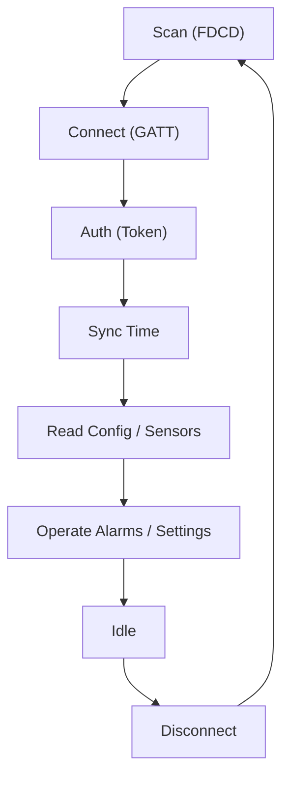
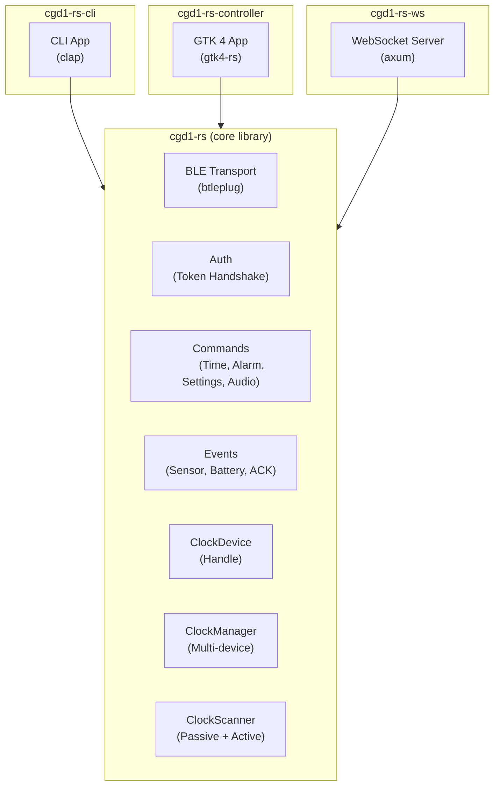
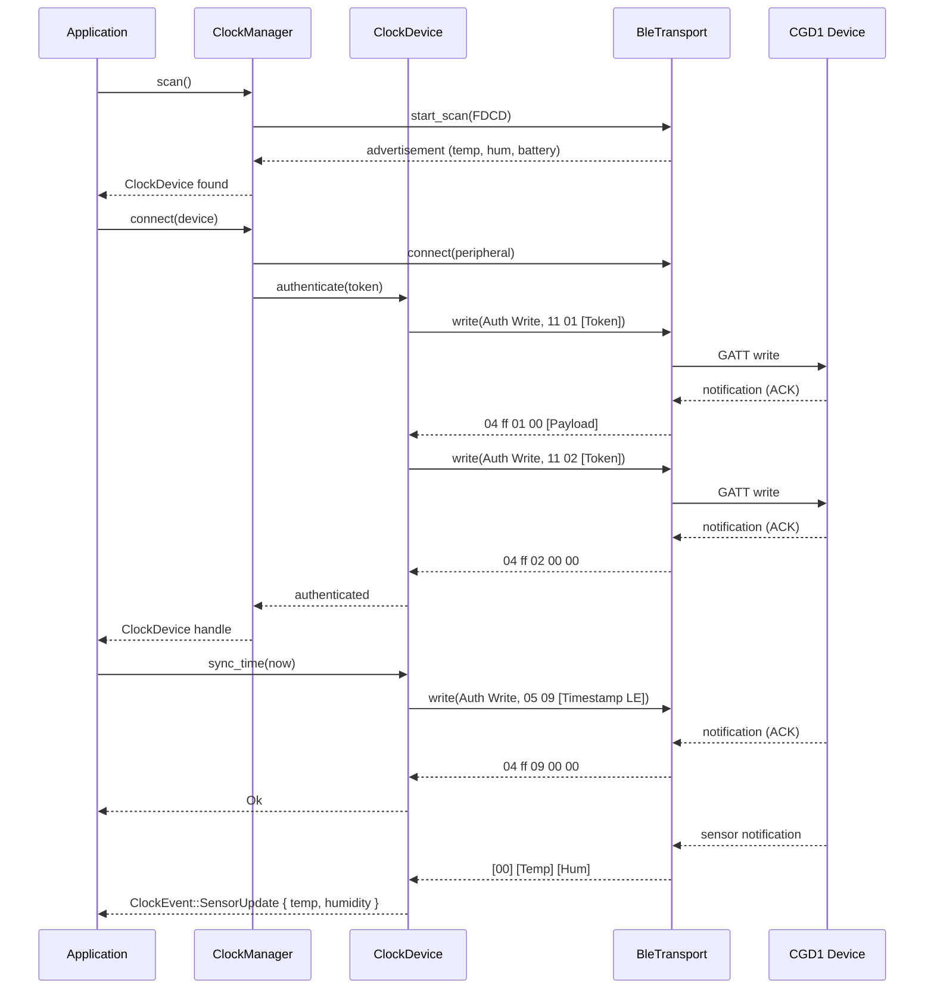
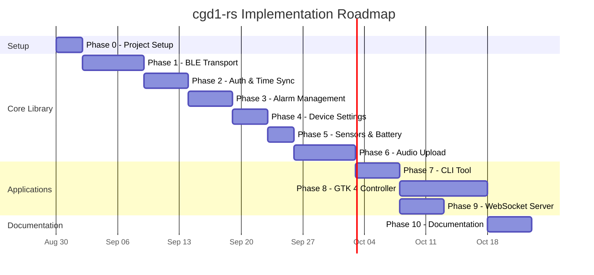
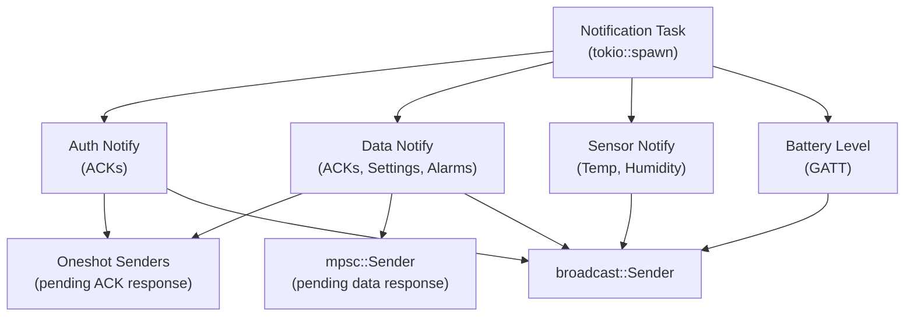
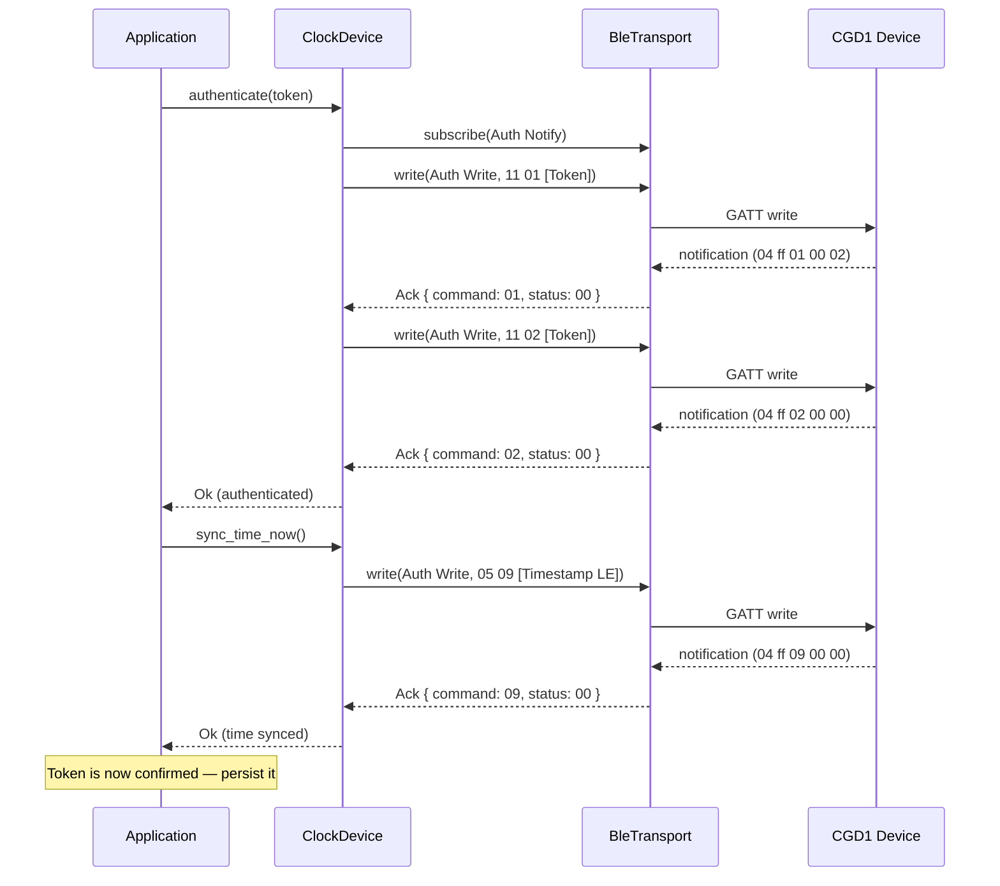
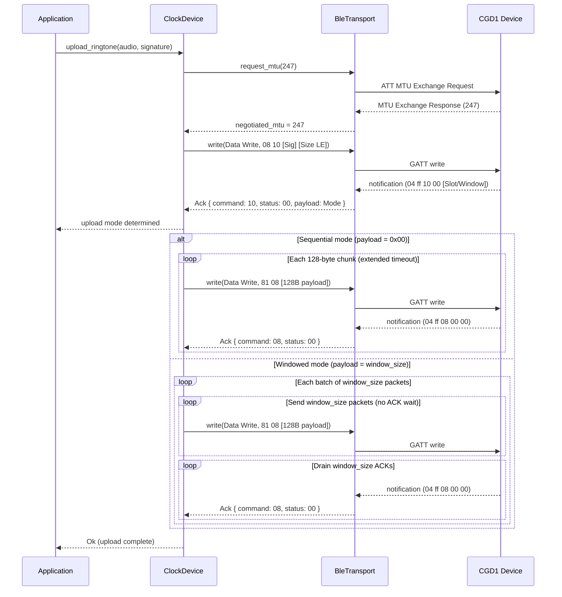
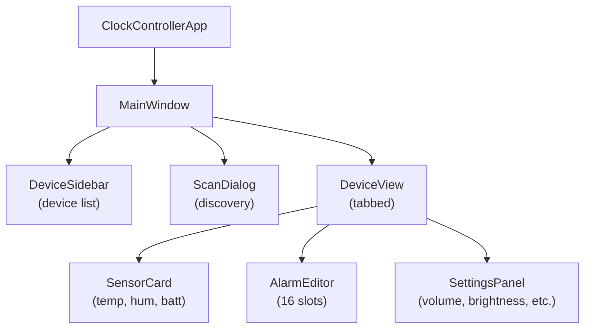
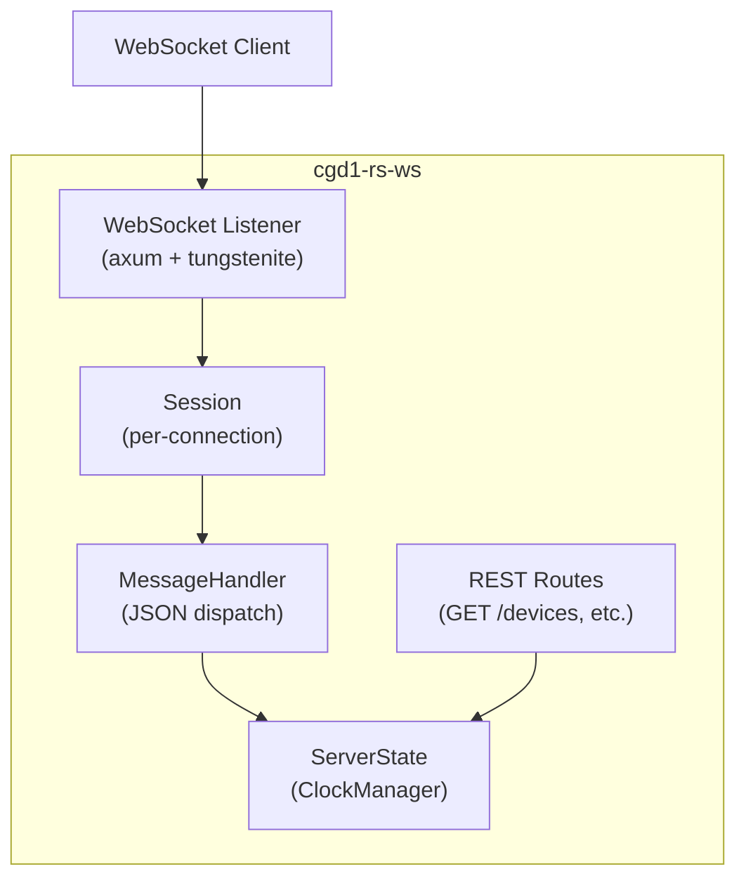

# cgd1-rs Concept

A Rust implementation of the Qingping CGD1 Bluetooth Alarm Clock BLE protocol.

The **Qingping Bluetooth Alarm Clock (Model CGD1)** is a battery-powered LCD
alarm clock with integrated temperature and humidity sensors. It communicates
via BLE 5.0 and exposes a custom GATT service for authentication, time
synchronization, alarm management, device settings, sensor streaming, and
custom ringtone uploads.

This project follows the architecture and patterns established by
[`dice-rs`](https://github.com/smearor/dice-rs), adapting them for the CGD1
device protocol.

## Features

- **Passive scanning**: Receive sensor data (temperature, humidity, battery)
  from BLE advertisements without connecting.
- **Active connection**: Authenticate, sync time, manage alarms, read/write
  settings, stream real-time sensor data.
- **Alarm management**: Create, modify, delete, and read up to 16 alarm slots
  with day-bitmask repeat rules and snooze.
- **Device settings**: Configure volume, brightness, night mode, timezone,
  time format, temperature unit, language, and ringtone selection.
- **Sensor streaming**: Real-time temperature and humidity via connected
  notify characteristic, plus passive advertisement parsing.
- **Battery monitoring**: Via standard GATT battery service or passive
  advertisements.
- **Custom ringtone upload**: 8-bit PCM audio transfer protocol with
  alternating slot management.
- **Firmware version query**: Read firmware version string from device.
- **CLI tool** (`cgd1-rs-cli`): Full device control from the command line.
- **GTK 4 controller** (`cgd1-rs-controller`): Graphical desktop application.
- **WebSocket server** (`cgd1-rs-ws`): Network API for integration and
  remote control.

## Workspace Layout

```
cgd1-rs/
├── Cargo.toml          # Workspace root
├── cgd1-rs/            # Core library crate
├── cgd1-rs-cli/        # CLI tool crate
├── cgd1-rs-controller/ # GTK 4 application crate
├── cgd1-rs-ws/         # WebSocket + REST server crate
├── docs/               # BLE protocol and hardware documentation
├── book/               # mdBook user guide
└── concepts/           # Design documents
```

### Crate Summary

| Crate | Description |
|---|---|
| `cgd1-rs` | Core library: BLE transport, auth, commands, events, device handle |
| `cgd1-rs-cli` | Command-line tool wrapping the core library |
| `cgd1-rs-controller` | GTK 4 desktop application with sensor display and alarm editor |
| `cgd1-rs-ws` | axum-based WebSocket + REST server for network access |

## BLE Protocol Summary

The full protocol is documented in [`docs/BLE.md`](../../docs/BLE.md). This
section provides a concise reference for the concept document.

### GATT Service & Characteristics

| Name | UUID | Direction |
|---|---|---|
| Custom Primary Service | `22210000-554a-4546-5542-46534450466d` | — |
| Auth Write | `00000001-0000-1000-8000-00805f9b34fb` | Host → Device |
| Auth Notify | `00000002-0000-1000-8000-00805f9b34fb` | Device → Host |
| Data Write | `0000000b-0000-1000-8000-00805f9b34fb` | Host → Device |
| Data Notify | `0000000c-0000-1000-8000-00805f9b34fb` | Device → Host |
| Sensor Notify | `00000100-0000-1000-8000-00805f9b34fb` | Device → Host |
| Battery Level | `0x2a19` (Service `0x180f`) | Device → Host |

### Frame Format

```
Request:  [Length] [Command] [Payload...]
ACK:      04 ff [Command] [Status] [Payload 1B]
```

The first byte is the count of bytes following it (not a command ID). An ACK
is always 5 bytes: `04 ff [Command] [Status] [Payload 1B]`. Status `00` means
success.

### Command Reference

| Length | Command | Operation | Characteristic |
|---|---|---|---|
| `0x11` | `0x01` | Auth Init | Auth Write |
| `0x11` | `0x02` | Auth Confirm | Auth Write |
| `0x05` | `0x09` | Time Sync | Auth Write |
| `0x01` | `0x0d` | Read Firmware | Auth Write |
| `0x01` | `0x02` | Read Settings | Data Write |
| `0x13` | `0x01` | Set Settings | Data Write |
| `0x02` | `0x03` | Set Brightness | Data Write |
| `0x01` | `0x04` | Preview Ringtone (current vol) | Data Write |
| `0x02` | `0x04` | Preview Ringtone (specific vol) | Data Write |
| `0x01` | `0x06` | Read Alarms | Data Write |
| `0x07` | `0x05` | Set/Delete Alarm | Data Write |
| `0x08` | `0x10` | Audio Init | Data Write |
| `0x81` | `0x08` | Audio Data Packet | Data Write |
| `0x04` | `0xff` | ACK (Notify) | Auth/Data Notify |

### Passive Advertisement

Sensor data (temperature, humidity, battery) is broadcast via BLE
advertisements under Service Data UUID `0xFDCD`. No connection required.

### Authentication

Two-step token handshake with a 16-byte random token on Auth
characteristics. The token must be stored and reused for future connections.

### Connection Lifecycle



## Architecture



### Data Flow



---

## Implementation Phases

### Phase Plan

The phases follow `docs/GOAL.md`. Phase 3 is intentionally absent from the goal
document (skipped numbering); this concept preserves that numbering.



### Phase 0 - Project Setup

Phase 0 creates the Cargo workspace, scaffolds all crate entry points,
populates the mdBook table of contents, and adapts the existing GitHub
Actions workflows to the `cgd1-rs` project.

#### Workspace Cargo.toml

```toml
[workspace]
resolver = "2"
members = [
    "cgd1-rs",
    "cgd1-rs-cli",
    "cgd1-rs-controller",
    "cgd1-rs-ws",
]

[workspace.package]
version = "0.1.0"
edition = "2024"
license = "MIT"
repository = "https://github.com/smearor/cgd1-rs"

[workspace.dependencies]
axum = { version = "0.8", features = ["ws"] }
btleplug = "0.12"
gio = "0.22"
glib = "0.22"
gtk4 = "0.11"
serde = { version = "1", features = ["derive"] }
serde_json = "1"
thiserror = "2"
tokio = { version = "1", features = ["full"] }
tracing = "0.1"
uuid = { version = "1", features = ["v4"] }
```

#### Scaffolded Entry Points

Each crate gets a minimal entry point so the workspace compiles from
the start:

```rust
// cgd1-rs/src/lib.rs
// Module declarations will be added in Phase 1.
```

```rust
// cgd1-rs-cli/src/main.rs
fn main() {
    println!("cgd1-rs-cli: not yet implemented");
}
```

```rust
// cgd1-rs-controller/src/main.rs
fn main() {
    println!("cgd1-rs-controller: not yet implemented");
}
```

```rust
// cgd1-rs-ws/src/main.rs
fn main() {
    println!("cgd1-rs-ws: not yet implemented");
}
```

#### mdBook Summary

`book/src/SUMMARY.md` is populated with the chapter outline so the book
builds from the start. Chapter files are created as stubs and filled in
during their respective phases.

```markdown
# Summary

- [Introduction](./introduction.md)
- [Getting Started](./getting-started.md)
- [Architecture](./architecture.md)
- [BLE Protocol](./ble-protocol.md)
- [Scanning & Connecting](./connecting.md)
- [Authentication](./authentication.md)
- [Alarms](./alarms.md)
- [Device Settings](./settings.md)
- [Sensors & Battery](./sensors.md)
- [Audio Upload](./audio.md)
- [CLI Tool](./cli.md)
- [Controller](./controller.md)
- [WebSocket Server](./websocket.md)
- [Platform Notes](./platform-notes.md)
```

#### GitHub Actions Adaptation

The repository inherits generic workflow files from the template. Phase 0
adapts them to the `cgd1-rs` workspace:

| Workflow | Change |
|---|---|
| `build.yml` | Replace `dice-rs` crate references with `cgd1-rs` equivalents in `build_cross_platform` and `test_cross_platform` jobs |
| `audit.yml` | Update path filters from `dice-rs*/Cargo.toml` to `cgd1-rs*/Cargo.toml` |
| `book.yml` | No changes needed — already generic (builds `book/` directory) |
| `docs.yml` | Update path filters from `dice-rs*/src/**/*.rs` to `cgd1-rs*/src/**/*.rs` |
| `msrv.yml` | Update crate references if present |

**Verification commands** (run locally before committing):

```sh
cargo fmt --all -- --check
cargo clippy --all-targets -- -D warnings
cargo test --all
cargo audit
mdbook build book/
```

#### Deliverables

| Artifact | Location | Description |
|---|---|---|
| `Cargo.toml` | workspace root | Workspace definition with 4 members |
| `cgd1-rs/src/lib.rs` | `cgd1-rs/` | Library crate entry point (stub) |
| `cgd1-rs-cli/src/main.rs` | `cgd1-rs-cli/` | CLI binary entry point (stub) |
| `cgd1-rs-controller/src/main.rs` | `cgd1-rs-controller/` | GTK 4 binary entry point (stub) |
| `cgd1-rs-ws/src/main.rs` | `cgd1-rs-ws/` | WebSocket server binary entry point (stub) |
| `SUMMARY.md` | `book/src/` | mdBook table of contents (14 chapters) |
| Adapted workflows | `.github/workflows/` | `build.yml`, `audit.yml`, `msrv.yml` updated |

---

### Phase 1 - BLE Transport

#### Crate Structure

```
cgd1-rs/
├── Cargo.toml
└── src/
    ├── lib.rs                 # Module declarations + pub use re-exports
    ├── error.rs               # ClockError enum (thiserror)
    ├── ble/
    │   ├── mod.rs             # Module declarations + pub use re-exports
    │   ├── transport.rs       # BleTransport trait
    │   ├── btleplug_transport.rs # BtleplugTransport implementation
    │   ├── characteristic.rs  # CharacteristicUuid type
    │   └── advertisement.rs   # AdvertisementData parser
    ├── scanner.rs             # ClockScanner struct
    ├── manager.rs             # ClockManager struct
    ├── device.rs              # ClockDevice handle
    ├── token.rs               # AuthToken type
    ├── event.rs               # ClockEvent enum
    └── command/
        ├── mod.rs             # Module declarations + pub use re-exports
        ├── auth.rs            # AuthInit, AuthConfirm commands
        ├── time_sync.rs       # TimeSync command
        ├── alarm/             # Alarm types (one struct per file)
        │   ├── mod.rs         # Module declarations + re-exports
        │   ├── day_mask.rs    # DayMask newtype (day-of-week bitmask)
        │   ├── entry.rs       # AlarmEntry (hour, minute, repeat, enabled, snooze)
        │   ├── slot.rs        # AlarmSlot (entry + slot index)
        │   └── slot_index.rs  # AlarmSlotIndex newtype (validated 0–15)
        ├── settings/          # Settings types (one struct per file)
        │   ├── mod.rs         # Module declarations + re-exports
        │   ├── brightness.rs       # Brightness newtype (0–100, multiple of 10)
        │   ├── device_settings.rs  # DeviceSettings struct (18-byte payload)
        │   ├── language.rs         # Language enum (Chinese, English)
        │   ├── ringtone_signature.rs  # RingtoneSignature newtype (4 bytes)
        │   ├── temperature_unit.rs # TemperatureUnit enum (Celsius, Fahrenheit)
        │   ├── time_format.rs      # TimeFormat enum (12h, 24h)
        │   └── timezone.rs         # Timezone newtype (6-minute unit encoding)
        ├── firmware.rs        # ReadFirmware command
        └── audio.rs           # AudioInit, AudioDataPacket commands
```

#### BleTransport Trait

Abstraction over the BLE backend, mirroring the `dice-rs` pattern. This keeps
the door open for alternative backends (e.g., `bluer`).

```rust
use async_trait::async_trait;
use uuid::Uuid;

/// BLE transport abstraction for CGD1 communication.
#[async_trait]
pub trait BleTransport: Send + Sync {
    /// Start scanning for devices with the given service-data UUID filter.
    async fn start_scan(&self, filter_uuid: Uuid) -> Result<()>;

    /// Stop an active scan.
    async fn stop_scan(&self) -> Result<()>;

    /// Receive the next advertisement event during scanning.
    async fn next_advertisement(&self) -> Option<AdvertisementData>;

    /// Connect to a peripheral by MAC address.
    async fn connect(&self, address: &str) -> Result<()>;

    /// Disconnect from the current peripheral.
    async fn disconnect(&self) -> Result<()>;

    /// Write data to a characteristic.
    async fn write(&self, characteristic: CharacteristicUuid, data: &[u8]) -> Result<()>;

    /// Subscribe to notifications from a characteristic.
    async fn subscribe(&self, characteristic: CharacteristicUuid) -> Result<()>;

    /// Receive the next notification value.
    async fn next_notification(&self) -> Option<Vec<u8>>;

    /// Read a characteristic value.
    async fn read(&self, characteristic: CharacteristicUuid) -> Result<Vec<u8>>;

    /// Request a larger ATT MTU via the BLE MTU exchange procedure.
    ///
    /// The default ATT MTU is 23 bytes (20 bytes usable payload). Audio
    /// data packets require 130 bytes, so an MTU exchange must succeed
    /// before uploading ringtones. Returns the negotiated MTU on success.
    async fn request_mtu(&self, mtu: u16) -> Result<u16>;

    /// Check if the device is currently connected.
    fn is_connected(&self) -> bool;
}
```

#### CharacteristicUuid

```rust
use uuid::Uuid;

/// CGD1 GATT characteristic identifiers.
#[derive(Debug, Clone, Copy, PartialEq, Eq, Hash)]
pub enum CharacteristicUuid {
    /// Auth Write — `00000001-0000-1000-8000-00805f9b34fb`
    AuthWrite,
    /// Auth Notify — `00000002-0000-1000-8000-00805f9b34fb`
    AuthNotify,
    /// Data Write — `0000000b-0000-1000-8000-00805f9b34fb`
    DataWrite,
    /// Data Notify — `0000000c-0000-1000-8000-00805f9b34fb`
    DataNotify,
    /// Sensor Notify — `00000100-0000-1000-8000-00805f9b34fb`
    SensorNotify,
    /// Battery Level — `0x2a19` (standard GATT)
    BatteryLevel,
}

impl CharacteristicUuid {
    /// Convert to the full 128-bit UUID.
    pub fn uuid(self) -> Uuid {
        match self {
            Self::AuthWrite => Uuid::parse_str("00000001-0000-1000-8000-00805f9b34fb").unwrap(),
            Self::AuthNotify => Uuid::parse_str("00000002-0000-1000-8000-00805f9b34fb").unwrap(),
            Self::DataWrite => Uuid::parse_str("0000000b-0000-1000-8000-00805f9b34fb").unwrap(),
            Self::DataNotify => Uuid::parse_str("0000000c-0000-1000-8000-00805f9b34fb").unwrap(),
            Self::SensorNotify => Uuid::parse_str("00000100-0000-1000-8000-00805f9b34fb").unwrap(),
            Self::BatteryLevel => Uuid::from_u16(0x2a19),
        }
    }
}
```

#### AdvertisementData

Parsed from passive BLE advertisements (Service Data UUID `0xFDCD`).

```rust
/// Parsed sensor data from a passive BLE advertisement.
#[derive(Debug, Clone, PartialEq)]
pub struct AdvertisementData {
    /// Device MAC address (reversed from advertisement).
    pub mac: [u8; 6],
    /// Temperature in degrees Celsius (scaled by / 10 or / 100, firmware-dependent).
    pub temperature: f32,
    /// Relative humidity in percent (scaled by / 10 or / 100).
    pub humidity: f32,
    /// Battery level percentage (0–100, bit 7 masked).
    pub battery: u8,
}

impl AdvertisementData {
    /// Parse a raw service-data payload into advertisement data.
    ///
    /// The payload follows the TLV format documented in `docs/BLE.md` §8.
    /// TLV blocks may appear in any order depending on firmware revision
    /// (e.g., some revisions emit Battery before Temp/Humidity). This parser
    /// iterates over the payload and extracts each known type dynamically
    /// rather than assuming a fixed byte layout.
    pub fn parse(payload: &[u8]) -> Result<Self> {
        // Header: [flags 1B] [model_id 1B = 0x0C] [MAC 6B reversed]
        if payload.len() < 8 {
            return Err(ClockError::Parse("advertisement too short for header"));
        }
        let mac = {
            let mut mac = [0u8; 6];
            mac.copy_from_slice(&payload[2..8]);
            mac.reverse();
            mac
        };

        // Iterate over TLV blocks starting at offset 8.
        // Each block: [type 1B] [length 1B] [value N bytes]
        let mut temperature: Option<f32> = None;
        let mut humidity: Option<f32> = None;
        let mut battery: Option<u8> = None;

        let mut offset = 8;
        while offset + 2 <= payload.len() {
            let tlv_type = payload[offset];
            let tlv_len = payload[offset + 1] as usize;
            let value_start = offset + 2;
            let value_end = value_start + tlv_len;

            if value_end > payload.len() {
                break;
            }

            match tlv_type {
                0x01 if tlv_len >= 4 => {
                    // Temperature + Humidity: two 16-bit little-endian values.
                    let temp_raw = i16::from_le_bytes([
                        payload[value_start],
                        payload[value_start + 1],
                    ]);
                    let hum_raw = u16::from_le_bytes([
                        payload[value_start + 2],
                        payload[value_start + 3],
                    ]);
                    // Firmware-dependent scaling: /10 or /100.
                    temperature = Some(if temp_raw.abs() > 1000 {
                        temp_raw as f32 / 100.0
                    } else {
                        temp_raw as f32 / 10.0
                    });
                    humidity = Some(if hum_raw > 1000 {
                        hum_raw as f32 / 100.0
                    } else {
                        hum_raw as f32 / 10.0
                    });
                }
                0x02 if tlv_len >= 1 => {
                    // Battery level percentage (bit 7 may be set as a flag).
                    battery = Some(payload[value_start] & 0x7F);
                }
                _ => {
                    // Unknown or short TLV block — skip silently.
                }
            }

            offset = value_end;
        }

        let temperature = temperature
            .ok_or_else(|| ClockError::Parse("advertisement missing temperature TLV (0x01)"))?;
        let humidity = humidity
            .ok_or_else(|| ClockError::Parse("advertisement missing humidity TLV (0x01)"))?;
        let battery = battery
            .ok_or_else(|| ClockError::Parse("advertisement missing battery TLV (0x02)"))?;

        Ok(Self { mac, temperature, humidity, battery })
    }
}
```

#### ClockScanner

Scans for CGD1 devices. Supports both passive advertisement scanning
(sensor data without connection) and active GATT scanning.

```rust
use tokio::sync::broadcast;

/// Scans for Qingping CGD1 devices via BLE advertisements.
pub struct ClockScanner {
    transport: Arc<dyn BleTransport>,
    advertisement_sender: broadcast::Sender<AdvertisementData>,
}

impl ClockScanner {
    /// Create a new scanner with the given transport.
    pub fn new(transport: Arc<dyn BleTransport>) -> Self {
        let (advertisement_sender, _) = broadcast::channel(64);
        Self { transport, advertisement_sender }
    }

    /// Start passive scanning for CGD1 advertisements.
    ///
    /// Returns a receiver that yields parsed advertisement data.
    pub async fn scan_passive(&self) -> Result<broadcast::Receiver<AdvertisementData>>;

    /// Start active scanning and return discovered devices.
    ///
    /// Scans for `duration` seconds, collecting unique MAC addresses.
    pub async fn scan_active(&self, duration: Duration) -> Result<Vec<DiscoveredDevice>>;
}

/// A discovered CGD1 device.
#[derive(Debug, Clone)]
pub struct DiscoveredDevice {
    /// MAC address as a string.
    pub address: String,
    /// Last seen advertisement data (if any).
    pub advertisement: Option<AdvertisementData>,
    /// RSSI signal strength.
    pub rssi: Option<i16>,
}
```

#### ClockManager

Manages connections to one or more CGD1 devices.

```rust
use std::collections::HashMap;
use tokio::sync::Mutex;

/// Manages BLE connections to CGD1 alarm clocks.
pub struct ClockManager {
    transport: Arc<dyn BleTransport>,
    devices: Mutex<HashMap<String, ClockDevice>>,
}

impl ClockManager {
    /// Create a new manager with the given transport.
    pub fn new(transport: Arc<dyn BleTransport>) -> Self {
        Self { transport, devices: Mutex::new(HashMap::new()) }
    }

    /// Connect to a discovered device and return a handle.
    pub async fn connect(&self, device: &DiscoveredDevice) -> Result<ClockDevice>;

    /// Disconnect from a device by address.
    pub async fn disconnect(&self, address: &str) -> Result<()>;

    /// Get a connected device by address.
    pub async fn device(&self, address: &str) -> Option<ClockDevice>;

    /// List all connected device addresses.
    pub async fn connected_addresses(&self) -> Vec<String>;
}
```

#### ClockDevice

Handle to a connected CGD1 device. Provides the full API for authentication,
time sync, alarms, settings, sensors, and audio upload.

```rust
use std::sync::atomic::AtomicBool;
use tokio::sync::broadcast;

/// Handle to a connected Qingping CGD1 alarm clock.
///
/// All command methods that send a frame and wait for an ACK are serialized
/// via `command_mutex` to prevent race conditions when multiple callers
/// invoke the same command byte concurrently.
///
/// Stores the last successful auth token so that reconnection can
/// automatically re-authenticate without caller intervention.
#[derive(Clone)]
pub struct ClockDevice {
    transport: Arc<dyn BleTransport>,
    address: String,
    event_sender: broadcast::Sender<ClockEvent>,
    /// Serializes write operations to prevent concurrent same-command races.
    command_mutex: Arc<Mutex<()>>,
    /// Last successful auth token, used for automatic re-auth on reconnect.
    auth_token: Arc<Mutex<Option<AuthToken>>>,
    /// Whether the device is currently authenticated.
    is_authenticated: Arc<AtomicBool>,
}

impl ClockDevice {
    /// Subscribe to device events (sensor updates, battery, disconnections).
    pub fn subscribe(&self) -> broadcast::Receiver<ClockEvent> {
        self.event_sender.subscribe()
    }

    /// Authenticate with the device using a 16-byte token.
    pub async fn authenticate(&self, token: &AuthToken) -> Result<()>;

    /// Synchronize the device clock to the given Unix timestamp.
    pub async fn sync_time(&self, timestamp: u32) -> Result<()>;

    /// Read all alarm slots from the device.
    pub async fn read_alarms(&self) -> Result<Vec<AlarmSlot>>;

    /// Set or modify an alarm at the given slot index.
    pub async fn set_alarm(&self, alarm: &AlarmEntry, slot: AlarmSlotIndex) -> Result<()>;

    /// Delete an alarm at the given slot index.
    pub async fn delete_alarm(&self, slot: AlarmSlotIndex) -> Result<()>;

    /// Read device settings.
    pub async fn read_settings(&self) -> Result<DeviceSettings>;

    /// Write device settings.
    pub async fn write_settings(&self, settings: &DeviceSettings) -> Result<()>;

    /// Set immediate brightness (preview, 0–10).
    pub async fn set_brightness(&self, value: Brightness) -> Result<()>;

    /// Preview ringtone at current or specified volume.
    pub async fn preview_ringtone(&self, volume: Option<u8>) -> Result<()>;

    /// Read firmware version string.
    pub async fn read_firmware(&self) -> Result<String>;

    /// Read battery level (via GATT battery service).
    pub async fn read_battery(&self) -> Result<u8>;

    /// Upload a custom ringtone.
    pub async fn upload_ringtone(&self, audio: &[u8], signature: [u8; 4]) -> Result<()>;

    /// Disconnect from the device.
    pub async fn disconnect(self) -> Result<()>;
}
```

#### AuthToken

```rust
use rand::RngCore;

/// 16-byte authentication token for CGD1 BLE protocol.
#[derive(Debug, Clone, PartialEq, Eq)]
pub struct AuthToken([u8; 16]);

impl AuthToken {
    /// Generate a new random token.
    pub fn generate() -> Self {
        let mut bytes = [0u8; 16];
        rand::thread_rng().fill_bytes(&mut bytes);
        Self(bytes)
    }

    /// Create a token from raw bytes.
    pub fn from_bytes(bytes: [u8; 16]) -> Self {
        Self(bytes)
    }

    /// Get the raw token bytes.
    pub fn as_bytes(&self) -> &[u8; 16] {
        &self.0
    }
}
```

#### ClockEvent

```rust
/// Events emitted by a connected CGD1 device.
#[derive(Debug, Clone, PartialEq)]
pub enum ClockEvent {
    /// Real-time sensor update (temperature, humidity).
    SensorUpdate {
        /// Temperature in degrees Celsius.
        temperature: f32,
        /// Relative humidity in percent.
        humidity: f32,
    },
    /// Battery level update.
    BatteryLevel {
        /// Battery percentage (0–100).
        level: u8,
    },
    /// ACK received for a command.
    Ack {
        /// Command ID that was acknowledged.
        command: u8,
        /// Status byte (0 = success).
        status: u8,
    },
    /// Device disconnected.
    Disconnected,
    /// Device reconnected and state recovered (auth + subscriptions restored).
    /// Callers that queued commands during the outage can retry.
    Reconnected,
    /// Passive advertisement received (no connection needed).
    Advertisement(AdvertisementData),
}
```

#### ClockError

```rust
/// Errors returned by the cgd1-rs library.
#[derive(Debug, thiserror::Error)]
pub enum ClockError {
    /// BLE transport error.
    #[error("BLE transport error: {0}")]
    Transport(String),

    /// Authentication failed (token rejected by device).
    #[error("authentication failed: {0}")]
    AuthFailed(String),

    /// No authentication token available for this device.
    #[error("no auth token: device not paired")]
    NoAuthToken,

    /// Command was rejected by the device (non-zero ACK status).
    #[error("command rejected: command={command:#04x}, status={status}")]
    CommandRejected {
        /// The command byte that was rejected.
        command: u8,
        /// The ACK status from the device.
        status: AckStatus,
    },

    /// Timeout waiting for a response from the device.
    #[error("timeout waiting for response")]
    Timeout,

    /// Device is not connected.
    #[error("not connected")]
    NotConnected,

    /// Device is already connected.
    #[error("already connected")]
    AlreadyConnected,

    /// Invalid settings value (out of range).
    #[error("invalid settings value: {0}")]
    InvalidSettings(String),

    /// Failed to parse an advertisement or notification.
    #[error("parse error: {0}")]
    Parse(String),

    /// I/O error.
    #[error("IO error: {0}")]
    Io(#[from] std::io::Error),

    /// Internal btleplug error.
    #[error("btleplug error: {0}")]
    Btleplug(#[from] btleplug::Error),
}
```

#### Notification Task Architecture

A background `tokio::task` per connected device listens for BLE
notifications and dispatches them to the appropriate handler:



The notification task uses `tokio::select!` to multiplex notifications from
Auth Notify, Data Notify, and Sensor Notify characteristics. ACKs are matched
to pending request-response oneshot channels by command ID using a FIFO queue
per command byte (`VecDeque`), so concurrent requests with the same command
byte are served in order. The `pop_pending` function removes the front sender
when an ACK arrives. Non-ACK data notifications (e.g., alarm read responses,
firmware version) are forwarded via an `mpsc::Sender` channel, allowing
multi-packet responses to be accumulated by the receiver. Sensor and battery
notifications are broadcast directly to event subscribers.

#### Request-Response Pattern

Commands that expect an ACK use a `oneshot::channel` to wait for the
response:

```rust
use std::collections::{HashMap, VecDeque};
use std::sync::Arc;
use tokio::sync::{broadcast, oneshot, Mutex};

/// Shared state for matching ACKs to pending requests.
///
/// Uses a `VecDeque` per command byte so that multiple concurrent requests
/// with the same command byte are queued rather than overwriting each other.
/// The notification task pops the front sender when an ACK arrives.
type PendingMap = Arc<Mutex<HashMap<u8, VecDeque<oneshot::Sender<Result<Ack>>>>>>;

/// Response timeout in seconds.
const RESPONSE_TIMEOUT_SECS: u64 = 10;

/// An ACK frame parsed from a notification.
#[derive(Debug, Clone, PartialEq, Eq)]
pub struct Ack {
    /// The command byte that was acknowledged.
    pub command: u8,
    /// The status byte (0 = success).
    pub status: u8,
    /// The single payload byte.
    pub payload: u8,
}

/// Register a pending request for a given command byte.
///
/// Pushes the oneshot sender onto the queue for that command. When the
/// notification task receives an ACK with a matching command byte, it pops
/// the front sender and delivers the result.
async fn register_pending(
    pending: &PendingMap,
    command: u8,
    sender: oneshot::Sender<Result<Ack>>,
) {
    let mut map = pending.lock().await;
    map.entry(command).or_default().push_back(sender);
}

/// Pop the next pending sender for a given command byte.
///
/// Called by the notification task when an ACK arrives. Returns `None` if
/// no request is pending for that command.
async fn pop_pending(
    pending: &PendingMap,
    command: u8,
) -> Option<oneshot::Sender<Result<Ack>>> {
    let mut map = pending.lock().await;
    map.get_mut(&command).and_then(|queue| queue.pop_front())
}
```

#### Reconnect Logic

If the device disconnects unexpectedly, the library attempts reconnection
with exponential backoff. After a successful BLE reconnect, the device must
be brought back to a fully operational state — BLE connection alone is not
sufficient. The `reconnect_and_restore` method performs the full state
recovery sequence:

1. **BLE Reconnect** via `transport.connect(address)` with backoff.
2. **GATT Re-subscription** for all three notify characteristics:
   `AuthNotify`, `DataNotify`, `SensorNotify`. Without re-subscribing, the
   notification task will not receive any ACKs or sensor data.
3. **Re-authentication** using the stored `auth_token`. The device loses all
   session state on disconnect, so the two-step token handshake must be
   repeated.
4. **Flag reset**: `is_authenticated` is set to `true` on success.

If any step fails, the next backoff attempt retries the entire sequence.

```rust
use std::sync::atomic::Ordering;

/// Reconnect with exponential backoff and full state recovery.
///
/// Delay sequence: 1s, 2s, 4s, 8s, 16s, 32s (capped).
///
/// After a successful BLE connect, re-subscribes to all GATT notify
/// characteristics and re-authenticates with the stored token. This
/// ensures the device is fully operational before commands resume.
async fn reconnect_and_restore(
    device: &ClockDevice,
    max_attempts: u32,
) -> Result<()> {
    let mut delay = Duration::from_secs(1);
    let max_delay = Duration::from_secs(32);

    for attempt in 1..=max_attempts {
        debug!(attempt, delay_ms = delay.as_millis(), "attempting reconnect");

        // Step 1: BLE Reconnect
        if device.transport.connect(&device.address).await.is_err() {
            tokio::time::sleep(delay).await;
            delay = (delay * 2).min(max_delay);
            continue;
        }

        // Step 2: Re-subscribe to all notify characteristics
        let characteristics = [
            CharacteristicUuid::AuthNotify,
            CharacteristicUuid::DataNotify,
            CharacteristicUuid::SensorNotify,
        ];

        let mut all_subscribed = true;
        for char_uuid in &characteristics {
            if device.transport.subscribe(*char_uuid).await.is_err() {
                all_subscribed = false;
            }
        }

        if !all_subscribed {
            warn!("reconnect: GATT re-subscription failed, retrying");
            tokio::time::sleep(delay).await;
            delay = (delay * 2).min(max_delay);
            continue;
        }

        // Step 3: Re-authenticate with stored token
        let token = device.auth_token.lock().await;
        if let Some(ref token) = *token {
            if device.authenticate(token).await.is_err() {
                warn!("reconnect: re-authentication failed, retrying");
                tokio::time::sleep(delay).await;
                delay = (delay * 2).min(max_delay);
                continue;
            }
        }

        // Step 4: Mark as authenticated and notify subscribers
        device.is_authenticated.store(true, Ordering::SeqCst);
        let _ = device.event_sender.send(ClockEvent::Reconnected);
        info!("reconnect: state recovery complete");
        return Ok(());
    }

    Err(ClockError::Transport("reconnect with state recovery failed".into()))
}
```

The notification task monitors the BLE connection state. When a disconnect
is detected, it:

1. Broadcasts `ClockEvent::Disconnected` to all subscribers.
2. Sets `is_authenticated` to `false`.
3. Spawns `reconnect_and_restore` as a background task.
4. On success, `reconnect_and_restore` broadcasts `ClockEvent::Reconnected`
   so callers know commands can resume.

#### Testing Strategy

- **Unit tests**: `AdvertisementData::parse` with known payloads, command
  encoding (exact byte sequences), ACK parsing, `AuthToken` generation.
- **Integration tests**: `MockBleTransport` implementing `BleTransport` with
  in-memory channels. Tests verify scanner filtering, manager connect/
  disconnect, and event flow.
- **Hardware tests**: Behind `#[ignore]` attribute, require physical CGD1.

#### Types Defined in Phase 1

| Type | File | Description |
|---|---|---|
| `BleTransport` | `ble/transport.rs` | BLE transport trait |
| `BtleplugTransport` | `ble/btleplug_transport.rs` | btleplug implementation |
| `CharacteristicUuid` | `ble/characteristic.rs` | GATT characteristic enum |
| `AdvertisementData` | `ble/advertisement.rs` | Parsed advertisement payload |
| `ClockScanner` | `scanner.rs` | Device scanner (passive + active) |
| `DiscoveredDevice` | `scanner.rs` | Discovered device info |
| `ClockManager` | `manager.rs` | Multi-device connection manager |
| `ClockDevice` | `device.rs` | Connected device handle |
| `AuthToken` | `token.rs` | 16-byte auth token |
| `ClockEvent` | `event.rs` | Device event enum |
| `ClockError` | `error.rs` | Library error enum |
| `Ack` | `device.rs` | Parsed ACK frame |
| `PendingRequest` | `device.rs` | Pending request-response state |

---

### Phase 2 - Authentication & Time Synchronization

#### Authentication Protocol

The CGD1 uses a two-step token handshake on the Auth characteristics. The
library implements this as `ClockDevice::authenticate`.

```rust
impl ClockDevice {
    /// Authenticate with the device using a 16-byte token.
    ///
    /// Performs the two-step handshake:
    /// 1. Send Auth Init: `11 01 [Token 16B]` to Auth Write.
    /// 2. Wait for ACK on Auth Notify: `04 ff 01 00 [Payload]`.
    /// 3. Send Auth Confirm: `11 02 [Token 16B]` to Auth Write.
    /// 4. Wait for final ACK: `04 ff 02 00 00`.
    pub async fn authenticate(&self, token: &AuthToken) -> Result<()> {
        let token_bytes = token.as_bytes();

        // Step 1: Auth Init
        let mut init_frame = Vec::with_capacity(18);
        init_frame.push(0x11); // Length
        init_frame.push(0x01); // Command: Auth Init
        init_frame.extend_from_slice(token_bytes);
        self.transport.write(CharacteristicUuid::AuthWrite, &init_frame).await?;

        let ack = self.wait_for_ack(0x01).await?;
        if ack.status != 0x00 {
            return Err(ClockError::AuthFailed(format!("init status: {:#04x}", ack.status)));
        }

        // Step 2: Auth Confirm
        let mut confirm_frame = Vec::with_capacity(18);
        confirm_frame.push(0x11); // Length
        confirm_frame.push(0x02); // Command: Auth Confirm
        confirm_frame.extend_from_slice(token_bytes);
        self.transport.write(CharacteristicUuid::AuthWrite, &confirm_frame).await?;

        let ack = self.wait_for_ack(0x02).await?;
        if ack.status != 0x00 {
            return Err(ClockError::AuthFailed(format!("confirm status: {:#04x}", ack.status)));
        }

        Ok(())
    }
}
```

#### Token Persistence

The auth token must be persisted after a successful pairing. The library
provides a `TokenStore` trait for storage backends:

```rust
use std::path::PathBuf;

/// Storage backend for auth tokens.
pub trait TokenStore: Send + Sync {
    /// Load the token for a device address.
    fn load(&self, address: &str) -> Option<AuthToken>;

    /// Save the token for a device address.
    fn save(&self, address: &str, token: &AuthToken) -> Result<()>;
}

/// File-based token store using a simple directory of files keyed by MAC.
pub struct FileTokenStore {
    /// Directory path for token files.
    directory: PathBuf,
}

impl FileTokenStore {
    /// Create a new file token store at the given directory.
    pub fn new(directory: PathBuf) -> Self {
        Self { directory }
    }
}

impl TokenStore for FileTokenStore {
    fn load(&self, address: &str) -> Option<AuthToken> {
        let path = self.directory.join(address);
        let bytes = std::fs::read(path).ok()?;
        if bytes.len() == 16 {
            let mut arr = [0u8; 16];
            arr.copy_from_slice(&bytes);
            Some(AuthToken::from_bytes(arr))
        } else {
            None
        }
    }

    fn save(&self, address: &str, token: &AuthToken) -> Result<()> {
        std::fs::create_dir_all(&self.directory)?;
        let path = self.directory.join(address);
        std::fs::write(path, token.as_bytes())?;
        Ok(())
    }
}
```

**Token persistence rule**: A newly generated token is only persisted after a
privileged command (e.g., time sync) succeeds. An Auth Confirm ACK alone does
not prove the token was accepted — the device may send an ACK even with a bad
token.

#### Time Synchronization

```rust
impl ClockDevice {
    /// Synchronize the device clock to the given Unix timestamp.
    ///
    /// Sends: `05 09 [Timestamp 4B LE]` to Auth Write.
    /// Expects ACK: `04 ff 09 00 00`.
    ///
    /// This is the first privileged command after authentication. If the
    /// token was rejected, the device will drop the connection here.
    pub async fn sync_time(&self, timestamp: u32) -> Result<()> {
        let mut frame = Vec::with_capacity(6);
        frame.push(0x05); // Length
        frame.push(0x09); // Command: Time Sync
        frame.extend_from_slice(&timestamp.to_le_bytes());

        self.transport.write(CharacteristicUuid::AuthWrite, &frame).await?;

        let ack = self.wait_for_ack(0x09).await?;
        if ack.status != 0x00 {
            return Err(ClockError::CommandRejected { command: 0x09, status: ack.status });
        }

        Ok(())
    }

    /// Synchronize the device clock to the current system time.
    pub async fn sync_time_now(&self) -> Result<()> {
        let now = std::time::SystemTime::now()
            .duration_since(std::time::UNIX_EPOCH)
            .map_err(|e| ClockError::Transport(e.to_string()))?;
        self.sync_time(now.as_secs() as u32).await
    }
}
```

#### Authentication Flow



#### Firmware Version Query

```rust
impl ClockDevice {
    /// Read the firmware version string from the device.
    ///
    /// Sends: `01 0d` to Auth Write.
    /// Expects response on Auth Notify: `0b [Byte] [ASCII String]`.
    pub async fn read_firmware(&self) -> Result<String> {
        let frame = [0x01, 0x0d];
        self.transport.write(CharacteristicUuid::AuthWrite, &frame).await?;

        // Wait for response (not a standard ACK, but a data frame)
        let response = self.wait_for_response(0x0d, Duration::from_secs(RESPONSE_TIMEOUT_SECS)).await?;

        // Parse: skip length byte, skip one byte (ambiguous: command or length),
        // rest is ASCII string
        if response.len() < 2 {
            return Err(ClockError::Parse("firmware response too short".into()));
        }
        let version = String::from_utf8_lossy(&response[2..]).to_string();
        Ok(version)
    }
}
```

#### Testing Strategy

- **Unit tests**: Auth frame encoding (`11 01 [Token]`), time sync frame
  encoding (`05 09 [Timestamp LE]`), ACK parsing, token generation and
  persistence.
- **Integration tests**: `MockBleTransport` simulating the auth handshake,
  verifying correct frame sequences and error handling on bad tokens.
- **Hardware tests**: Real device authentication and time sync, `#[ignore]`.

#### Types Defined in Phase 2

| Type | File | Description |
|---|---|---|
| `TokenStore` | `token.rs` | Token storage trait |
| `FileTokenStore` | `token.rs` | File-based token store |

---

### Phase 3 - Alarm Management

#### Alarm Protocol Overview

The CGD1 supports up to 16 alarm slots (indices 0–15). Each alarm is defined
by a time, a day-of-week repeat bitmask, and enable/snooze flags. Alarms are
managed via the Data Write characteristic with command `0x05` (set/delete)
and command `0x06` (read all).

The alarm types are organized into separate files under `command/alarm/`,
following the one-struct-per-file guideline:

```
command/alarm/
├── mod.rs         # Module declarations + re-exports
├── day_mask.rs    # DayMask newtype
├── entry.rs       # AlarmEntry struct
├── slot.rs        # AlarmSlot struct
└── slot_index.rs  # AlarmSlotIndex newtype
```

#### DayMask

A newtype wrapping a `u8` day-of-week bitmask. Encapsulates the bit layout
and provides named constants for common patterns.

```rust
/// Day-of-week bitmask for alarm repeat rules.
///
/// Bit 0 = Sunday, bit 1 = Monday, ..., bit 6 = Saturday.
/// 0x7F means every day. 0x00 means one-shot (fires once then auto-disables).
#[derive(Debug, Clone, Copy, PartialEq, Eq)]
pub struct DayMask(u8);

impl DayMask {
    pub const ONCE: DayMask = DayMask(0x00);
    pub const EVERY_DAY: DayMask = DayMask(0x7F);
    pub const WEEKDAYS: DayMask = DayMask(0x3E);
    pub const WEEKENDS: DayMask = DayMask(0x41);

    /// Create a DayMask from a raw bitmask value.
    pub const fn new(value: u8) -> Self { Self(value) }

    /// Get the raw bitmask value.
    pub const fn value(self) -> u8 { self.0 }
}
```

#### AlarmSlotIndex

A newtype wrapping a `u8` slot index with validation enforcing the valid
range 0–15. Construction via `new()` returns `Result<Self>`, and `TryFrom<u8>`
is implemented for ergonomic conversion.

```rust
/// Validated alarm slot index (0–15).
#[derive(Debug, Clone, Copy, PartialEq, Eq, PartialOrd, Ord, Hash)]
pub struct AlarmSlotIndex(u8);

impl AlarmSlotIndex {
    /// Maximum valid slot index.
    pub const MAX: u8 = 15;

    /// Create a validated slot index. Returns an error if > 15.
    pub fn new(value: u8) -> Result<Self> {
        if value > Self::MAX {
            return Err(ClockError::Parse(format!("invalid alarm slot index: {value}")));
        }
        Ok(Self(value))
    }

    /// Get the raw slot index value.
    pub const fn value(self) -> u8 { self.0 }
}

impl TryFrom<u8> for AlarmSlotIndex { /* ... */ }
impl From<AlarmSlotIndex> for u8 { /* ... */ }
```

#### AlarmEntry

A single alarm entry with private fields and construction-time validation
of hour (0–23) and minute (0–59). Access is via getter methods.

```rust
/// A single alarm entry.
///
/// Maps to the 5-byte alarm structure used in the CGD1 BLE protocol:
/// `[Enabled] [HH] [MM] [Days] [Snooze]`.
///
/// Invariants are enforced by construction:
/// - `hour` is in range 0–23
/// - `minute` is in range 0–59
#[derive(Debug, Clone, PartialEq, Eq)]
pub struct AlarmEntry {
    hour: u8,
    minute: u8,
    repeat_mask: DayMask,
    enabled: bool,
    snooze: bool,
}

impl AlarmEntry {
    pub const MAX_HOUR: u8 = 23;
    pub const MAX_MINUTE: u8 = 59;

    /// Create a new alarm entry, validating hour and minute ranges.
    pub fn new(hour: u8, minute: u8, repeat_mask: DayMask, enabled: bool, snooze: bool) -> Result<Self>;

    pub const fn hour(&self) -> u8;
    pub const fn minute(&self) -> u8;
    pub const fn repeat_mask(&self) -> DayMask;
    pub const fn enabled(&self) -> bool;
    pub const fn snooze(&self) -> bool;

    /// Encode into the 5-byte structure: `[Enabled] [HH] [MM] [Days] [Snooze]`.
    pub fn encode(&self) -> [u8; 5];

    /// Decode from a raw 5-byte payload. Returns `None` for empty slots (all 0xFF).
    /// Validates hour and minute ranges from the decoded payload.
    pub fn decode(payload: &[u8]) -> Result<Option<Self>>;

    /// Encode the set-alarm payload (6 bytes): `[ID] [Enabled] [HH] [MM] [Days] [Snooze]`.
    pub fn encode_set_payload(&self, slot: AlarmSlotIndex) -> [u8; 6];
}
```

#### AlarmSlot

```rust
/// An alarm slot read from the device, combining the entry and its slot index.
#[derive(Debug, Clone, PartialEq, Eq)]
pub struct AlarmSlot {
    /// Validated slot index (0–15).
    pub index: AlarmSlotIndex,
    /// The alarm entry data.
    pub entry: AlarmEntry,
}
```

#### Set Alarm Command

```rust
impl ClockDevice {
    /// Set or modify an alarm at the given slot index.
    ///
    /// Sends: `07 05 [ID] [Enabled] [HH] [MM] [Days] [Snooze]` to Data Write.
    /// Expects ACK: `04 ff 05 00 00`.
    pub async fn set_alarm(&self, alarm: &AlarmEntry, slot: AlarmSlotIndex) -> Result<()> {
        let _guard = self.command_mutex.lock().await;

        let payload = alarm.encode_set_payload(slot);
        self.transport.write_frame(Command::SetAlarm, &payload).await?;

        let ack = self.wait_for_ack(Command::SetAlarm).await?;
        if let AckStatus::Failure(_) = ack.status {
            return Err(ClockError::CommandRejected { command: 0x05, status: ack.status });
        }

        Ok(())
    }

    /// Delete an alarm at the given slot index.
    ///
    /// Sends: `07 05 [ID] [00] [00] [00] [00] [00]` to Data Write.
    /// This is equivalent to setting a disabled alarm with no repeat.
    pub async fn delete_alarm(&self, slot: AlarmSlotIndex) -> Result<()> {
        let _guard = self.command_mutex.lock().await;

        let payload = [slot.value(), 0x00, 0x00, 0x00, 0x00, 0x00];
        self.transport.write_frame(Command::SetAlarm, &payload).await?;

        let ack = self.wait_for_ack(Command::SetAlarm).await?;
        if let AckStatus::Failure(_) = ack.status {
            return Err(ClockError::CommandRejected { command: 0x05, status: ack.status });
        }

        Ok(())
    }
}
```

#### Read Alarms Command

```rust
impl ClockDevice {
    /// Read all alarm slots from the device.
    ///
    /// Sends: `01 06` to Data Write.
    /// Expects response on Data Notify: a multi-byte frame containing all
    /// alarm slots in sequence. The response may span multiple BLE
    /// notification packets, which are accumulated via an `mpsc` channel.
    pub async fn read_alarms(&self) -> Result<Vec<AlarmSlot>> {
        let _guard = self.command_mutex.lock().await;

        self.transport.write_frame(Command::ReadAlarms, &[]).await?;

        // Accumulate response packets via mpsc channel.
        let mut data = Vec::new();
        while let Some(packet) = self.wait_for_data(Duration::from_secs(RESPONSE_TIMEOUT_SECS)).await? {
            data.extend_from_slice(&packet);
            // Response is complete when we have all 16 slots × 5 bytes + 2-byte header.
            if data.len() >= 2 + 16 * 5 {
                break;
            }
        }

        // Parse: header [0x11] [0x06], then 16 × 5-byte alarm entries.
        // Each entry: [Enabled] [HH] [MM] [Days] [Snooze].
        // Empty slots are all 0xFF.
        let mut slots = Vec::new();
        for (i, chunk) in data[2..].chunks(5).enumerate() {
            if chunk.len() < 5 { break; }
            if let Some(entry) = AlarmEntry::decode(chunk)? {
                let index = AlarmSlotIndex::new(i as u8)?;
                slots.push(AlarmSlot { index, entry });
            }
        }

        Ok(slots)
    }
}
```

#### Alarm Repeat Bitmask

| Bit | Day |
|---|---|
| 0 | Sunday |
| 1 | Monday |
| 2 | Tuesday |
| 3 | Wednesday |
| 4 | Thursday |
| 5 | Friday |
| 6 | Saturday |

Common patterns:
- `0x7F` — every day
- `0x3E` — weekdays (Mon–Fri)
- `0x41` — weekends (Sat, Sun)
- `0x00` — one-shot (fires once, then auto-disables)

#### Snooze

The snooze flag is part of the alarm entry (5th byte in the BLE payload).
When enabled, the device snoozes the alarm for 5 minutes when the hardware
snooze button is pressed. Snooze duration is fixed and not configurable via
BLE.

#### Testing Strategy

- **Unit tests**: `AlarmEntry::encode` / `AlarmEntry::decode` round-trip
  with known byte sequences. `AlarmEntry::new` validation of hour/minute
  boundaries. `AlarmSlotIndex::new` validation of slot range 0–15.
  `DayMask` constant values.
- **Integration tests**: `MockBleTransport` with auto-ACK verifying
  set/delete frame encoding and ACK handling. Read alarms response parsing
  with multi-slot data and multi-packet notification accumulation.
- **Hardware tests**: Real device alarm set, read, and delete, `#[ignore]`.

#### Types Defined in Phase 3

| Type | File | Description |
|---|---|---|
| `DayMask` | `command/alarm/day_mask.rs` | Day-of-week bitmask newtype with named constants |
| `AlarmSlotIndex` | `command/alarm/slot_index.rs` | Validated slot index newtype (0–15) |
| `AlarmEntry` | `command/alarm/entry.rs` | Alarm data (hour, minute, repeat, enabled, snooze) with validated construction |
| `AlarmSlot` | `command/alarm/slot.rs` | Alarm entry with validated slot index |

---

### Phase 4 - Device Settings

#### Settings Protocol Overview

The CGD1 exposes a settings structure that can be read via command `0x02`
and written via command `0x01` on the Data Write characteristic. The settings
frame is 20 bytes (`0x13` length byte + `0x01`/`0x02` command byte + 18 bytes
payload). The protocol is documented in `docs/BLE.md` §6.3.

The 18-byte payload packs multiple configuration values including a flags
byte (language, time format, temperature unit), timezone in 6-minute units
with a separate sign byte, packed brightness (day/night in nibbles), night
mode schedule, screen duration, and a 4-byte ringtone signature.

#### Module Structure

Settings types are organized in `command/settings/` with one struct/enum
per file, following the same modularization pattern as `command/alarm/`:

```
command/settings/
├── mod.rs                  # Module declarations + re-exports
├── brightness.rs           # Brightness newtype (0–150, multiple of 10)
├── device_settings.rs      # DeviceSettings struct (18-byte payload)
├── language.rs             # Language enum (Chinese, English)
├── ringtone_signature.rs   # RingtoneSignature newtype (4 bytes)
├── temperature_unit.rs     # TemperatureUnit enum (Celsius, Fahrenheit)
├── time_format.rs          # TimeFormat enum (12h, 24h)
└── timezone.rs             # Timezone newtype (6-minute unit encoding)
```

#### TimeFormat

```rust
/// Time display format for the CGD1.
/// Encoded as bit 1 of the flags byte in the settings payload.
#[derive(Debug, Clone, Copy, PartialEq, Eq)]
pub enum TimeFormat {
    /// 24-hour format.
    TwentyFourHour,
    /// 12-hour format (AM/PM).
    TwelveHour,
}
```

`TimeFormat` provides `flag_bit()` (returns `0x00` or `0x02`) and
`from_flags(u8)` for encoding/decoding from the packed flags byte. It also
implements `TryFrom<u8>` and `From<TimeFormat> for u8`.

#### TemperatureUnit

```rust
/// Temperature display unit for the CGD1.
/// Encoded as bit 2 of the flags byte in the settings payload.
#[derive(Debug, Clone, Copy, PartialEq, Eq)]
pub enum TemperatureUnit {
    /// Degrees Celsius.
    Celsius,
    /// Degrees Fahrenheit.
    Fahrenheit,
}
```

`TemperatureUnit` provides `flag_bit()` (returns `0x00` or `0x04`) and
`from_flags(u8)` for encoding/decoding from the packed flags byte.

#### Language

```rust
/// Display language for the CGD1.
/// Encoded as bit 0 of the flags byte in the settings payload.
#[derive(Debug, Clone, Copy, PartialEq, Eq)]
pub enum Language {
    /// Chinese (Simplified).
    Chinese,
    /// English.
    English,
}
```

`Language` provides `flag_bit()` (returns `0x00` or `0x01`) and
`from_flags(u8)` for encoding/decoding from the packed flags byte.

#### Brightness

```rust
/// Brightness level (0–150, must be a multiple of 10).
/// Encoded as a nibble value (0–15) in the packed brightness byte.
#[derive(Debug, Clone, Copy, PartialEq, Eq, PartialOrd, Ord)]
pub struct Brightness(u8);
```

`Brightness` is a newtype that validates the value is 0–150 and a multiple
of 10. It provides `new(u8) -> Result<Self>`, `value() -> u8`,
`nibble() -> u8` (value / 10), and `from_nibble(u8) -> Result<Self>`.
The device accepts nibble values 0–15, though the typical range is 0–10
(0–100%).

The packed brightness byte in the settings payload uses the high nibble for
daytime brightness and the low nibble for nighttime brightness.

#### Timezone

```rust
/// Timezone offset encoded in 6-minute units as used by the CGD1 protocol.
#[derive(Debug, Clone, Copy, PartialEq, Eq, PartialOrd, Ord)]
pub struct Timezone {
    /// Timezone offset in minutes (e.g., +60 for UTC+1, -300 for UTC-5).
    offset_minutes: i16,
}
```

`Timezone` is a newtype that stores the offset in minutes (range -720 to
+840). It provides:
- `from_minutes(i16) -> Result<Self>` — validates range
- `from_hours(i8) -> Result<Self>` — convenience constructor
- `minutes() -> i16`, `hours() -> i8` — accessors
- `encoded_units() -> u8` — returns `abs(offset_minutes) / 6`
- `sign_byte() -> u8` — returns `0x01` for positive/zero, `0x00` for negative
- `from_encoded(units: u8, sign: u8) -> Result<Self>` — decodes from protocol

#### RingtoneSignature

```rust
/// 4-byte ringtone signature used in the settings payload.
#[derive(Debug, Clone, Copy, PartialEq, Eq)]
pub struct RingtoneSignature([u8; 4]);
```

`RingtoneSignature` is a newtype wrapping a 4-byte array. It provides
constants `UNUSED` (`0xFF`×4), `CUSTOM_SLOT_A` (`0xDEADDEAD`), and
`CUSTOM_SLOT_B` (`0xBEEFBEEF`). It provides `new([u8; 4])`, `bytes() ->
[u8; 4]`, and `is_unused() -> bool`.

#### DeviceSettings

```rust
/// Device settings for the CGD1 alarm clock.
/// Maps to the 18-byte settings payload documented in `docs/BLE.md` §6.3
/// and cross-referenced against the clOwOck Android implementation.
#[derive(Debug, Clone, PartialEq, Eq)]
pub struct DeviceSettings {
    /// Sound volume (1–5).
    volume: u8,
    /// Flags byte (language, time format, temperature unit, master alarm disable).
    flags: u8,
    /// Timezone offset.
    timezone: Timezone,
    /// Screen light duration in seconds.
    screen_duration: u8,
    /// Daytime brightness (0–150, multiple of 10).
    brightness: Brightness,
    /// Nighttime brightness (0–150, multiple of 10).
    night_brightness: Brightness,
    /// Night mode start hour (0–23).
    night_start_hour: u8,
    /// Night mode start minute (0–59).
    night_start_minute: u8,
    /// Night mode end hour (0–23).
    night_end_hour: u8,
    /// Night mode end minute (0–59).
    night_end_minute: u8,
    /// Whether night mode is enabled.
    night_mode_enabled: bool,
    /// Whether the master alarm switch is disabled.
    master_alarm_disabled: bool,
    /// Ringtone signature (4 bytes, 0xFF when unused).
    ringtone_signature: RingtoneSignature,
}
```

Fields are private with getter methods, following the same encapsulation
pattern as `AlarmEntry`. The `new()` constructor validates all invariants
(volume 1–5, night hours 0–23, night minutes 0–59).

#### Settings Encoding

The 18-byte payload layout (offsets within the payload, after the
`[length] [command]` header):

| Offset | Field | Size | Description |
|--------|-------|------|-------------|
| 0 | Volume | 1 | Sound volume (1–5) |
| 1 | Hdr1 | 1 | Header byte (`0x58`) |
| 2 | Hdr2 | 1 | Header byte (`0x02`) |
| 3 | Flags | 1 | Bit 0: Language, Bit 1: Time format, Bit 2: Temp unit, Bit 4: Master alarm disable |
| 4 | Timezone | 1 | Timezone offset in 6-minute units (`abs(minutes) / 6`) |
| 5 | Screen Duration | 1 | Screen light duration in seconds |
| 6 | Brightness | 1 | High nibble = day brightness / 10, Low nibble = night / 10 |
| 7 | Night Start Hour | 1 | Hour when night mode begins (0–23) |
| 8 | Night Start Minute | 1 | Minute when night mode begins (0–59) |
| 9 | Night End Hour | 1 | Hour when night mode ends (0–23) |
| 10 | Night End Minute | 1 | Minute when night mode ends (0–59) |
| 11 | Timezone Sign | 1 | `0x01` = positive/zero, `0x00` = negative |
| 12 | Night Mode Enabled | 1 | `0x01` = enabled, `0x00` = disabled |
| 13 | Reserved | 1 | Always `0xFF` |
| 14–17 | Ringtone Signature | 4 | 4-byte signature, `0xFF`×4 when unused |

When night mode is disabled, the night start/end values are overwritten to
`00:00–00:01` in the encoded payload. This matches the firmware workaround
used by clOwOck and the official app, since the device does not properly
support disabling night mode via the enabled flag alone.

Flags byte bit layout:

| Bit | Mask | Field | 0 | 1 |
|-----|------|-------|---|---|
| 0 | `0x01` | Language | Chinese | English |
| 1 | `0x02` | Time Format | 24-hour | 12-hour |
| 2 | `0x04` | Temperature Unit | Celsius | Fahrenheit |
| 4 | `0x10` | Master Alarm | Enabled | Disabled |

```rust
impl DeviceSettings {
    /// Encode settings into the 18-byte payload for the settings frame.
    pub fn encode(&self) -> [u8; 18] {
        let mut payload = [0u8; 18];
        payload[0] = self.volume;
        payload[1] = Self::HDR_BYTE_1; // 0x58
        payload[2] = Self::HDR_BYTE_2; // 0x02
        payload[3] = self.flags;
        payload[4] = self.timezone.encoded_units();
        payload[5] = self.screen_duration;
        payload[6] = (self.brightness.nibble() << 4) | self.night_brightness.nibble();
        if self.night_mode_enabled {
            payload[7] = self.night_start_hour;
            payload[8] = self.night_start_minute;
            payload[9] = self.night_end_hour;
            payload[10] = self.night_end_minute;
        } else {
            // Firmware workaround: 1-minute night mode to effectively disable it.
            payload[7] = 0;
            payload[8] = 0;
            payload[9] = 0;
            payload[10] = 1;
        }
        payload[11] = self.timezone.sign_byte();
        payload[12] = if self.night_mode_enabled { 0x01 } else { 0x00 };
        payload[13] = 0xFF;
        payload[14..18].copy_from_slice(&self.ringtone_signature.bytes());
        payload
    }

    /// Decode settings from a raw 18-byte payload read from the device.
    pub fn decode(payload: &[u8]) -> Result<Self> {
        if payload.len() < 18 {
            return Err(ClockError::Parse("settings payload too short".into()));
        }
        // ... decode each field from the payload ...
    }
}
```

#### Read Settings Command

```rust
impl ClockDevice {
    /// Read device settings.
    ///
    /// Sends: `01 02` to Data Write.
    /// Expects response on Data Notify: `13 02 [18 bytes payload]`.
    pub async fn read_settings(&self) -> Result<DeviceSettings> {
        let _guard = self.command_mutex.lock().await;

        let (sender, mut receiver) = mpsc::channel(16);
        {
            let mut pending = self.pending_data_response.lock().await;
            *pending = Some(sender);
        }

        self.transport.write_frame(Command::ReadSettings, &[]).await?;

        let response = match timeout(
            Duration::from_secs(RESPONSE_TIMEOUT_SECS),
            receiver.recv(),
        ).await {
            Ok(Some(data)) => data,
            Ok(None) => return Err(ClockError::Transport("settings response canceled".into())),
            Err(_) => return Err(ClockError::Timeout),
        };

        {
            let mut pending = self.pending_data_response.lock().await;
            *pending = None;
        }

        if response.len() < 2 {
            return Err(ClockError::Parse("settings response too short".into()));
        }
        DeviceSettings::decode(&response[2..])
    }
}
```

#### Write Settings Command

```rust
impl ClockDevice {
    /// Write device settings.
    ///
    /// Sends: `13 01 [18 bytes payload]` to Data Write.
    /// Expects ACK: `04 ff 01 00 00`.
    pub async fn write_settings(&self, settings: &DeviceSettings) -> Result<()> {
        let _guard = self.command_mutex.lock().await;

        let payload = settings.encode();
        self.transport.write_frame(Command::SetSettings, &payload).await?;

        let ack = self.wait_for_ack(Command::SetSettings).await?;
        if let AckStatus::Failure(_) = ack.status {
            return Err(ClockError::CommandRejected { command: 0x01, status: ack.status });
        }

        Ok(())
    }
}
```

#### Brightness Command

In addition to the settings-based brightness, the device supports an
immediate brightness preview command:

```rust
impl ClockDevice {
    /// Set immediate brightness (preview, 0–10).
    ///
    /// Sends: `02 03 [Value]` to Data Write.
    /// This is a temporary preview and does not persist to settings.
    pub async fn set_brightness(&self, value: Brightness) -> Result<()> {
        let _guard = self.command_mutex.lock().await;

        let payload = [value.nibble()];
        self.transport.write_frame(Command::SetBrightness, &payload).await?;

        let ack = self.wait_for_ack(Command::SetBrightness).await?;
        if let AckStatus::Failure(_) = ack.status {
            return Err(ClockError::CommandRejected { command: 0x03, status: ack.status });
        }

        Ok(())
    }
}
```

#### Ringtone Preview Command

```rust
impl ClockDevice {
    /// Preview ringtone at current or specified volume.
    ///
    /// Sends: `01 04` (current volume) or `02 04 [Volume]` (specific volume)
    /// to Data Write.
    pub async fn preview_ringtone(&self, volume: Option<u8>) -> Result<()> {
        let _guard = self.command_mutex.lock().await;

        let payload = match volume {
            Some(v) => vec![v],
            None => vec![],
        };
        self.transport.write_frame(Command::PreviewRingtone, &payload).await?;

        let ack = self.wait_for_ack(Command::PreviewRingtone).await?;
        if let AckStatus::Failure(_) = ack.status {
            return Err(ClockError::CommandRejected { command: 0x04, status: ack.status });
        }

        Ok(())
    }
}
```

#### Settings Validation

| Field | Range | Notes |
|---|---|---|
| `volume` | 1–5 | Sound volume level |
| `screen_duration` | 1–30 | Screen light duration in seconds |
| `brightness` | 0–100 (multiple of 10) | Daytime brightness |
| `night_brightness` | 0–100 (multiple of 10) | Nighttime brightness |
| `night_start_hour` | 0–23 | Hour when night mode begins |
| `night_start_minute` | 0–59 | Minute when night mode begins |
| `night_end_hour` | 0–23 | Hour when night mode ends |
| `night_end_minute` | 0–59 | Minute when night mode ends |
| `timezone` | -720 to +840 minutes | Encoded in 6-minute units with sign byte |
| `flags.language` | bit 0 | 0 = Chinese, 1 = English |
| `flags.time_format` | bit 1 | 0 = 24h, 1 = 12h |
| `flags.temperature_unit` | bit 2 | 0 = Celsius, 1 = Fahrenheit |

#### Testing Strategy

- **Unit tests**: Each newtype/enum has dedicated tests for construction,
  validation, flag bit encoding, and nibble round-trips.
  `DeviceSettings::encode`/`decode` round-trip and known-value encoding.
  Rejection of invalid volume, screen duration, and night mode hours.
- **Integration tests**: `MockBleTransport` verifying `write_settings` frame
  encoding (`13 01 [18B]`), `read_settings` response parsing from Data
  Notify, `set_brightness` frame (`02 03 [nibble]`), and `preview_ringtone`
  frames (`01 04` and `02 04 [vol]`).
- **Hardware tests**: Real device settings read/write, `#[ignore]`.

#### Types Defined in Phase 4

| Type | File | Description |
|---|---|---|
| `DeviceSettings` | `command/settings/device_settings.rs` | Full settings struct (18-byte payload) |
| `TimeFormat` | `command/settings/time_format.rs` | 12h/24h enum (flags bit 1) |
| `TemperatureUnit` | `command/settings/temperature_unit.rs` | C/F enum (flags bit 2) |
| `Language` | `command/settings/language.rs` | Chinese/English enum (flags bit 0) |
| `Brightness` | `command/settings/brightness.rs` | Validated 0–100 newtype (multiple of 10) |
| `Timezone` | `command/settings/timezone.rs` | Timezone newtype (6-minute unit encoding) |
| `RingtoneSignature` | `command/settings/ringtone_signature.rs` | 4-byte signature newtype |

---

### Phase 5 - Sensors & Battery

#### Sensor Data Sources

The CGD1 provides sensor data through two channels:

1. **Passive advertisements** (Service Data UUID `0xFDCD`): Temperature,
   humidity, and battery are broadcast periodically without requiring a
   connection. Parsed by `AdvertisementData::parse`.

2. **Active sensor notifications** (Sensor Notify characteristic
   `00000100-0000-1000-8000-00805f9b34fb`): Real-time temperature and
   humidity updates while connected. Subscribed via
   `BleTransport::subscribe(SensorNotify)`.

3. **Battery GATT service** (Service `0x180f`, Characteristic `0x2a19`):
   Standard BLE battery level. Read via `BleTransport::read(BatteryLevel)`.

#### Sensor Notification Format

```rust
/// Parsed sensor notification from the Sensor Notify characteristic.
///
/// Format: `[0x00] [TempLo] [TempHi] [HumLo] [HumHi]` (5 bytes).
/// Temperature is a signed 16-bit little-endian value, scaled by / 100.
/// Humidity is an unsigned 16-bit little-endian value, scaled by / 100.
#[derive(Debug, Clone, PartialEq)]
pub struct SensorNotification {
    /// Temperature in degrees Celsius.
    pub temperature: Temperature,
    /// Relative humidity in percent.
    pub humidity: Humidity,
}

impl SensorNotification {
    /// Parse a raw sensor notification payload.
    ///
    /// The first byte must be `0x00` (sensor data header).
    pub fn parse(payload: &[u8]) -> Result<Self> {
        if payload.len() < 5 {
            return Err(ClockError::Parse("sensor notification too short".into()));
        }
        if payload[0] != 0x00 {
            return Err(ClockError::Parse(format!(
                "unexpected sensor header byte: 0x{:02X}",
                payload[0]
            )));
        }

        let temp_raw = i16::from_le_bytes([payload[1], payload[2]]);
        let humidity_raw = u16::from_le_bytes([payload[3], payload[4]]);

        Ok(Self {
            temperature: Temperature::new(temp_raw as f32 / 100.0),
            humidity: Humidity::new(humidity_raw as f32 / 100.0),
        })
    }
}
```

#### Advertisement Parsing Detail

```rust
impl AdvertisementData {
    /// Parse a raw service-data payload (UUID `0xFDCD`).
    ///
    /// Payload structure:
    /// ```text
    /// [Flags 1B] [0x0C] [MAC 6B reversed]
    /// [01] [04] [TempHigh] [TempLow] [HumHigh] [HumLow]
    /// [02] [01] [Battery]
    /// ```
    /// Temperature is signed 16-bit big-endian, scaled by / 10.
    /// Humidity is unsigned 16-bit big-endian, scaled by / 10.
    /// Battery is 1 byte, bit 7 (0x80) masked off.
    pub fn parse(payload: &[u8]) -> Result<Self> {
        if payload.len() < 16 {
            return Err(ClockError::Parse("advertisement payload too short".into()));
        }

        // Skip flags byte and 0x0C marker
        let mut offset = 2;

        // MAC address (6 bytes, reversed)
        let mut mac = [0u8; 6];
        mac.copy_from_slice(&payload[offset..offset + 6]);
        mac.reverse(); // Reverse to get actual MAC
        offset += 6;

        // Temperature TLV: 01 04 [TempHigh] [TempLow]
        if payload[offset] != 0x01 || payload[offset + 1] != 0x04 {
            return Err(ClockError::Parse("expected temperature TLV".into()));
        }
        let temp_raw = i16::from_be_bytes([payload[offset + 2], payload[offset + 3]]);
        let temperature = temp_raw as f32 / 10.0;
        offset += 4;

        // Humidity TLV: (continues from temperature) [HumHigh] [HumLow]
        // Actually the TLV is: 01 04 [Temp 2B] [Hum 2B] — 4 bytes of data
        // Re-parse: 01 04 means type=1, length=4, then 4 bytes of data
        let humidity_raw = u16::from_be_bytes([payload[offset], payload[offset + 1]]);
        let humidity = humidity_raw as f32 / 10.0;
        offset += 2;

        // Battery TLV: 02 01 [Battery]
        if payload[offset] != 0x02 || payload[offset + 1] != 0x01 {
            return Err(ClockError::Parse("expected battery TLV".into()));
        }
        let battery = payload[offset + 2] & 0x7F; // Mask off bit 7

        Ok(Self {
            mac,
            temperature,
            humidity,
            battery,
        })
    }
}
```

#### Battery Reading

```rust
impl ClockDevice {
    /// Read battery level (via GATT battery service).
    ///
    /// Reads the standard Battery Level characteristic (0x2A19).
    /// Returns a percentage 0–100.
    pub async fn read_battery(&self) -> Result<u8> {
        let data = self.transport.read(CharacteristicUuid::BatteryLevel).await?;
        if data.is_empty() {
            return Err(ClockError::Parse("battery response empty".into()));
        }
        Ok(data[0])
    }
}
```

#### Sensor Event Dispatch

When connected, the notification task parses Sensor Notify payloads and
broadcasts `ClockEvent::SensorUpdate`:

```rust
// Inside the notification task loop:
match notification_source {
    CharacteristicUuid::SensorNotify => {
        if let Ok(sensor) = SensorNotification::parse(&data) {
            let _ = event_sender.send(ClockEvent::SensorUpdate {
                temperature: sensor.temperature,
                humidity: sensor.humidity,
            });
        }
    }
    CharacteristicUuid::BatteryLevel => {
        if !data.is_empty() {
            let _ = event_sender.send(ClockEvent::BatteryLevel { level: data[0] });
        }
    }
    _ => {}
}
```

#### Testing Strategy

- **Unit tests**: `AdvertisementData::parse` with known advertisement
  payloads (including edge cases: negative temperatures, zero humidity, full
  battery). `SensorNotification::parse` with known notification payloads.
  MAC reversal verification.
- **Integration tests**: `MockBleTransport` feeding synthetic advertisement
  and notification data. Verify event broadcast and parsing.
- **Hardware tests**: Real device passive scanning and connected sensor
  streaming, `#[ignore]`.

#### Types Defined in Phase 5

| Type | File | Description |
|---|---|---|
| `SensorNotification` | `ble/sensor_notification.rs` | Parsed sensor notify payload (temp + humidity) |
| `BatteryLevel` | `types/battery_level.rs` | Battery percentage newtype (0–100) |

#### Methods Added in Phase 5

| Method | Type | Description |
|---|---|---|
| `ClockDevice::read_battery()` | `async -> Result<BatteryLevel>` | Read battery via GATT Battery Service |
| `SensorNotification::parse()` | `fn -> Result<Self>` | Parse 5-byte sensor notify payload |

---

### Phase 6 - Audio Upload

#### Audio Protocol Overview

The CGD1 supports custom ringtone uploads via a two-step protocol on the Data
Write characteristic:

1. **MTU Exchange**: Before any audio data can be sent, the BLE ATT MTU must
   be increased. The default MTU of 23 bytes (20 bytes usable payload) is far
   too small for 130-byte audio data packets. The transport requests an MTU
   of at least 247 bytes (the typical maximum for BLE 4.2+). If the device
   rejects the MTU exchange, the upload is aborted with a descriptive error.

2. **Audio Init** (command `0x10`): Sends a 4-byte signature and total size
   to initialize the upload. The device responds with an ACK indicating the
   slot to use (alternating between two slots).

3. **Audio Data Packets** (command `0x08`): Sends 128-byte chunks of 8-bit
   PCM audio data. Each packet is acknowledged by the device.

The audio must be 8-bit unsigned PCM at 16 kHz sample rate, mono. The maximum
duration is approximately 90 seconds.

#### MTU and Throughput Considerations

**MTU**: An audio data packet frame is 130 bytes (`0x81 0x08` + 128 bytes
payload). The default ATT MTU of 23 bytes only allows 20 bytes of payload per
GATT write. Without an explicit MTU exchange, writes of 130 bytes will fail
with a `BleError::WriteTooLong` or be silently truncated by the BLE stack.
The `upload_ringtone` method performs `transport.request_mtu(247)` before
starting the upload and aborts if the negotiated MTU is below 132 (130 bytes
frame + 2 bytes ATT header overhead).

**Throughput**: At maximum size (~1.44 MB, ~11,250 packets of 128 bytes), the
upload duration depends on the BLE connection interval and whether each packet
waits for an individual ACK:

| Connection interval | Per-packet RTT | Total time (with ACK per packet) |
|---|---|---|
| 7.5 ms | ~15 ms | ~170 seconds |
| 15 ms | ~30 ms | ~340 seconds |
| 30 ms | ~60 ms | ~675 seconds |

To mitigate long upload times, the implementation supports two upload modes:

- **Sequential mode** (default): Each packet is sent and the code waits for
  the per-packet ACK before sending the next. Used when the device firmware
  does not support windowed uploads. Extended timeout of 30 seconds per
  packet.
- **Windowed mode** (optional): Multiple packets are sent in a pipeline
  before waiting for ACKs. The window size is negotiated during Audio Init.
  This reduces the total upload time by overlapping BLE write latency with
  device-side processing.

The upload mode is determined by the Audio Init ACK payload. If the ACK
payload byte indicates windowed support (non-zero window size), the
windowed code path is used. Otherwise, the sequential fallback is used.

#### AudioInit Command

```rust
impl ClockDevice {
    /// Initialize a custom ringtone upload.
    ///
    /// Sends: `08 10 [Signature 4B] [TotalSize 3B LE]` to Data Write.
    /// Expects ACK: `04 ff 10 00 [Slot]`.
    ///
    /// The device alternates between two slots (0 and 1) for each upload.
    /// The ACK payload byte indicates which slot was assigned.
    pub async fn audio_init(&self, signature: [u8; 4], total_size: u32) -> Result<u8> {
        let mut frame = Vec::with_capacity(10);
        frame.push(0x08); // Length
        frame.push(0x10); // Command: Audio Init
        frame.extend_from_slice(&signature);
        frame.extend_from_slice(&total_size.to_le_bytes()[0..3]);

        self.transport.write(CharacteristicUuid::DataWrite, &frame).await?;

        let ack = self.wait_for_ack(0x10).await?;
        if ack.status != 0x00 {
            return Err(ClockError::CommandRejected { command: 0x10, status: ack.status });
        }

        Ok(ack.payload)
    }
}
```

#### AudioDataPacket Command

```rust
/// Maximum payload size per audio data packet.
const AUDIO_PACKET_PAYLOAD_SIZE: usize = 128;

/// Default window size for windowed audio uploads.
const DEFAULT_AUDIO_WINDOW_SIZE: usize = 8;

/// Audio upload strategy determined during Audio Init.
///
/// The device indicates whether it supports windowed (pipelined) uploads
/// via the Audio Init ACK payload. When supported, multiple packets can be
/// sent before waiting for ACKs, significantly reducing total upload time.
#[derive(Debug, Clone, Copy, PartialEq, Eq)]
pub enum AudioUploadMode {
    /// Sequential: send one packet, wait for ACK, send next.
    Sequential,
    /// Windowed: send up to `window_size` packets, then drain ACKs.
    Windowed {
        /// Maximum number of in-flight (unacknowledged) packets.
        window_size: usize,
    },
}

impl ClockDevice {
    /// Upload a custom ringtone.
    ///
    /// Performs the full upload sequence:
    /// 1. MTU exchange to support 130-byte GATT writes.
    /// 2. Audio Init with a 4-byte signature and total size.
    /// 3. Audio Data Packets in 128-byte chunks until complete.
    ///
    /// The upload mode (sequential vs. windowed) is determined by the
    /// Audio Init ACK payload. Windowed mode pipelines multiple packets
    /// to reduce total upload time when the device supports it.
    ///
    /// The audio must be 8-bit unsigned PCM, 16 kHz, mono.
    pub async fn upload_ringtone(&self, audio: &[u8], signature: [u8; 4]) -> Result<()> {
        validate_audio(audio)?;

        let total_size = audio.len() as u32;

        // Step 1: MTU Exchange — audio packets are 130 bytes, default MTU is 23
        let negotiated_mtu = self.transport.request_mtu(247).await?;
        if negotiated_mtu < 132 {
            return Err(ClockError::InvalidSettings(format!(
                "MTU too small for audio upload: {} (need >= 132)",
                negotiated_mtu
            )));
        }
        debug!(negotiated_mtu, "MTU exchange successful");

        // Step 2: Audio Init — determine upload mode from ACK payload
        let slot = self.audio_init(signature, total_size).await?;
        debug!(slot, total_size, "audio upload initialized");

        // The ACK payload from Audio Init indicates the upload mode:
        //   0x00 = sequential (no windowed support)
        //   non-zero = windowed with that many packets per window
        let upload_mode = self.detect_upload_mode(slot).await?;
        debug!(?upload_mode, "upload mode determined");

        // Step 3: Send data packets using the selected mode
        let total_packets = (total_size as usize + AUDIO_PACKET_PAYLOAD_SIZE - 1) / AUDIO_PACKET_PAYLOAD_SIZE;
        match upload_mode {
            AudioUploadMode::Sequential => {
                self.upload_sequential(audio, total_packets).await?;
            }
            AudioUploadMode::Windowed { window_size } => {
                self.upload_windowed(audio, total_packets, window_size).await?;
            }
        }

        info!(slot, total_packets, "ringtone upload complete");
        Ok(())
    }

    /// Detect the upload mode from the Audio Init ACK payload.
    ///
    /// Returns `Sequential` if the payload is 0x00, otherwise `Windowed`
    /// with the payload value as the window size.
    async fn detect_upload_mode(&self, ack_payload: u8) -> Result<AudioUploadMode> {
        if ack_payload == 0 {
            Ok(AudioUploadMode::Sequential)
        } else {
            let window_size = ack_payload as usize;
            Ok(AudioUploadMode::Windowed { window_size })
        }
    }

    /// Sequential upload: send one packet, wait for ACK, repeat.
    ///
    /// This is the fallback mode used when the device does not support
    /// windowed uploads. Uses an extended timeout of 30 seconds per packet.
    async fn upload_sequential(&self, audio: &[u8], total_packets: usize) -> Result<()> {
        for (index, chunk) in audio.chunks(AUDIO_PACKET_PAYLOAD_SIZE).enumerate() {
            self.audio_data_packet_sequential(chunk, index as u16).await?;
            if index % 100 == 0 {
                debug!(index, total_packets, "audio upload progress (sequential)");
            }
        }
        Ok(())
    }

    /// Windowed upload: pipeline multiple packets, then drain ACKs.
    ///
    /// Sends up to `window_size` packets without waiting for individual
    /// ACKs, then collects all pending ACKs before sending the next batch.
    /// This overlaps BLE write latency with device-side processing.
    async fn upload_windowed(
        &self,
        audio: &[u8],
        total_packets: usize,
        window_size: usize,
    ) -> Result<()> {
        let chunks: Vec<&[u8]> = audio.chunks(AUDIO_PACKET_PAYLOAD_SIZE).collect();
        let mut sent = 0usize;
        let mut acked = 0usize;

        while sent < total_packets {
            // Fill the window: send up to `window_size` packets
            let batch_end = (sent + window_size).min(total_packets);
            for index in sent..batch_end {
                self.audio_data_packet_write_only(chunks[index], index as u16).await?;
            }
            sent = batch_end;

            // Drain ACKs for the sent batch
            for _ in acked..sent {
                let ack = tokio::time::timeout(
                    Duration::from_secs(AUDIO_ACK_TIMEOUT_SECS),
                    self.wait_for_ack(0x08),
                )
                .await
                .map_err(|_| ClockError::Timeout { command: 0x08 })??;

                if ack.status != 0x00 {
                    return Err(ClockError::CommandRejected {
                        command: 0x08,
                        status: ack.status,
                    });
                }
            }
            acked = sent;

            debug!(sent, acked, total_packets, "audio upload progress (windowed)");
        }

        Ok(())
    }

    /// Write a single audio data packet without waiting for ACK.
    ///
    /// Used in windowed mode where ACKs are drained in batch after
    /// sending a full window of packets.
    async fn audio_data_packet_write_only(&self, data: &[u8], index: u16) -> Result<()> {
        let mut payload = [0u8; AUDIO_PACKET_PAYLOAD_SIZE];
        let copy_len = data.len().min(AUDIO_PACKET_PAYLOAD_SIZE);
        payload[..copy_len].copy_from_slice(&data[..copy_len]);

        let mut frame = Vec::with_capacity(130);
        frame.push(0x81); // Length (129 bytes follow)
        frame.push(0x08); // Command: Audio Data Packet
        frame.extend_from_slice(&payload);

        self.transport.write(CharacteristicUuid::DataWrite, &frame).await?;
        Ok(())
    }

    /// Send a single audio data packet and wait for its ACK.
    ///
    /// Used in sequential mode. Acquires `command_mutex` to prevent
    /// concurrent same-command races.
    ///
    /// Uses an extended timeout of 30 seconds (vs. the default 10 seconds)
    /// to account for BLE connection interval latency during uploads.
    async fn audio_data_packet_sequential(&self, data: &[u8], index: u16) -> Result<()> {
        let _guard = self.command_mutex.lock().await;
        self.audio_data_packet_write_only(data, index).await?;

        let ack = tokio::time::timeout(
            Duration::from_secs(AUDIO_ACK_TIMEOUT_SECS),
            self.wait_for_ack(0x08),
        )
        .await
        .map_err(|_| ClockError::Timeout { command: 0x08 })??;

        if ack.status != 0x00 {
            return Err(ClockError::CommandRejected { command: 0x08, status: ack.status });
        }

        Ok(())
    }
}
```

#### Audio Upload Flow



#### Audio Format Requirements

| Property | Value |
|---|---|
| Format | 8-bit unsigned PCM |
| Sample rate | 16 kHz |
| Channels | Mono (1 channel) |
| Max duration | ~90 seconds |
| Max size | ~1,440,000 bytes |
| Required MTU | >= 132 bytes (130 frame + 2 ATT overhead) |
| Requested MTU | 247 bytes (BLE 4.2+ typical max) |
| Packet count (max) | ~11,250 |
| Per-packet ACK timeout | 30 seconds (extended) |
| Upload modes | Sequential (default), Windowed (if supported) |
| Default window size | 8 packets |

#### Audio Conversion

The library does not perform audio conversion. The caller is responsible for
providing audio in the correct format. A utility module is provided for
validation:

```rust
/// Extended ACK timeout for audio data packets (seconds).
///
/// Regular commands use `RESPONSE_TIMEOUT_SECS` (10s), but audio uploads
/// involve many sequential packets over a potentially slow BLE link.
/// The extended timeout prevents spurious failures during long uploads.
const AUDIO_ACK_TIMEOUT_SECS: u64 = 30;

/// Validate that audio data meets the CGD1 format requirements.
pub fn validate_audio(audio: &[u8]) -> Result<()> {
    if audio.is_empty() {
        return Err(ClockError::InvalidSettings("audio data is empty".into()));
    }
    if audio.len() > 1_440_000 {
        return Err(ClockError::InvalidSettings(format!(
            "audio too large: {} bytes (max 1,440,000)",
            audio.len()
        )));
    }
    Ok(())
}
```

#### Testing Strategy

- **Unit tests**: `validate_audio` with valid and invalid data. Audio init
  frame encoding. Audio data packet frame encoding with padding.
- **Integration tests**: `MockBleTransport` simulating the full upload
  sequence with ACK responses. Verify chunking and padding of last packet.
- **Hardware tests**: Real device ringtone upload, `#[ignore]`.

#### Types Defined in Phase 6

No new types. Uses existing `ClockDevice` methods and `ClockError` variants.

---

### Phase 7 - CLI Tool

#### Crate Structure

```
cgd1-rs-cli/
├── Cargo.toml
└── src/
    ├── main.rs              # Entry point, clap parsing, command dispatch
    ├── scan.rs              # Scan command implementation
    ├── connect.rs           # Connect command implementation
    ├── time_sync.rs         # Time sync command implementation
    ├── alarm.rs             # Alarm list/set/delete command implementations
    ├── settings.rs          # Settings read/write command implementations
    ├── brightness.rs        # Brightness command implementation
    ├── ringtone.rs          # Ringtone preview/upload command implementations
    ├── firmware.rs          # Firmware read command implementation
    ├── battery.rs           # Battery read command implementation
    └── monitor.rs           # Sensor monitoring command implementation
```

#### CLI Design

The CLI uses `clap` with subcommands mirroring the core library API:

```rust
use clap::{Parser, Subcommand};

/// Command-line tool for the Qingping CGD1 Bluetooth Alarm Clock.
#[derive(Parser)]
#[command(name = "cgd1", version, about = "Control Qingping CGD1 via BLE")]
struct Cli {
    /// Verbosity level (-v, -vv, -vvv)
    #[arg(short, long, action = clap::ArgAction::Count)]
    verbose: u8,

    #[command(subcommand)]
    command: Commands,
}

#[derive(Subcommand)]
enum Commands {
    /// Scan for nearby CGD1 devices.
    Scan {
        /// Scan duration in seconds.
        #[arg(short, long, default_value = "10")]
        duration: u64,
    },

    /// Connect to a device by MAC address.
    Connect {
        /// Device MAC address.
        address: String,
    },

    /// Synchronize the device clock to the current system time.
    SyncTime {
        /// Device MAC address.
        address: String,
    },

    /// Read all alarms from the device.
    AlarmList {
        /// Device MAC address.
        address: String,
    },

    /// Set an alarm at a specific slot.
    AlarmSet {
        /// Device MAC address.
        address: String,
        /// Slot index (0–15).
        slot: u8,
        /// Hour (0–23).
        hour: u8,
        /// Minute (0–59).
        minute: u8,
        /// Repeat mask as hex (e.g., 7f for every day, 3e for weekdays).
        #[arg(short, long, default_value = "7f")]
        repeat: String,
    },

    /// Delete an alarm at a specific slot.
    AlarmDelete {
        /// Device MAC address.
        address: String,
        /// Slot index (0–15).
        slot: u8,
    },

    /// Read device settings.
    SettingsRead {
        /// Device MAC address.
        address: String,
    },

    /// Write device settings.
    SettingsWrite {
        /// Device MAC address.
        address: String,
        /// Volume (0–30).
        #[arg(long)]
        volume: Option<u8>,
        /// Brightness (0–10).
        #[arg(long)]
        brightness: Option<u8>,
        /// Night brightness (0–10).
        #[arg(long)]
        night_brightness: Option<u8>,
        /// Timezone offset (-12 to +14).
        #[arg(long)]
        timezone: Option<i8>,
        /// Time format: 12 or 24.
        #[arg(long)]
        time_format: Option<u8>,
        /// Temperature unit: C or F.
        #[arg(long)]
        temp_unit: Option<String>,
        /// Ringtone (0–7).
        #[arg(long)]
        ringtone: Option<u8>,
    },

    /// Set immediate brightness (preview).
    Brightness {
        /// Device MAC address.
        address: String,
        /// Brightness value (0–10).
        value: u8,
    },

    /// Preview a ringtone.
    RingtonePreview {
        /// Device MAC address.
        address: String,
        /// Volume level (optional, uses device volume if omitted).
        #[arg(short, long)]
        volume: Option<u8>,
    },

    /// Upload a custom ringtone from a file.
    RingtoneUpload {
        /// Device MAC address.
        address: String,
        /// Path to 8-bit PCM audio file (16 kHz, mono).
        file: String,
        /// 4-byte signature as hex (e.g., "deadbeef").
        #[arg(short, long, default_value = "00000000")]
        signature: String,
    },

    /// Read firmware version.
    Firmware {
        /// Device MAC address.
        address: String,
    },

    /// Read battery level.
    Battery {
        /// Device MAC address.
        address: String,
    },

    /// Monitor sensor data (temperature, humidity) in real-time.
    Monitor {
        /// Device MAC address.
        address: String,
        /// Duration in seconds (0 = indefinite).
        #[arg(short, long, default_value = "0")]
        duration: u64,
    },
}
```

#### Command Implementations

Each command follows the same pattern: create a `ClockManager`, connect to
the device, call the relevant `ClockDevice` method, print the result.

```rust
/// Scan command: discovers nearby CGD1 devices.
async fn cmd_scan(duration: u64) -> Result<()> {
    let transport = Arc::new(BtleplugTransport::new().await?);
    let scanner = ClockScanner::new(transport);

    println!("Scanning for {} seconds...", duration);
    let devices = scanner.scan_active(Duration::from_secs(duration)).await?;

    if devices.is_empty() {
        println!("No CGD1 devices found.");
        return Ok(());
    }

    println!("Found {} device(s):", devices.len());
    for device in &devices {
        println!("  MAC: {}", device.address);
        if let Some(ad) = &device.advertisement {
            println!("    Temperature: {:.1} C", ad.temperature);
            println!("    Humidity: {:.1} %", ad.humidity);
            println!("    Battery: {} %", ad.battery);
        }
        if let Some(rssi) = device.rssi {
            println!("    RSSI: {} dBm", rssi);
        }
    }

    Ok(())
}

/// Sync time command: synchronizes device clock to system time.
///
/// Token handling strategy:
/// 1. Check FileTokenStore for an existing token for this MAC address.
/// 2. If a token exists, use it — generating a new token without prior
///    unpairing will cause the device to reject authentication.
/// 3. If no token exists, generate a new one and attempt the full handshake.
/// 4. Persist the token only after sync_time (privileged command) succeeds.
/// 5. If authentication fails with an existing token, report that the device
///    may need unpairing (factory reset) before a new token can be used.
async fn cmd_sync_time(address: String) -> Result<()> {
    let transport = Arc::new(BtleplugTransport::new().await?);
    let manager = ClockManager::new(transport);

    let device = manager.connect(&DiscoveredDevice {
        address: address.clone(),
        advertisement: None,
        rssi: None,
    }).await?;

    let store = FileTokenStore::new(token_directory());
    let (token, is_new_token) = match store.load(&address) {
        Some(existing) => {
            debug!(address = %address, "found existing token in store");
            (existing, false)
        }
        None => {
            let token = AuthToken::generate();
            debug!(address = %address, "no existing token, generated new one");
            (token, true)
        }
    };

    // Attempt authentication with the loaded or generated token.
    if let Err(ClockError::AuthFailed(msg)) = device.authenticate(&token).await {
        if is_new_token {
            return Err(ClockError::AuthFailed(format!(
                "authentication failed with new token: {}. \
                The device may require unpairing (factory reset) before \
                a new token can be accepted.",
                msg
            )));
        } else {
            return Err(ClockError::AuthFailed(format!(
                "authentication failed with stored token: {}. \
                The device may have been reset or re-paired. \
                Remove the token file at '{}/{}' and retry.",
                msg,
                token_directory().display(),
                address
            )));
        }
    }

    // sync_time is the first privileged command — only persist the token
    // after it succeeds. An Auth Confirm ACK alone does not prove the
    // token was accepted by the device.
    device.sync_time_now().await?;

    if is_new_token {
        save_token(&address, &token)?;
        info!(address = %address, "new token persisted after successful sync_time");
    }

    println!("Time synchronized for {}.", address);
    Ok(())
}

/// Monitor command: streams sensor data in real-time.
async fn cmd_monitor(address: String, duration: u64) -> Result<()> {
    let transport = Arc::new(BtleplugTransport::new().await?);
    let manager = ClockManager::new(transport);

    let device = manager.connect(&DiscoveredDevice {
        address: address.clone(),
        advertisement: None,
        rssi: None,
    }).await?;

    let token = load_or_generate_token(&address)?;
    device.authenticate(&token).await?;

    let mut receiver = device.subscribe();
    println!("Monitoring sensor data (Ctrl+C to stop)...");

    let deadline = if duration > 0 {
        Some(tokio::time::Instant::now() + Duration::from_secs(duration))
    } else {
        None
    };

    loop {
        tokio::select! {
            event = receiver.recv() => {
                match event {
                    Ok(ClockEvent::SensorUpdate { temperature, humidity }) => {
                        println!("{:.1} C  {:.1} %", temperature, humidity);
                    }
                    Ok(ClockEvent::BatteryLevel { level }) => {
                        println!("Battery: {} %", level);
                    }
                    Ok(ClockEvent::Disconnected) => {
                        println!("Device disconnected.");
                        break;
                    }
                    Err(tokio::sync::broadcast::error::RecvError::Lagged(n)) => {
                        warn!("Skipped {} events.", n);
                    }
                    Err(_) => break,
                }
            }
            _ = tokio::time::sleep_until(deadline.unwrap_or_else(|| {
                tokio::time::Instant::now() + Duration::from_secs(u64::MAX)
            })) => {
                println!("Monitoring duration elapsed.");
                break;
            }
        }
    }

    Ok(())
}
```

#### Token Management

The CLI manages auth tokens via a `FileTokenStore` in the user's config
directory:

```rust
use std::path::PathBuf;

/// Get the token store directory.
fn token_directory() -> PathBuf {
    let config = dirs::config_dir().unwrap_or_else(|| PathBuf::from("."));
    config.join("cgd1-rs")
}

/// Load an existing token or generate a new one.
///
/// **Warning**: Generating a new token when the device already has a paired
/// token will cause authentication to fail. The device requires an explicit
/// unpairing (factory reset) before accepting a new token. Always check
/// the `FileTokenStore` first.
fn load_or_generate_token(address: &str) -> Result<AuthToken> {
    let store = FileTokenStore::new(token_directory());
    if let Some(token) = store.load(address) {
        Ok(token)
    } else {
        let token = AuthToken::generate();
        Ok(token)
    }
}

/// Save a token after successful authentication.
fn save_token(address: &str, token: &AuthToken) -> Result<()> {
    let store = FileTokenStore::new(token_directory());
    store.save(address, token)
}
```

#### Output Formatting

The CLI uses plain text output for human readability and optional JSON output
for scripting:

```rust
/// Output format selection.
#[derive(Debug, Clone, Copy, PartialEq, Eq)]
pub enum OutputFormat {
    /// Human-readable text (default).
    Text,
    /// JSON for scripting and piping.
    Json,
}
```

#### Dependencies

```toml
[dependencies]
cgd1-rs = { path = "../cgd1-rs" }
clap = { version = "4", features = ["derive"] }
tokio = { version = "1", features = ["full"] }
tracing = "0.1"
tracing-subscriber = "0.3"
serde_json = "1"
dirs = "5"
hex = "0.4"
```

#### Testing Strategy

- **Unit tests**: CLI argument parsing. Output formatting (text and JSON).
  Token path resolution.
- **Integration tests**: End-to-end command execution with `MockBleTransport`.
  Verify correct frame sequences for each subcommand.
- **Hardware tests**: Real device CLI commands, `#[ignore]`.

#### Types Defined in Phase 7

| Type | File | Description |
|---|---|---|
| `Cli` | `main.rs` | Top-level clap CLI struct |
| `Commands` | `main.rs` | Subcommand enum |
| `OutputFormat` | `main.rs` | Text/JSON output selection |

---

### Phase 8 - GTK 4 Controller

#### Crate Structure

```
cgd1-rs-controller/
├── Cargo.toml
└── src/
    ├── main.rs                 # Entry point, GTK app initialization
    ├── app.rs                  # ClockControllerApp struct
    ├── window.rs               # MainWindow with header bar and device sidebar
    ├── scan_dialog.rs          # Scanning dialog with device list
    ├── device_view.rs          # Connected device view (sensors, settings, alarms)
    ├── sensor_card.rs          # Sensor display card (temperature, humidity, battery)
    ├── alarm_editor.rs         # Alarm list and editor widget
    ├── settings_panel.rs       # Settings panel with sliders and dropdowns
    ├── brightness_slider.rs    # Brightness preview slider widget
    ├── ringtone_row.rs         # Ringtone selection and preview row
    ├── audio_upload_dialog.rs  # File chooser dialog for ringtone upload
    └── css.rs                  # CSS styling constants
```

#### Application Architecture



#### ClockControllerApp

```rust
use gtk4::prelude::*;
use gtk4::{Application, gio};

/// GTK 4 application for controlling Qingping CGD1 alarm clocks.
pub struct ClockControllerApp {
    /// The GTK application instance.
    pub app: Application,
    /// Core library BLE manager.
    pub manager: Arc<ClockManager>,
}

impl ClockControllerApp {
    /// Create a new controller application.
    pub fn new(manager: Arc<ClockManager>) -> Self {
        let app = Application::builder()
            .application_id("com.smearor.cgd1-rs.controller")
            .build();

        Self { app, manager }
    }

    /// Run the application.
    pub fn run(&self) {
        let manager = self.manager.clone();
        self.app.connect_activate(move |app| {
            let window = MainWindow::new(app, manager.clone());
            window.present();
        });

        self.app.run();
    }
}
```

#### MainWindow

```rust
use gtk4::prelude::*;
use gtk4::{ApplicationWindow, HeaderBar, Button, ScrolledWindow, Box as GtkBox, Orientation};

/// Main application window with device sidebar and content area.
pub struct MainWindow {
    /// The GTK window widget.
    pub window: ApplicationWindow,
    /// The core library BLE manager.
    pub manager: Arc<ClockManager>,
}

impl MainWindow {
    /// Create a new main window.
    pub fn new(app: &Application, manager: Arc<ClockManager>) -> Self {
        let window = ApplicationWindow::builder()
            .application(app)
            .title("CGD1 Controller")
            .default_width(900)
            .default_height(600)
            .build();

        let header = HeaderBar::new();
        let scan_button = Button::with_label("Scan");
        header.pack_start(&scan_button);
        window.set_titlebar(Some(&header));

        let content = GtkBox::new(Orientation::Horizontal, 0);

        // Device sidebar (left)
        let sidebar = ScrolledWindow::new();
        let device_list = GtkBox::new(Orientation::Vertical, 6);
        sidebar.set_child(Some(&device_list));
        sidebar.set_min_content_width(250);
        content.append(&sidebar);

        // Device view (right, initially empty)
        let device_view = GtkBox::new(Orientation::Vertical, 12);
        device_view.set_margin_start(12);
        device_view.set_margin_end(12);
        device_view.set_margin_top(12);
        device_view.set_margin_bottom(12);
        content.append(&device_view);

        window.set_child(Some(&content));

        // Connect scan button
        let manager_clone = manager.clone();
        let window_clone = window.clone();
        scan_button.connect_clicked(move |_| {
            let dialog = ScanDialog::new(&window_clone, manager_clone.clone());
            dialog.present();
        });

        Self { window, manager }
    }

    /// Present the window to the user.
    pub fn present(&self) {
        self.window.present();
    }
}
```

#### ScanDialog

```rust
/// Scanning dialog that discovers CGD1 devices.
pub struct ScanDialog {
    /// The GTK dialog widget.
    pub dialog: gtk4::Dialog,
    /// List of discovered devices.
    pub devices: Arc<Mutex<Vec<DiscoveredDevice>>>,
    /// Cancellation token to abort the scan task when the dialog closes.
    pub cancel_token: tokio_util::sync::CancellationToken,
}

impl ScanDialog {
    /// Create a new scan dialog.
    pub fn new(parent: &ApplicationWindow, manager: Arc<ClockManager>) -> Self {
        let dialog = gtk4::Dialog::with_buttons(
            "Scanning for CGD1 devices...",
            Some(parent),
            gtk4::DialogFlags::MODAL,
            &[("Close", gtk4::ResponseType::Close)],
        );

        let content = dialog.content_area();
        let spinner = gtk4::Spinner::new();
        spinner.start();
        content.append(&spinner);

        let device_list_box = gtk4::Box::new(Orientation::Vertical, 6);
        content.append(&device_list_box);

        let devices = Arc::new(Mutex::new(Vec::new()));
        let cancel_token = tokio_util::sync::CancellationToken::new();

        // Spawn async scan task with cancellation support
        let devices_clone = devices.clone();
        let device_list_box_clone = device_list_box.clone();
        let cancel_child = cancel_token.child_token();
        glib::MainContext::default().spawn_local(async move {
            let scanner = ClockScanner::new(manager.transport());

            // Race the scan against cancellation so that closing
            // the dialog aborts the BLE scan immediately.
            let scan_result = tokio::select! {
                biased;
                _ = cancel_child.cancelled() => return,
                result = scanner.scan_active(Duration::from_secs(10)) => result,
            };

            match scan_result {
                Ok(found) => {
                    let mut devs = devices_clone.lock().await;
                    *devs = found.clone();
                    for device in &found {
                        let label = gtk4::Label::new(Some(&format!(
                            "{} ({:.1} C, {:.1} %, {} % battery)",
                            device.address,
                            device.advertisement.as_ref().map(|a| a.temperature).unwrap_or(0.0),
                            device.advertisement.as_ref().map(|a| a.humidity).unwrap_or(0.0),
                            device.advertisement.as_ref().map(|a| a.battery).unwrap_or(0),
                        )));
                        device_list_box_clone.append(&label);
                    }
                }
                Err(e) => {
                    let error_label = gtk4::Label::new(Some(&format!("Scan error: {}", e)));
                    device_list_box_clone.append(&error_label);
                }
            }
        });

        // Cancel the scan task when the dialog is closed
        let cancel_for_close = cancel_token.clone();
        dialog.connect_response(move |_dlg, response| {
            if response == gtk4::ResponseType::Close {
                cancel_for_close.cancel();
            }
        });

        Self { dialog, devices, cancel_token }
    }

    /// Present the dialog.
    pub fn present(&self) {
        self.dialog.present();
    }
}
```

#### SensorCard

```rust
/// Card widget displaying sensor data (temperature, humidity, battery).
pub struct SensorCard {
    /// Container widget.
    pub container: gtk4::Box,
    /// Temperature label.
    pub temp_label: gtk4::Label,
    /// Humidity label.
    pub humidity_label: gtk4::Label,
    /// Battery label.
    pub battery_label: gtk4::Label,
}

impl SensorCard {
    /// Create a new sensor card.
    pub fn new() -> Self {
        let container = gtk4::Box::new(Orientation::Horizontal, 24);
        container.set_margin_start(12);
        container.set_margin_end(12);
        container.set_margin_top(12);
        container.set_margin_bottom(12);

        let temp_label = gtk4::Label::new(Some("--.- C"));
        let humidity_label = gtk4::Label::new(Some("--.- %"));
        let battery_label = gtk4::Label::new(Some("-- %"));

        container.append(&temp_label);
        container.append(&humidity_label);
        container.append(&battery_label);

        Self { container, temp_label, humidity_label, battery_label }
    }

    /// Update the sensor display with new values.
    pub fn update(&self, temperature: f32, humidity: f32, battery: u8) {
        self.temp_label.set_label(&format!("{:.1} C", temperature));
        self.humidity_label.set_label(&format!("{:.1} %", humidity));
        self.battery_label.set_label(&format!("{} %", battery));
    }
}
```

#### AlarmEditor

```rust
/// Alarm editor widget showing all 16 alarm slots.
pub struct AlarmEditor {
    /// Container widget.
    pub container: gtk4::Box,
    /// Per-slot toggle switches and time labels.
    pub slots: Vec<AlarmSlotRow>,
}

/// A single alarm slot row in the editor.
pub struct AlarmSlotRow {
    /// Slot index (0–15).
    pub slot: u8,
    /// Enable toggle switch.
    pub switch: gtk4::Switch,
    /// Time display label (e.g., "07:30").
    pub time_label: gtk4::Label,
    /// Repeat days label (e.g., "Mon-Fri").
    pub repeat_label: gtk4::Label,
}

impl AlarmEditor {
    /// Create a new alarm editor with 16 slot rows.
    pub fn new() -> Self {
        let container = gtk4::Box::new(Orientation::Vertical, 4);

        let mut slots = Vec::with_capacity(16);
        for slot in 0..16 {
            let row = AlarmSlotRow {
                slot,
                switch: gtk4::Switch::new(),
                time_label: gtk4::Label::new(Some("--:--")),
                repeat_label: gtk4::Label::new(Some("")),
            };

            let row_box = gtk4::Box::new(Orientation::Horizontal, 12);
            row_box.append(&row.switch);
            row_box.append(&row.time_label);
            row_box.append(&row.repeat_label);
            container.append(&row_box);

            slots.push(row);
        }

        Self { container, slots }
    }

    /// Populate the editor from a list of alarm slots read from the device.
    pub fn populate(&self, alarms: &[AlarmSlot]) {
        // Clear all slots first
        for row in &self.slots {
            row.switch.set_active(false);
            row.time_label.set_label("--:--");
            row.repeat_label.set_label("");
        }

        // Populate active alarms
        for alarm in alarms {
            if let Some(row) = self.slots.get(alarm.slot as usize) {
                row.switch.set_active(alarm.entry.enabled);
                row.time_label.set_label(&format!(
                    "{:02}:{:02}",
                    alarm.entry.hour, alarm.entry.minute
                ));
                row.repeat_label.set_label(&repeat_mask_to_string(alarm.entry.repeat_mask));
            }
        }
    }
}

/// Convert a repeat bitmask to a human-readable string.
fn repeat_mask_to_string(mask: u8) -> String {
    if mask == 0x7F {
        return "Every day".to_string();
    }
    if mask == 0x3E {
        return "Mon-Fri".to_string();
    }
    if mask == 0x41 {
        return "Sat-Sun".to_string();
    }
    if mask == 0x00 {
        return "One-shot".to_string();
    }

    let days = ["Sun", "Mon", "Tue", "Wed", "Thu", "Fri", "Sat"];
    let mut active = Vec::new();
    for (i, day) in days.iter().enumerate() {
        if mask & (1 << i) != 0 {
            active.push(*day);
        }
    }
    active.join(", ")
}
```

#### SettingsPanel

```rust
/// Settings panel with sliders, dropdowns, toggles, and spin buttons.
pub struct SettingsPanel {
    /// Container widget.
    pub container: gtk4::Box,
    /// Volume slider (0–30).
    pub volume_scale: gtk4::Scale,
    /// Brightness slider (0–10).
    pub brightness_scale: gtk4::Scale,
    /// Night brightness slider (0–10).
    pub night_brightness_scale: gtk4::Scale,
    /// Night mode start hour (0–23).
    pub night_start_hour_spin: gtk4::SpinButton,
    /// Night mode start minute (0–59).
    pub night_start_minute_spin: gtk4::SpinButton,
    /// Night mode end hour (0–23).
    pub night_end_hour_spin: gtk4::SpinButton,
    /// Night mode end minute (0–59).
    pub night_end_minute_spin: gtk4::SpinButton,
    /// Timezone offset (-12 to +14).
    pub timezone_spin: gtk4::SpinButton,
    /// Time format dropdown (12h/24h).
    pub time_format_combo: gtk4::DropDown,
    /// Temperature unit dropdown (C/F).
    pub temp_unit_combo: gtk4::DropDown,
    /// Language dropdown.
    pub language_combo: gtk4::DropDown,
    /// Ringtone dropdown (0–7).
    pub ringtone_combo: gtk4::DropDown,
}

impl SettingsPanel {
    /// Create a new settings panel.
    pub fn new() -> Self {
        let container = gtk4::Box::new(Orientation::Vertical, 12);

        let volume_scale = gtk4::Scale::with_range(gtk4::Orientation::Horizontal, 0.0, 30.0, 1.0);
        volume_scale.set_label("Volume");

        let brightness_scale = gtk4::Scale::with_range(gtk4::Orientation::Horizontal, 0.0, 10.0, 1.0);
        brightness_scale.set_label("Brightness");

        let night_brightness_scale = gtk4::Scale::with_range(gtk4::Orientation::Horizontal, 0.0, 10.0, 1.0);
        night_brightness_scale.set_label("Night Brightness");

        // Night mode time spin buttons
        let night_start_hour_spin = gtk4::SpinButton::with_range(0.0, 23.0, 1.0);
        night_start_hour_spin.set_label("Night Start Hour");

        let night_start_minute_spin = gtk4::SpinButton::with_range(0.0, 59.0, 1.0);
        night_start_minute_spin.set_label("Night Start Minute");

        let night_end_hour_spin = gtk4::SpinButton::with_range(0.0, 23.0, 1.0);
        night_end_hour_spin.set_label("Night End Hour");

        let night_end_minute_spin = gtk4::SpinButton::with_range(0.0, 59.0, 1.0);
        night_end_minute_spin.set_label("Night End Minute");

        // Timezone offset spin button (-12 to +14)
        let timezone_spin = gtk4::SpinButton::with_range(-12.0, 14.0, 1.0);
        timezone_spin.set_label("Timezone Offset");

        let time_format_combo = gtk4::DropDown::from_strings(&["12-hour", "24-hour"]);
        let temp_unit_combo = gtk4::DropDown::from_strings(&["Celsius", "Fahrenheit"]);
        let language_combo = gtk4::DropDown::from_strings(&["English", "Chinese", "German", "Japanese"]);
        let ringtone_combo = gtk4::DropDown::from_strings(&[
            "Ringtone 1", "Ringtone 2", "Ringtone 3", "Ringtone 4",
            "Ringtone 5", "Ringtone 6", "Ringtone 7", "Ringtone 8",
        ]);

        container.append(&volume_scale);
        container.append(&brightness_scale);
        container.append(&night_brightness_scale);
        container.append(&night_start_hour_spin);
        container.append(&night_start_minute_spin);
        container.append(&night_end_hour_spin);
        container.append(&night_end_minute_spin);
        container.append(&timezone_spin);
        container.append(&time_format_combo);
        container.append(&temp_unit_combo);
        container.append(&language_combo);
        container.append(&ringtone_combo);

        Self {
            container,
            volume_scale,
            brightness_scale,
            night_brightness_scale,
            night_start_hour_spin,
            night_start_minute_spin,
            night_end_hour_spin,
            night_end_minute_spin,
            timezone_spin,
            time_format_combo,
            temp_unit_combo,
            language_combo,
            ringtone_combo,
        }
    }

    /// Populate the panel from device settings.
    pub fn populate(&self, settings: &DeviceSettings) {
        self.volume_scale.set_value(settings.volume as f64);
        self.brightness_scale.set_value(settings.brightness as f64);
        self.night_brightness_scale.set_value(settings.night_brightness as f64);
        self.night_start_hour_spin.set_value(settings.night_start_hour as f64);
        self.night_start_minute_spin.set_value(settings.night_start_minute as f64);
        self.night_end_hour_spin.set_value(settings.night_end_hour as f64);
        self.night_end_minute_spin.set_value(settings.night_end_minute as f64);
        self.timezone_spin.set_value(settings.timezone as f64);
        self.time_format_combo.set_selected(match settings.time_format {
            TimeFormat::TwelveHour => 0,
            TimeFormat::TwentyFourHour => 1,
        });
        self.temp_unit_combo.set_selected(match settings.temperature_unit {
            TemperatureUnit::Celsius => 0,
            TemperatureUnit::Fahrenheit => 1,
        });
        self.language_combo.set_selected(match settings.language {
            Language::English => 0,
            Language::Chinese => 1,
            Language::German => 2,
            Language::Japanese => 3,
        });
        self.ringtone_combo.set_selected(settings.ringtone as u32);
    }

    /// Collect the current panel values into a DeviceSettings struct.
    pub fn collect(&self) -> DeviceSettings {
        DeviceSettings {
            volume: self.volume_scale.value() as u8,
            brightness: self.brightness_scale.value() as u8,
            night_brightness: self.night_brightness_scale.value() as u8,
            night_start_hour: self.night_start_hour_spin.value() as u8,
            night_start_minute: self.night_start_minute_spin.value() as u8,
            night_end_hour: self.night_end_hour_spin.value() as u8,
            night_end_minute: self.night_end_minute_spin.value() as u8,
            timezone: self.timezone_spin.value() as i8,
            time_format: match self.time_format_combo.selected() {
                0 => TimeFormat::TwelveHour,
                _ => TimeFormat::TwentyFourHour,
            },
            temperature_unit: match self.temp_unit_combo.selected() {
                0 => TemperatureUnit::Celsius,
                _ => TemperatureUnit::Fahrenheit,
            },
            language: match self.language_combo.selected() {
                0 => Language::English,
                1 => Language::Chinese,
                2 => Language::German,
                _ => Language::Japanese,
            },
            ringtone: self.ringtone_combo.selected() as u8,
        }
    }
}
```

#### CSS Styling

```css
/* Application-wide CSS */
window {
    background-color: @theme_bg_color;
}

.sensor-card {
    padding: 12px;
    border-radius: 8px;
    background-color: @theme_base_color;
}

.alarm-slot-row {
    padding: 6px 12px;
}

.settings-panel scale {
    margin: 6px 0;
}
```

#### Event Loop Integration

The GTK controller uses `glib::MainContext::spawn_local` to bridge async
core library calls with the GTK event loop. All spawned tasks accept a
`tokio_util::sync::CancellationToken` so they can be aborted when the
associated view or dialog is closed, preventing unnecessary BLE operations:

```rust
/// Spawn an async task on the GTK main context.
fn spawn_async<F>(fut: F)
where
    F: std::future::Future<Output = ()> + 'static,
{
    glib::MainContext::default().spawn_local(fut);
}

/// Update sensor card from a ClockEvent stream.
///
/// The `cancel_token` allows the caller to abort the event loop when
/// the owning view is closed (e.g., MainWindow close or device tab
/// removal). Without cancellation, the spawned task would continue
/// receiving BLE events indefinitely.
fn watch_sensor_events(
    device: ClockDevice,
    sensor_card: SensorCard,
    cancel_token: tokio_util::sync::CancellationToken,
) {
    let mut receiver = device.subscribe();
    spawn_local(async move {
        loop {
            tokio::select! {
                biased;
                _ = cancel_token.cancelled() => break,
                event = receiver.recv() => {
                    match event {
                        Ok(ClockEvent::SensorUpdate { temperature, humidity }) => {
                            let card = sensor_card.clone();
                            glib::idle_add_local_once(move || {
                                card.update(temperature, humidity, 0);
                            });
                        }
                        Ok(ClockEvent::BatteryLevel { level }) => {
                            let card = sensor_card.clone();
                            glib::idle_add_local_once(move || {
                                card.battery_label.set_label(&format!("{} %", level));
                            });
                        }
                        Ok(ClockEvent::Disconnected) => break,
                        Ok(ClockEvent::Reconnected) => {
                            // Device recovered — resume streaming.
                        }
                        Err(_) => break,
                    }
                }
            }
        }
    });
}
```

#### Dependencies

```toml
[dependencies]
cgd1-rs = { path = "../cgd1-rs" }
gtk4 = "0.9"
gio = "0.20"
glib = "0.20"
tokio = { version = "1", features = ["sync"] }
tokio-util = { version = "0.7", features = ["rt"] }
tracing = "0.1"
```

#### Testing Strategy

- **Unit tests**: `repeat_mask_to_string` with all common patterns. Settings
  panel collect/populate round-trip.
- **Integration tests**: GTK widget creation and property verification. Alarm
  editor populate from known alarm data.
- **Hardware tests**: Manual testing with real device, `#[ignore]`.

#### Types Defined in Phase 8

| Type | File | Description |
|---|---|---|
| `ClockControllerApp` | `app.rs` | GTK application struct |
| `MainWindow` | `window.rs` | Main window with sidebar |
| `ScanDialog` | `scan_dialog.rs` | Device scanning dialog |
| `SensorCard` | `sensor_card.rs` | Sensor display card |
| `AlarmEditor` | `alarm_editor.rs` | Alarm slot editor |
| `AlarmSlotRow` | `alarm_editor.rs` | Single alarm row |
| `SettingsPanel` | `settings_panel.rs` | Settings controls panel |

---

### Phase 9 - WebSocket Server

#### Crate Structure

```
cgd1-rs-ws/
├── Cargo.toml
└── src/
    ├── main.rs              # Entry point, server startup
    ├── server.rs            # Server state and listener
    ├── session.rs           # WebSocket session management
    ├── handler.rs           # Message handler (command dispatch)
    ├── error.rs             # ServerError enum
    └── routes.rs            # REST API route definitions
```

#### Server Architecture



#### ServerState

```rust
use std::sync::Arc;
use axum::extract::State;

/// Shared server state containing the BLE manager.
#[derive(Clone)]
pub struct ServerState {
    /// Core library BLE manager.
    pub manager: Arc<ClockManager>,
}

impl ServerState {
    /// Create new server state with the given manager.
    pub fn new(manager: Arc<ClockManager>) -> Self {
        Self { manager }
    }
}
```

#### WebSocket Session

```rust
use axum::extract::ws::{Message, WebSocket, WebSocketUpgrade};

/// Handle a WebSocket upgrade request.
pub async fn ws_handler(
    ws: WebSocketUpgrade,
    State(state): State<ServerState>,
) -> impl IntoResponse {
    ws.on_upgrade(|socket| handle_session(socket, state))
}

/// Process a single WebSocket session.
async fn handle_session(socket: WebSocket, state: ServerState) {
    let (sender, mut receiver) = socket.split();

    let sender = Arc::new(Mutex::new(sender));

    while let Some(msg) = receiver.next().await {
        match msg {
            Ok(Message::Text(text)) => {
                let sender_clone = sender.clone();
                let state_clone = state.clone();
                tokio::spawn(async move {
                    let response = handle_message(&text, &state_clone).await;
                    let json = serde_json::to_string(&response).unwrap_or_else(|e| {
                        format!("{{\"error\":\"serialization failed: {}\"}}", e)
                    });
                    let mut tx = sender_clone.lock().await;
                    let _ = tx.send(Message::Text(json)).await;
                });
            }
            Ok(Message::Close(_)) | Err(_) => break,
            _ => {}
        }
    }
}
```

#### JSON Protocol

```rust
use serde::{Deserialize, Serialize};

/// Incoming WebSocket request.
#[derive(Debug, Clone, Deserialize)]
pub struct WsRequest {
    /// Request ID for matching responses.
    pub id: u32,
    /// Command to execute.
    pub command: WsCommand,
}

/// Supported WebSocket commands.
#[derive(Debug, Clone, Deserialize)]
#[serde(tag = "type", rename_all = "snake_case")]
pub enum WsCommand {
    /// Scan for devices.
    Scan { duration_secs: u64 },
    /// Connect to a device.
    Connect { address: String },
    /// Disconnect from a device.
    Disconnect { address: String },
    /// Synchronize device time.
    SyncTime { address: String },
    /// Read all alarms.
    ReadAlarms { address: String },
    /// Set an alarm.
    SetAlarm { address: String, slot: u8, hour: u8, minute: u8, repeat_mask: u8, enabled: bool },
    /// Delete an alarm.
    DeleteAlarm { address: String, slot: u8 },
    /// Read device settings.
    ReadSettings { address: String },
    /// Write device settings.
    WriteSettings { address: String, settings: DeviceSettingsDto },
    /// Set brightness preview.
    SetBrightness { address: String, value: u8 },
    /// Preview ringtone.
    PreviewRingtone { address: String, volume: Option<u8> },
    /// Read firmware version.
    ReadFirmware { address: String },
    /// Read battery level.
    ReadBattery { address: String },
    /// Subscribe to sensor events.
    SubscribeEvents { address: String },
}

/// Outgoing WebSocket response.
#[derive(Debug, Clone, Serialize)]
pub struct WsResponse {
    /// Request ID that this response corresponds to.
    pub id: u32,
    /// Response payload.
    #[serde(skip_serializing_if = "Option::is_none")]
    pub result: Option<serde_json::Value>,
    /// Error message if the command failed.
    #[serde(skip_serializing_if = "Option::is_none")]
    pub error: Option<String>,
}

/// Event pushed to subscribed clients.
#[derive(Debug, Clone, Serialize)]
pub struct WsEvent {
    /// Event type.
    pub event: String,
    /// Event payload.
    pub data: serde_json::Value,
}

/// DTO for DeviceSettings over the wire.
#[derive(Debug, Clone, Serialize, Deserialize)]
pub struct DeviceSettingsDto {
    /// Volume level (0–30).
    pub volume: u8,
    /// Brightness level (0–10).
    pub brightness: u8,
    /// Night mode brightness level (0–10).
    pub night_brightness: u8,
    /// Night mode start hour.
    pub night_start_hour: u8,
    /// Night mode start minute.
    pub night_start_minute: u8,
    /// Night mode end hour.
    pub night_end_hour: u8,
    /// Night mode end minute.
    pub night_end_minute: u8,
    /// Timezone offset.
    pub timezone: i8,
    /// Time format: "12h" or "24h".
    pub time_format: String,
    /// Temperature unit: "C" or "F".
    pub temperature_unit: String,
    /// Language: "en", "zh", "de", "ja".
    pub language: String,
    /// Ringtone index (0–7).
    pub ringtone: u8,
}
```

#### Message Handler

```rust
/// Handle a single WebSocket message and return a response.
async fn handle_message(text: &str, state: &ServerState) -> WsResponse {
    let request: WsRequest = match serde_json::from_str(text) {
        Ok(req) => req,
        Err(e) => {
            return WsResponse {
                id: 0,
                result: None,
                error: Some(format!("invalid JSON: {}", e)),
            };
        }
    };

    let result = match request.command {
        WsCommand::Scan { duration_secs } => {
            cmd_scan(state, duration_secs).await
        }
        WsCommand::Connect { address } => {
            cmd_connect(state, &address).await
        }
        WsCommand::SyncTime { address } => {
            cmd_sync_time(state, &address).await
        }
        WsCommand::ReadAlarms { address } => {
            cmd_read_alarms(state, &address).await
        }
        WsCommand::SetAlarm { address, slot, hour, minute, repeat_mask, enabled } => {
            cmd_set_alarm(state, &address, slot, hour, minute, repeat_mask, enabled).await
        }
        WsCommand::DeleteAlarm { address, slot } => {
            cmd_delete_alarm(state, &address, slot).await
        }
        WsCommand::ReadSettings { address } => {
            cmd_read_settings(state, &address).await
        }
        WsCommand::WriteSettings { address, settings } => {
            cmd_write_settings(state, &address, settings).await
        }
        WsCommand::SetBrightness { address, value } => {
            cmd_set_brightness(state, &address, value).await
        }
        WsCommand::PreviewRingtone { address, volume } => {
            cmd_preview_ringtone(state, &address, volume).await
        }
        WsCommand::ReadFirmware { address } => {
            cmd_read_firmware(state, &address).await
        }
        WsCommand::ReadBattery { address } => {
            cmd_read_battery(state, &address).await
        }
        WsCommand::Disconnect { address } => {
            cmd_disconnect(state, &address).await
        }
        WsCommand::SubscribeEvents { address } => {
            cmd_subscribe_events(state, &address).await
        }
    };

    match result {
        Ok(value) => WsResponse {
            id: request.id,
            result: Some(value),
            error: None,
        },
        Err(e) => WsResponse {
            id: request.id,
            result: None,
            error: Some(e.to_string()),
        },
    }
}
```

#### REST API Endpoints

In addition to the WebSocket interface, the server exposes REST endpoints
for simple queries:

| Method | Path | Description |
|---|---|---|
| `GET` | `/api/devices` | List connected devices |
| `GET` | `/api/devices/{address}/sensors` | Latest sensor data |
| `GET` | `/api/devices/{address}/battery` | Battery level |
| `GET` | `/api/devices/{address}/firmware` | Firmware version |
| `GET` | `/api/devices/{address}/alarms` | All alarms |
| `GET` | `/api/devices/{address}/settings` | Device settings |
| `GET` | `/health` | Server health check |

```rust
use axum::{routing::get, Router};

/// Build the REST API router.
pub fn build_router(state: ServerState) -> Router {
    Router::new()
        .route("/health", get(health_check))
        .route("/api/devices", get(list_devices))
        .route("/api/devices/:address/sensors", get(get_sensors))
        .route("/api/devices/:address/battery", get(get_battery))
        .route("/api/devices/:address/firmware", get(get_firmware))
        .route("/api/devices/:address/alarms", get(get_alarms))
        .route("/api/devices/:address/settings", get(get_settings))
        .route("/ws", get(ws_handler))
        .with_state(state)
}

/// Health check endpoint.
async fn health_check() -> impl IntoResponse {
    axum::Json(serde_json::json!({ "status": "ok" }))
}

/// List all connected devices.
async fn list_devices(State(state): State<ServerState>) -> impl IntoResponse {
    let addresses = state.manager.connected_addresses().await;
    axum::Json(serde_json::json!({ "devices": addresses }))
}
```

#### Server Startup

```rust
/// Start the WebSocket + REST server.
pub async fn run_server(addr: &str, manager: Arc<ClockManager>) -> Result<()> {
    let state = ServerState::new(manager);
    let router = build_router(state);

    let listener = tokio::net::TcpListener::bind(addr).await?;
    info!(addr, "WebSocket server listening");
    axum::serve(listener, router).await?;

    Ok(())
}
```

#### Dependencies

```toml
[dependencies]
cgd1-rs = { path = "../cgd1-rs" }
axum = { version = "0.7", features = ["ws"] }
tokio = { version = "1", features = ["full"] }
serde = { version = "1", features = ["derive"] }
serde_json = "1"
tracing = "0.1"
tracing-subscriber = "0.3"
tower = "0.5"
```

#### Testing Strategy

- **Unit tests**: JSON protocol serialization/deserialization. Message
  handler dispatch with mock state.
- **Integration tests**: Start server on a test port, connect via WebSocket
  client, send commands, verify responses. REST endpoint tests with
  `reqwest`.
- **Hardware tests**: Full server with real device, `#[ignore]`.

#### Types Defined in Phase 9

| Type | File | Description |
|---|---|---|
| `ServerState` | `server.rs` | Shared server state |
| `WsRequest` | `handler.rs` | Incoming WebSocket request |
| `WsCommand` | `handler.rs` | Command enum |
| `WsResponse` | `handler.rs` | Outgoing WebSocket response |
| `WsEvent` | `handler.rs` | Push event for subscribers |
| `DeviceSettingsDto` | `handler.rs` | Settings DTO for JSON |
| `ServerError` | `error.rs` | Server error enum |

---

### Phase 10 - Documentation

#### mdBook User Guide

The project includes an mdBook-based user guide in the `book/` directory,
following the same pattern as `dice-rs`.

```
book/
├── book.toml              # mdBook configuration
├── src/
│   ├── SUMMARY.md         # Table of contents
│   ├── introduction.md    # Project overview and features
│   ├── installation.md    # Build and install instructions
│   ├── ble-protocol.md    # BLE protocol reference (links to docs/BLE.md)
│   ├── cli-usage.md       # CLI tool usage guide
│   ├── controller.md      # GTK 4 controller guide
│   ├── websocket.md       # WebSocket server API documentation
│   ├── examples.md        # Code examples and recipes
│   └── troubleshooting.md # Common issues and solutions
└── mermaid.min.js         # Mermaid diagram preprocessor
```

#### book.toml

```toml
[book]
title = "cgd1-rs User Guide"
authors = ["smearor"]
language = "en"
src = "src"

[preprocessor.mermaid]
command = "mdbook-mermaid"

[output.html]
git-repository-url = "https://github.com/smearor/cgd1-rs"
additional-js = ["mermaid.min.js"]
```

#### Documentation Scope

- **Introduction**: What the project does, supported hardware, feature list.
- **Installation**: Prerequisites (Rust, BlueZ on Linux), `cargo install`
  instructions, build from source.
- **BLE Protocol**: Cross-reference to `docs/BLE.md`, summary of GATT
  services, authentication flow, command reference.
- **CLI Usage**: All subcommands with examples, token management, output
  formats.
- **Controller**: GTK 4 app walkthrough, scanning, connecting, alarm editing,
  settings panel, sensor monitoring.
- **WebSocket API**: JSON protocol reference, all commands and responses,
  REST endpoints, event subscription, client examples.
- **Examples**: Common automation recipes (cron time sync, Home Assistant
  integration via WebSocket, alarm scheduling scripts).
- **Troubleshooting**: BLE connection issues, token loss, firmware
  compatibility, platform-specific notes.

#### Inline Documentation

All public types, traits, functions, and enum variants have rustdoc
comments per `AGENTS.md` standards. The `cargo doc` output serves as the
API reference.

#### README.md

The root `README.md` should be expanded to include:

- Project title and brief description
- Feature list
- Quick start (install + basic CLI usage)
- Links to the user guide, BLE protocol docs, and concept document
- License information
- Supported hardware note

#### Changelog

The project follows the [Keep a Changelog](https://keepachangelog.com/)
format and [Semantic Versioning](https://semver.org/). See
`CHANGELOG.md` for the full history.

---

## Overall Testing Strategy

### Test Categories

| Category | Scope | Tooling | Markers |
|---|---|---|---|
| Unit tests | Single function/type behavior | `#[test]` | None |
| Integration tests | Multi-component with mock BLE | `#[test]` | None |
| Hardware tests | Real CGD1 device | `#[test]` | `#[ignore]` |

### Test Organization

- **Inline tests**: In each source file under `#[cfg(test)] mod tests`,
  following `AGENTS.md` rules.
- **Integration tests**: In `tests/` directory of each crate, using
  `MockBleTransport` from the core library.
- **Hardware tests**: Behind `#[ignore]`, run manually with
  `cargo test -- --ignored`.

### MockBleTransport

```rust
use tokio::sync::mpsc;

/// Mock BLE transport for testing, using in-memory channels.
pub struct MockBleTransport {
    /// Queue of advertisement data to emit during scanning.
    advertisements: mpsc::Sender<AdvertisementData>,
    /// Queue of notification values to emit.
    notifications: mpsc::Sender<Vec<u8>>,
    /// Whether the device is "connected".
    connected: Arc<Mutex<bool>>,
}
```

### Test Coverage Goals

- **Core library**: 90%+ coverage on parsing, encoding, and protocol logic.
- **CLI**: 80%+ coverage on argument parsing and command dispatch.
- **Controller**: 70%+ coverage on widget logic (GTK testing is limited).
- **WebSocket server**: 85%+ coverage on JSON protocol and routing.

### CI Integration

```yaml
# .github/workflows/ci.yml (conceptual)
jobs:
  test:
    steps:
      - run: cargo fmt --all -- --check
      - run: cargo clippy --all-targets -- -D warnings
      - run: cargo test --all
      - run: cargo test --all -- --ignored  # hardware tests (optional)
```

---

## Limitations

### Platform Support

- **Linux**: Primary platform, uses BlueZ via `btleplug`. Full feature
  support.
- **macOS**: Supported via CoreBluetooth. May require additional
  permissions.
- **Windows**: Supported via WinRT. May have BLE stability issues.

### Protocol Limitations

- **No OTA firmware updates**: The BLE protocol does not expose firmware
  update commands.
- **Fixed snooze duration**: Snooze is hardcoded to 5 minutes by the
  device firmware and cannot be changed via BLE.
- **Limited language support**: Only 4 languages (EN, ZH, DE, JA) are
  recognized by the device.
- **Audio format**: Only 8-bit unsigned PCM at 16 kHz mono is supported.
  No built-in audio conversion.
- **Single concurrent connection**: `btleplug` on Linux typically supports
  one active GATT connection per adapter. Multi-device support requires
  multiple BLE adapters or sequential connections.

### Known Issues

- **Token loss**: If the auth token is lost, a new token must be generated
  and the device re-paired. There is no token recovery mechanism.
- **Advertisement frequency**: The CGD1 broadcasts advertisements every
  ~2 seconds. Rapid sensor updates require an active connection.
- **Night mode time picker**: The GTK controller settings panel does not
  yet have time picker widgets for night mode start/end. This is a
  planned UI improvement.

---

## Changelog Conventions

The project follows [Keep a Changelog](https://keepachangelog.com/) and
[Semantic Versioning](https://semver.org/).

### Version History

| Version | Date | Description |
|---|---|---|
| 0.1.0 | TBD | Initial release: BLE transport, auth, time sync, alarms, settings, sensors, CLI |

### Changelog Categories

- **Added**: New features.
- **Changed**: Changes in existing functionality.
- **Deprecated**: Soon-to-be removed features.
- **Removed**: Removed features.
- **Fixed**: Bug fixes.
- **Security**: Security-related changes.

## Open-Source References

| Repository | Description |
|---|---|
| [MrBoombastic/clOwOck](https://github.com/MrBoombastic/clOwOck) | Protocol specification (auth, time sync, alarm writing, brightness, audio) with Python example code. |
| [ov1d1u/qingping_alarm_clock](https://github.com/ov1d1u/qingping_alarm_clock) | Home Assistant custom component (Python/Bleak) — reference implementation for `set_alarm`, `delete_alarm`, `set_time`. |

## Resources

* [Manufacturer Specifications](https://qingping.co/bluetooth-alarm-clock/specifications)
