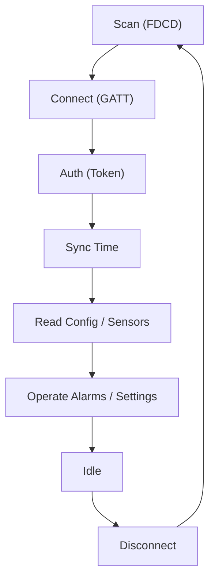

# Qingping CGD1 BLE Protocol Specification

Reverse-engineered Bluetooth Low Energy (BLE) protocol for the Qingping CGD1 Alarm Clock.

Sources:
- [MrBoombastic/clOwOck](https://github.com/MrBoombastic/clOwOck) — Android replacement app with full protocol specification
- [ov1d1u/qingping_alarm_clock](https://github.com/ov1d1u/qingping_alarm_clock) — Home Assistant integration (Python/Bleak)

## 1. GATT Service & Characteristics

### Custom Primary Service

```
22210000-554a-4546-5542-46534450466d
```

This service is discovered after connecting. Passive advertisements carry sensor data under the 16-bit `FDCD` service-data UUID (see [§6](#6-passive-sensor-stream-advertising)); the custom GATT UUID is not the service-data filter used for scanning.

### Characteristics

| Name          | UUID                                   | Direction     |
|---------------|----------------------------------------|---------------|
| Auth Write    | `00000001-0000-1000-8000-00805f9b34fb` | Host → Device |
| Auth Notify   | `00000002-0000-1000-8000-00805f9b34fb` | Device → Host |
| Data Write    | `0000000b-0000-1000-8000-00805f9b34fb` | Host → Device |
| Data Notify   | `0000000c-0000-1000-8000-00805f9b34fb` | Device → Host |
| Sensor Notify | `00000100-0000-1000-8000-00805f9b34fb` | Device → Host |

### Standard Services

| Service | UUID     | Characteristic | UUID     | Format                    |
|---------|----------|----------------|----------|---------------------------|
| Battery | `0x180f` | Battery Level  | `0x2a19` | 1 byte (percentage 0–100) |

## 2. Protocol Structure

### Frame Format

Every frame follows the same shape: a length byte, a command byte, and a payload.

```
Request:  [Length] [Command] [Payload...]
ACK:      04 ff [Command] [Status] [Payload 1B]
```

The first byte counts the bytes that follow it — it is a **length**, not a per-command identifier. This is why the same leading value appears for unrelated commands (e.g. `0x01` for every two-byte read request, `0x02` for brightness preview and ringtone preview): they simply have the same payload length.

An ACK is always exactly 5 bytes: `04 ff [Command] [Status] [Payload 1B]`. The status sits at index 3 and `00` means success. The single trailing byte is a command-specific payload (usually `00`).

Example: `04 ff 01 00 06` means "command `01` succeeded" and carries payload byte `06`.

### Length Byte Constants

| Constant       | Value  | Commands                                                     |
|----------------|--------|--------------------------------------------------------------|
| `AUTH`         | `0x11` | Auth Init, Auth Confirm, Read Alarms response                |
| `TIME`         | `0x05` | Time Sync                                                    |
| `GET_DATA`     | `0x01` | Read Settings, Read Firmware, Preview Ringtone (current vol) |
| `SET_ALARM`    | `0x07` | Set/Delete Alarm                                             |
| `BRIGHTNESS`   | `0x02` | Set Brightness, Preview Ringtone (specific vol)              |
| `SET_SETTINGS` | `0x13` | Set Settings, Read Settings response                         |
| `AUDIO_INIT`   | `0x08` | Audio Init                                                   |
| `AUDIO_PACKET` | `0x81` | Audio Data Packet                                            |

## 3. Authentication (Two-Step Token Protocol)

The device uses a two-step authentication protocol with a 16-byte random token. Once paired, the same token must be used for all future connections.

### Flow

1. Connect to the device and discover services.
2. Enable notifications on **Auth Notify** (`...0002`).
3. Send **Auth Init** to **Auth Write** (`...0001`): `11 01 [Token 16B]`
4. Wait for ACK on Auth Notify: `04 ff 01 00 [Payload 1B]` (status `00` = success, proceed to step 5). The payload byte is non-zero here (`02` or `06` depending on firmware); its meaning is unknown and can be ignored.
5. Send **Auth Confirm** to Auth Write: `11 02 [Token 16B]`
6. Wait for final ACK: `04 ff 02 00 00`

### Token Management

- **New devices**: Generate a random 16-byte token.
- **Paired devices**: Use the stored token from the previous pairing.
- The token must match what the device expects — the first successful pairing establishes the token.
- **Persist a newly generated token only after a privileged command (e.g. time synchronization) succeeds.** An Auth Confirm ACK alone does not prove that the token was accepted.
- The device will send an ACK even when the token is bad. Try to sync time or do another privileged action and check if the device closes the connection.

### ACK Format

```
04 ff [CmdID] [Status] [Payload 1B]
```

- Status `00` = Success (any other value means the command was rejected).
- The last byte is payload; it is `00` in every captured ACK except the Auth Init one.

## 4. Time Synchronization

After authentication, it is recommended to synchronize the time.

- **Command** (Auth Write): `05 09 [Timestamp 4B LE]`
- **Response** (Auth Notify): `04 ff 09 00 00` (success)

This is the first privileged command, so it doubles as the real proof that the token was accepted: if it is rejected (or the device drops the link), the pairing failed regardless of the auth ACKs.

### Timestamp Format

4-byte Unix timestamp in Little Endian:

```
byte 0 = (timestamp >> 0)  & 0xFF
byte 1 = (timestamp >> 8)  & 0xFF
byte 2 = (timestamp >> 16) & 0xFF
byte 3 = (timestamp >> 24) & 0xFF
```

## 5. Managing Alarms

The device supports a fixed capacity of **16 alarm slots** (indexed 0–15). All alarm operations happen on the **Data** characteristics.

> **Note**: The ov1d1u Home Assistant integration uses `ALARM_SLOTS_COUNT = 19`. The clOwOck specification documents 16 slots. This discrepancy may be firmware-dependent.

### 5.1. Set Alarm

Create or modify an alarm:

```
07 05 [ID] [Enabled] [HH] [MM] [Days] [Snooze]
```

| Field   | Bytes | Description               |
|---------|-------|---------------------------|
| ID      | 1     | Alarm index (0–15)        |
| Enabled | 1     | `0x01` = On, `0x00` = Off |
| HH      | 1     | Hour (0–23)               |
| MM      | 1     | Minute (0–59)             |
| Days    | 1     | Day bitmask (see below)   |
| Snooze  | 1     | `0x01` = On, `0x00` = Off |

#### Days Bitmask

| Bit | Value  | Day              |
|-----|--------|------------------|
| 0   | `0x01` | Monday           |
| 1   | `0x02` | Tuesday          |
| 2   | `0x04` | Wednesday        |
| 3   | `0x08` | Thursday         |
| 4   | `0x10` | Friday           |
| 5   | `0x20` | Saturday         |
| 6   | `0x40` | Sunday           |
| —   | `0x00` | Once (no repeat) |

### 5.2. Alarm Entry Structure (5 bytes)

Used in both Set Alarm and Read Alarms:

```
[Enabled] [HH] [MM] [Days] [Snooze]
```

An empty/unused slot has all bytes set to `0xFF`: `FF FF FF FF FF`

### 5.3. Delete Alarm

Overwrite the slot with `FF` values:

```
07 05 [ID] FF FF FF FF FF
```

ACK: `04 ff 05 00 00` (success)

### 5.4. Read Alarms

- **Command** (Data Write): `01 06`
- **Response** (Data Notify): `11 06 [Base Index] [Alarm Entry 1 (5B)] [Alarm Entry 2 (5B)] [Alarm Entry 3 (5B)]`

A reply packet is 18 bytes long and carries 3 alarms (the leading `0x11` = 17 bytes after it: command + base index + 3 × 5). All 16 slots are returned, so the device sends **6 packets** in a row. Empty slots have `FF FF FF FF FF` values.

The app parses as many 5-byte entries as the packet happens to contain, so a firmware using a different packing would still be read correctly.

## 6. Device Settings

Managed via a single comprehensive payload on **Data Write**.

### 6.1. Read Settings

- **Command** (Data Write): `01 02`
- **Response** (Data Notify): `13 02 [Settings Payload 18B]`

### 6.2. Set Settings

- **Command** (Data Write): `13 01 [Settings Payload 18B]`
- **ACK** (Data Notify): `04 ff 01 00 00` (success)

### 6.3. Settings Payload (20 bytes total)

```
13 01 [Vol] [Hdr1] [Hdr2] [Flags] [TZ] [Duration] [Brightness] [NightStartH] [NightStartM] [NightEndH] [NightEndM] [TzSign] [NightEn] [Reserved] [Sig 4B]
```

| Offset | Field       | Bytes | Description                                            |
|--------|-------------|-------|--------------------------------------------------------|
| 0      | Header      | 1     | `0x13` (length byte)                                   |
| 1      | Command     | 1     | `0x01` (set) or `0x02` (read response)                 |
| 2      | Volume      | 1     | Sound volume (1–5)                                     |
| 3      | Hdr1        | 1     | Fixed, set to `0x58` (confirmed via clOwOck)           |
| 4      | Hdr2        | 1     | Fixed, set to `0x02` (confirmed via clOwOck)           |
| 5      | Flags       | 1     | Mode bitfield (see below)                              |
| 6      | Timezone    | 1     | Timezone offset in 6-minute units (offset_minutes / 6) |
| 7      | Duration    | 1     | Screen light duration in seconds                       |
| 8      | Brightness  | 1     | Packed brightness (see below)                          |
| 9      | NightStartH | 1     | Night mode start hour (0–23)                           |
| 10     | NightStartM | 1     | Night mode start minute (0–59)                         |
| 11     | NightEndH   | 1     | Night mode end hour (0–23)                             |
| 12     | NightEndM   | 1     | Night mode end minute (0–59)                           |
| 13     | TzSign      | 1     | `0x01` = positive offset, `0x00` = negative            |
| 14     | NightEn     | 1     | `0x01` = night mode enabled, `0x00` = disabled         |
| 15     | Reserved    | 1     | Set to `0xFF`                                          |
| 16–19  | Signature   | 4     | Ringtone signature, set to `0xFF` when unused          |

### 6.4. Flags Bitfield (Byte 5)

| Bit | Mask   | Field            | 0       | 1          |
|-----|--------|------------------|---------|------------|
| 0   | `0x01` | Language         | Chinese | English    |
| 1   | `0x02` | Time Format      | 24-hour | 12-hour    |
| 2   | `0x04` | Temperature Unit | Celsius | Fahrenheit |
| 3   | `0x08` | Unknown          | —       | —          |
| 4   | `0x10` | Alarms           | Enabled | Disabled   |

> **Night mode workaround**: Disabling night mode is done by setting a 1-minute night mode window (`00:00`–`00:01`). Even the official app does this.

### 6.5. Brightness Encoding (Byte 8)

Packed into a single byte with two nibbles:

```
High nibble = daytime_brightness / 10
Low nibble  = nighttime_brightness / 10
```

Each brightness value must be 0–150 and a multiple of 10 (nibble 0–15).
Typical range is 0–100 (nibble 0–10), but the firmware accepts up to 150.

Example: Daytime 80%, Nighttime 30% → `(8 << 4) | 3 = 0x83`

### 6.6. Set Immediate Brightness (Preview)

- **Command** (Data Write): `02 03 [Value]`
- **Value**: Brightness level / 10 (0–15)
- **Response** (Data Notify): `04 ff 03 00 00` (success)

### 6.7. Preview Ringtone

Plays a generic "beep" sound for testing volume level (not the user's selected ringtone).

- **Command** (Data Write): `01 04` (play at current volume) or `02 04 [Vol]` (play at volume 1–5)
- **Response** (Data Notify): `04 ff 04 00 00` (success)

## 7. Real-Time Sensor Stream (Connected)

- **Target**: `00000100-0000-1000-8000-00805f9b34fb` (Notify)
- **Format**: `[00] [Temp L] [Temp H] [Hum L] [Hum H]`

This stream does **not** follow the length-byte framing: the packet is always 5 bytes and starts with a constant `00`.

| Field       | Type               | Scaling             |
|-------------|--------------------|---------------------|
| Temperature | Signed Int16 LE    | value / 100.0 (°C)  |
| Humidity    | Unsigned UInt16 LE | value / 100.0 (%RH) |

## 8. Passive Sensor Stream (Advertising)

The device broadcasts sensor data in BLE advertisement packets via Service Data.

- **Service UUID**: `0000fdcd-0000-1000-8000-00805f9b34fb` (ClearGrass/Qingping Service)
- **Format**: 8-byte header followed by TLV (Type-Length-Value) objects

### Header (8 bytes)

```
[08|88] 0C [MAC 6B]
```

The first byte is `0x08` or `0x88` (flags), the second is `0x0C` (length of remaining header = 12, but only 6 bytes of MAC follow in the common case).

### TLV Objects

| Type   | Length | Value                               | Scaling                  |
|--------|--------|-------------------------------------|--------------------------|
| `0x01` | `0x04` | `[Temp L] [Temp H] [Hum L] [Hum H]` | Same as connected stream |
| `0x02` | `0x01` | `[Battery]`                         | 0–100 (percentage)       |

### Example

A common 17-byte payload:

```
[08|88] 0C [MAC 6B] 01 04 [Temp 2B] [Humidity 2B] 02 01 [Battery]
```

## 9. Battery Level (Connected)

- **Service UUID**: `0x180f`
- **Characteristic UUID**: `0x2a19`
- **Format**: 1 byte (percentage 0–100)
- The app reads this characteristic and subscribes when notifications are supported.

## 10. Firmware Version

- **Command** (Auth Write): `01 0d`
- **Response** (Auth Notify): `0b [Byte] [ASCII String]`

The leading `0x0b` = 11 is a length byte. For the known 10-character versions (`1.0.1_0130`, `1.0.1_0132`), this leaves exactly one byte before the string. Whether that byte is the echoed command (`0d`) or the string length (`0a`) is not settled; the app reads it as a length and clamps it to the packet size, which works either way.

### Known Firmware Versions

- `1.0.1_0046`
- `1.0.1_0063`
- `1.0.1_0067`
- `1.0.1_0126`
- `1.0.1_0130`
- `1.0.1_0132`

## 11. Audio Transfer Protocol (Ringtone Upload)

### 11.1. Audio Format

- 8-bit Unsigned PCM
- 8000 Hz sample rate
- Mono

### 11.2. Known Ringtone Signatures

Official apps use these 4-byte signatures to identify ringtones:

| Signature     | Name               |
|---------------|--------------------|
| `fd c3 66 a5` | Beep               |
| `09 61 bb 77` | Digital Ringtone   |
| `ba 2c 2c 8c` | Digital Ringtone 2 |
| `ea 2d 4c 02` | Cuckoo             |
| `79 1b ac b3` | Telephone Ringtone |
| `1d 01 9f d6` | Exotic Guitar      |
| `6e 70 b6 59` | Lively Piano       |
| `8f 00 48 86` | Story Piano        |
| `26 52 25 19` | Forest Piano       |

### 11.3. Custom Ringtone Slots

For uploading custom ringtones, two alternating slot signatures are used:

- `de ad de ad`
- `be ef be ef`

**Important**: Always alternate between slots when uploading new custom audio. The device may reject uploads if the target signature matches the currently active ringtone, even if the audio content is different.

### 11.4. Ringtone JSON Manifest

A JSON manifest maps hex signatures (without `0x` prefix) to objects containing at least a `wav` URL:

```json
{
  "1d019fd6": { "name": "Exotic Guitar", "wav": "https://example.com/rings/1d019fd6.wav" },
  "6e70b659": { "name": "Lively Piano", "wav": "https://example.com/rings/6e70b659.wav" }
}
```

### 11.5. Upload Protocol

#### Step 0 — Prepare the Payload

- Decode/resample the source file to 8-bit unsigned PCM, 8000 Hz, mono.
- Pad the result to a multiple of 512 bytes: the first padding byte is `00` (end-of-audio marker), the remaining ones are `FF`.
- Keep the whole payload under ~98 KB (roughly 12 seconds at 8 kHz); the device rejects or truncates anything longer.

#### Step 1 — Init Command (Data Write)

```
08 10 [Size 3B LE] [Signature 4B]
```

- **Size**: Padded audio length in bytes (Little Endian, 3 bytes)
- **Signature**: Target ringtone slot signature

#### Step 2 — Wait for Init ACK (Data Notify)

```
04 ff 10 [Status] [Payload 1B]
```

Status `00` = success, proceed with the upload.

#### Step 3 — Send Audio Data

- **Packet size**: 128 bytes of audio, prepended with the `81 08` header (130 bytes on the wire).
- A trailing packet shorter than 128 bytes is padded with `FF`.
- **Packets per block**: 4 (512 bytes of audio per block).
- After the 4th packet of a block (or after the very last packet), wait for the block ACK: `04 ff 08 [Status] [Payload 1B]` before continuing; status `00` = keep going.
- Write every packet with write-with-response and wait for the write callback. Short delays between packets keep the device from falling behind.

#### Step 4 — Completion

After the last block is acknowledged, the device stores the audio under the given signature. Select it as the active ringtone by writing the same signature in the settings payload (bytes 16–19).

> **Important**: The transfer must own the connection. Alarm or settings reads, RSSI polling, or notification (re)subscriptions issued in parallel can abort the upload. Hold a mutex for the whole transfer and keep the link alive until it finishes.

## 12. Known Command IDs Summary

| Length | Command | Operation                       | Characteristic   |
|--------|---------|---------------------------------|------------------|
| `0x11` | `0x01`  | Auth Init                       | Auth Write       |
| `0x11` | `0x02`  | Auth Confirm                    | Auth Write       |
| `0x05` | `0x09`  | Time Sync                       | Auth Write       |
| `0x01` | `0x0d`  | Read Firmware                   | Auth Write       |
| `0x01` | `0x02`  | Read Settings                   | Data Write       |
| `0x13` | `0x01`  | Set Settings                    | Data Write       |
| `0x02` | `0x03`  | Set Brightness                  | Data Write       |
| `0x01` | `0x04`  | Preview Ringtone (current vol)  | Data Write       |
| `0x02` | `0x04`  | Preview Ringtone (specific vol) | Data Write       |
| `0x01` | `0x06`  | Read Alarms                     | Data Write       |
| `0x07` | `0x05`  | Set/Delete Alarm                | Data Write       |
| `0x08` | `0x10`  | Audio Init                      | Data Write       |
| `0x81` | `0x08`  | Audio Data Packet               | Data Write       |
| `0x04` | `0xff`  | ACK (Notify)                    | Auth/Data Notify |

## 13. GATT Disconnection Status Codes

When the device disconnects, the GATT status indicates the reason:

| Code   | Name                        | Description                  |
|--------|-----------------------------|------------------------------|
| `0x00` | `GATT_SUCCESS`              | Normal disconnection         |
| `0x08` | `GATT_CONN_TIMEOUT`         | Connection timeout           |
| `0x13` | `GATT_CONN_TERMINATE_PEER`  | Device terminated connection |
| `0x16` | `GATT_CONN_TERMINATE_LOCAL` | Host terminated connection   |

## 14. Connection Lifecycle



### Passive vs Connected

- **Passive (no connection)**: Sensor data (temperature, humidity, battery) via BLE advertisements with `FDCD` service-data UUID.
- **Connected**: Authentication required for all write operations (time sync, alarms, settings, audio upload). Sensor data also available via real-time notify characteristic. Battery via standard GATT battery service.
